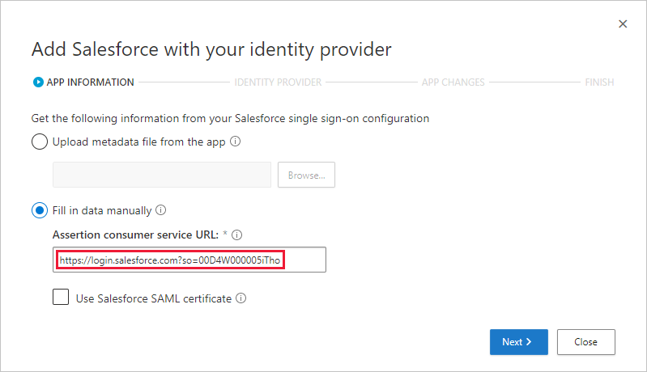
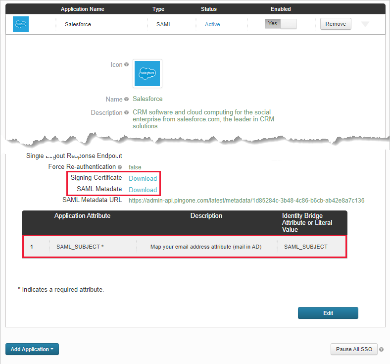
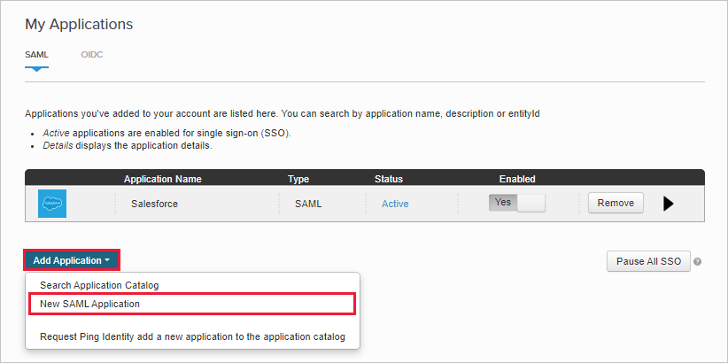
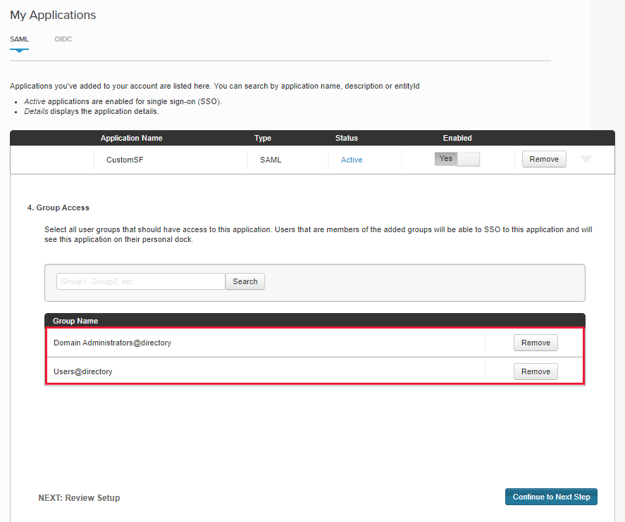
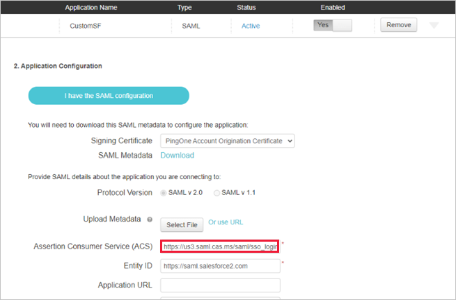
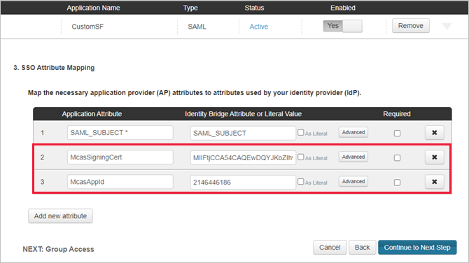
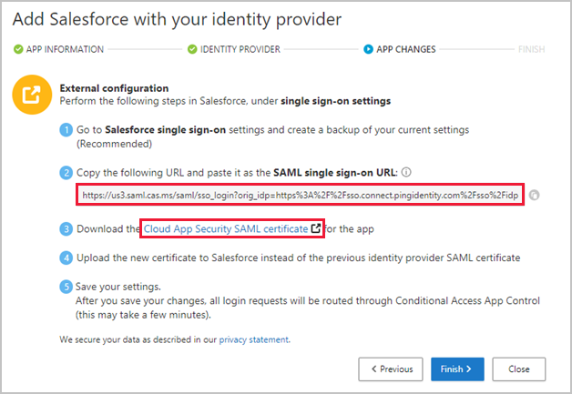
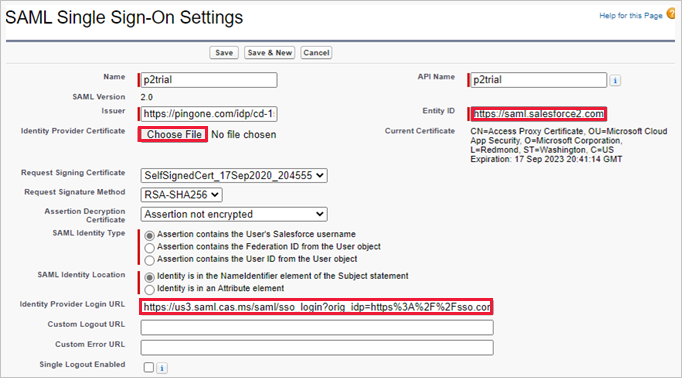

---
# required metadata

title: Deploy Cloud App Security Conditional Access App Control for Salesforce app using PingOne
description: This article provides information about how to deploy the Microsoft Cloud App Security Conditional Access App Control for Salesforce app using PingOne identity provider.
keywords:
author: shsagir
ms.author: shsagir
manager: shsagir
ms.date: 09/29/2020
ms.topic: how-to
ms.collection: M365-security-compliance
ms.prod:
ms.service: cloud-app-security
ms.technology:

# optional metadata

#ROBOTS:
#audience:
ms.suite: ems
---
# Onboard and deploy Conditional Access App Control for Salesforce app using PingOne identity provider (IdP)

[!INCLUDE [Banner for top of topics](includes/banner.md)]

Session controls in Microsoft Cloud App Security can be configured to work with any web app and any third-party IdP. Using the Salesforce app as an example, this article describes how to route app sessions from PingOne to Cloud App Security for real-time session controls.

## Prerequisites

- Your organization must have the following licenses to use Conditional Access App Control:

  - A relevant PingOne license (required for single sign-on)
  - Microsoft Cloud App Security

- An existing PingOne single sign-on configuration for the Salesforce app using the SAML 2.0 authentication protocol

## To configure session controls for your Salesforce app using PingOne as the IdP

Use the following steps to route your Salesforce app sessions from PingOne to Cloud App Security. For Azure AD configuration steps, see [Configure integration with Azure AD](proxy-deployment-any-app.md#configure-integration-with-azure-ad).

> [!NOTE]
> You can configure the Salesforce app's SAML single sign-on information provided by PingOne using one of the following methods:
>
> - **Option 1**: Uploading the app's SAML metadata file.
> - **Option 2**: Manually providing the app's SAML data.
>
> For the purpose of this example, we will use option 2.

**Step 1: [Get Salesforce SAML single sign-on settings](#sf-get-saml-info)**

**Step 2: [Configure Cloud App Security with Salesforce SAML information](#cas-config-sf-saml-info)**

**Step 3: [Create a custom Salesforce app in PingOne](#pingone-create-sf-app)**

**Step 4: [Configure Cloud App Security with PingOne app information](#cas-config-pingone-app-info)**

**Step 5: [Complete custom Salesforce app in PingOne](#pingone-complete-sf-app)**

**Step 6: [Get Salesforce app changes in Cloud App Security](#cas-get-sf-app-changes)**

**Step 7: [Complete app changes in Salesforce](#sf-complete-app-changes)**

**Step 8: [Complete configuration in Cloud App Security](#cas-complete-setup)**

## Step 1: Get Salesforce SAML single sign-on settings

1. In Salesforce, browse to **Setup** > **Settings** > **Identity** > **Single Sign-On Settings**.

1. Under **Single Sign-On Settings**, click on the name of the SAML 2.0 app you want to configure.

    

1. On the **SAML Single Sign-On Setting** page, make a note of the Salesforce **Login URL**. You'll need this later.

    

## Step 2: Configure Cloud App Security with Salesforce SAML information

1. In Cloud App Security, browse to **Investigate** > **Connected apps** > **Conditional Access App Control apps**.

1. Click the plus sign, and in the pop-up, select the app you want to deploy, and then click **Start Wizard**.
1. On the **APP INFORMATION** page, select **Fill in data manually**, in the **Assertion consumer service URL** enter the Salesforce **Login URL** you noted earlier, and then click **Next**.

    > [!NOTE]
    > If your app provides a SAML certificate, select **Use <app_name> SAML certificate** and upload the certificate file.

    

## Step 3: Create a custom Salesforce app in PingOne

Before you proceed, use the following steps to get information from your existing Salesforce app.

1. In PingOne, edit your existing Salesforce app.

1. On the **SSO Attribute Mapping** page, make a note of the SAML_SUBJECT attribute and value, and then download the **Signing Certificate** and **SAML Metadata** files.

    

1. Edit the SAML metadata file and make a note of the PingOne **SingleSignOnService Location**. You'll need this later.

    

1. On the **Group Access** page, make a note of the assigned groups.

    

Then use the instructions from the **Add a SAML application with your identity provider** page to configure a custom app in your IdP's portal.

> [!NOTE]
> Configuring a custom app enables you to test the Salesforce app with access and session controls without changing the existing behavior for your organization.

1. Create a **New SAML Application**.

    

1. On the **Application Details** page, fill out the form, and then click **Continue to Next Step**.

    > [!TIP]
    > Use an app name that will help you to differentiate between the custom app and the existing Salesforce app.

    

1. On the **Application Configuration** page, do the following, and then click **Continue to Next Step**.
    - In the **Assertion Consumer Service (ACS)** field, enter the Salesforce **Login URL** you noted earlier.
    - In the **Entity ID** field, enter a unique ID starting with *https://*. Make sure this is different to the exiting Salesforce PingOne app's configuration.
    - Make a note of the **Entity ID**. You'll need this later.

    

1. On the **SSO Attribute Mapping** page, add the existing Salesforce app's **SAML_SUBJECT** attribute and value you noted earlier, and then click **Continue to Next Step**.

    

1. On the **Group Access** page, add the existing Salesforce app's groups you noted earlier, and complete the configuration.

    

## Step 4: Configure Cloud App Security with PingOne app information

1. Back in the Cloud App Security **IDENTITY PROVIDER** page, click **Next** to proceed.

1. On the next page, select **Fill in data manually**, do the following, and then click **Next**.
    - For the **Assertion consumer service URL**, enter the Salesforce **Login URL** you noted earlier.
    - Select **Upload identity provider's SAML certificate** and upload the certificate file you downloaded earlier.

    

1. On the next page, make a note of the following information, and then click **Next**. You'll need the information later.

    - Cloud App Security single sign-on URL
    - Cloud App Security attributes and values

    

## Step 5: Complete custom Salesforce app in PingOne

1. In PingOne, locate and edit the custom Salesforce app.

    

1. In the **Assertion Consumer Service (ACS)** field, replace the URL with the Cloud App Security single sign-on URL you noted earlier, and then click **Next**.

    

1. Add the Cloud App Security attributes and values you noted earlier to the app's properties.

    

1. Save your settings.

## Step 6: Get Salesforce app changes in Cloud App Security

1. Back in the Cloud App Security **APP CHANGES** page, do the following, but **don't click Finish**. You'll need the information later.

    - Copy the Cloud App Security SAML Single sign-on URL
    - Download the Cloud App Security SAML certificate

    

## Step 7: Complete app changes in Salesforce

1. In Salesforce, browse to **Setup** > **Settings** > **Identity** > **Single Sign-On Settings**, and do the following:
    1. [Recommended] Create a backup of your current settings.
    1. Replace the **Identity Provider Login URL** field value with the Cloud App Security SAML single sign-on URL you noted earlier.
    1. Upload the Cloud App Security SAML certificate you downloaded earlier.
    1. Replace the **Entity ID** field value with the PingOne custom app entity ID you noted earlier.
    1. Click **Save**.
    > [!NOTE]
    > The Cloud App Security SAML certificate is valid for one year. After it expires, a new certificate will need to be generated.

    

## Step 8: Complete configuration in Cloud App Security

- Back in the Cloud App Security **APP CHANGES** page,, click **Finish**. After completing the wizard, all associated login requests to this app will be routed through Conditional Access App Control.

## Next steps

> [!div class="nextstepaction"]
> [« PREVIOUS: Deploy Conditional Access App Control for any apps](proxy-deployment-any-app.md)

## See also

> [!div class="nextstepaction"]
> [Introduction to Conditional Access App Control](proxy-intro-aad.md)

> [!div class="nextstepaction"]
> [Troubleshooting access and session controls](troubleshooting-proxy.md)

[!INCLUDE [Open support ticket](includes/support.md)]
