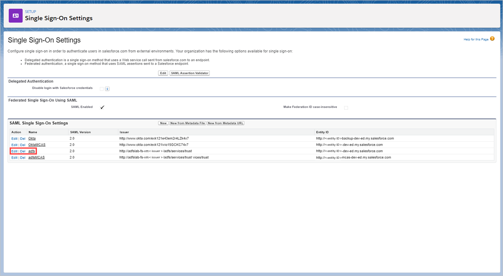
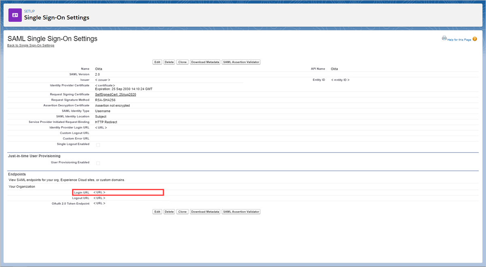
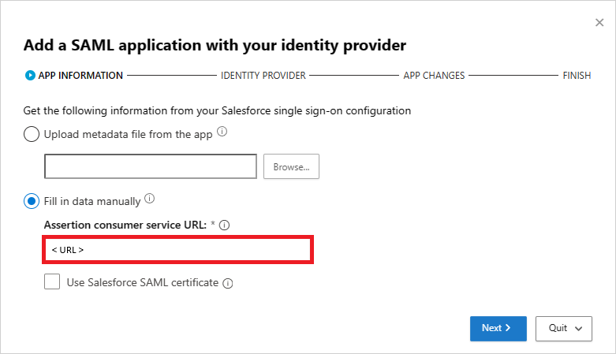
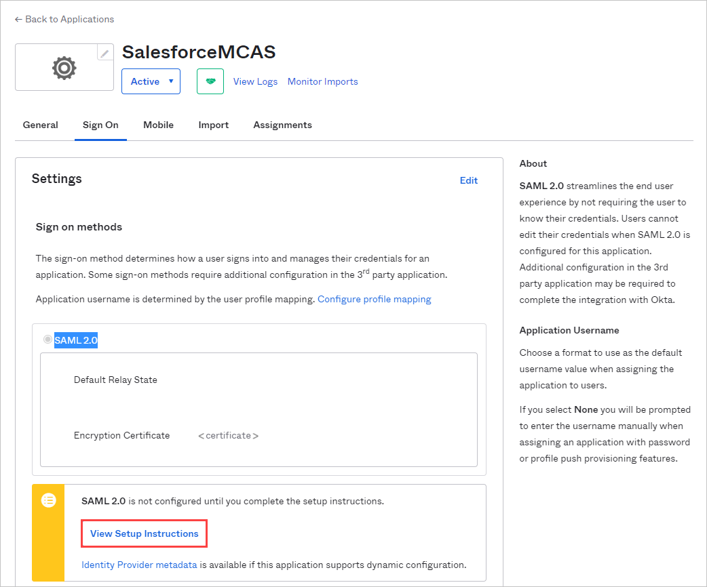
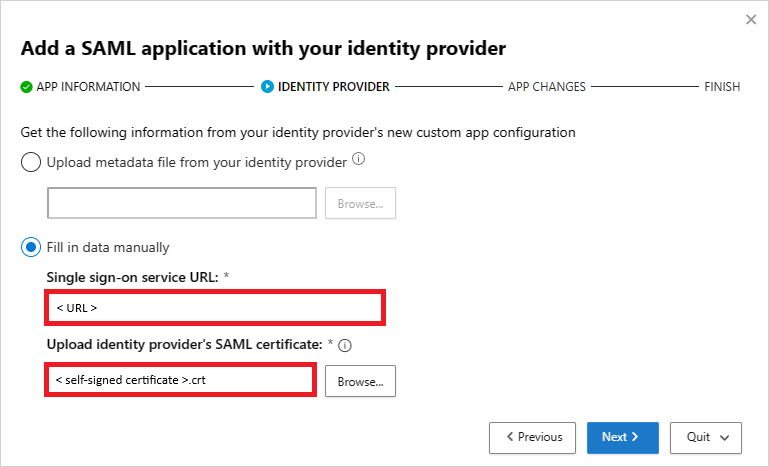
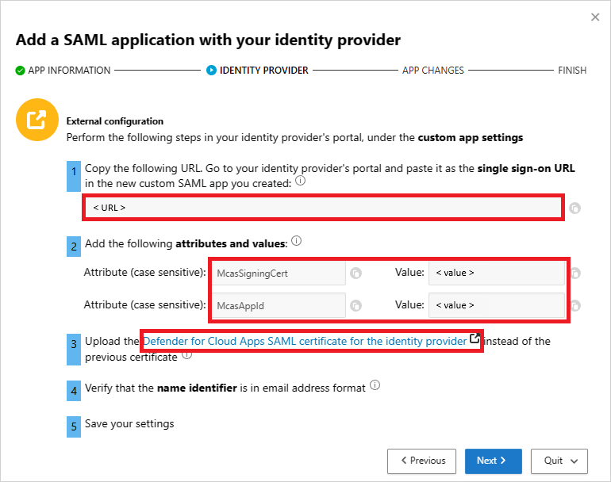
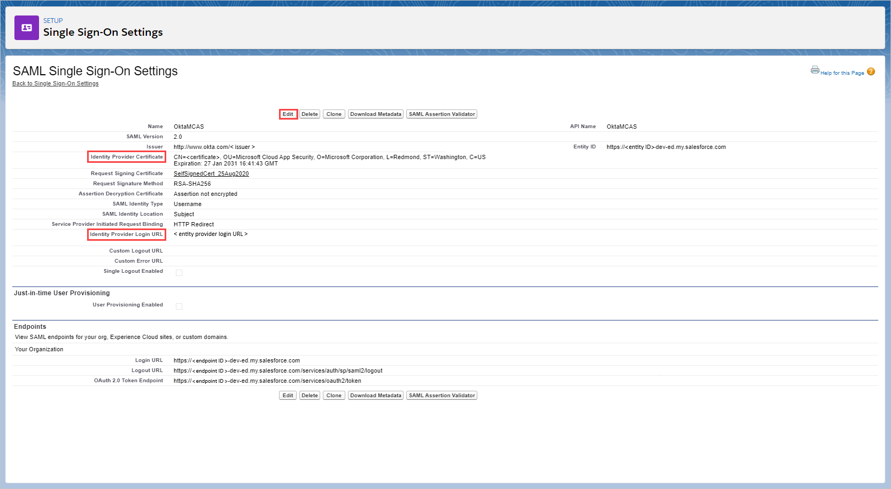

# Deploy conditional access app control for any web app using Okta as the identity provider (IdP)

You can configure session controls in Microsoft Defender for Cloud Apps to work with any web app and any non-Microsoft IdP. This article describes how to route app sessions from Okta to Defender for Cloud Apps for real-time session controls.

For this article, we'll use the Salesforce app as an example of a web app being configured to use Defender for Cloud Apps session controls.

## Prerequisites

- Your organization must have the following licenses to use conditional access app control:

  - A pre-configured Okta tenant.
  - Microsoft Defender for Cloud Apps

- An existing Okta single sign-on configuration for the app using the SAML 2.0 authentication protocol

## To configure session controls for your app using Okta as the IdP

Use the following steps to route your web app sessions from Okta to Defender for Cloud Apps.

> [!NOTE]
> You can configure the app's SAML single sign-on information provided by Okta using one of the following methods:
>
> - **Option 1**: Uploading the app's SAML metadata file.
> - **Option 2**: Manually providing the app's SAML data.
>
> In the following steps, we'll use option 2.

**Step 1: [Get your app's SAML single sign-on settings](#idp1-get-your-app-saml-sso-info)**

**Step 2: [Configure Defender for Cloud Apps with your app's SAML information](#idp1-conf-cas-with-your-app-saml-info)**

**Step 3: [Create a new Okta Custom Application and app single sign-on configuration](#idp1-create-custom-app-okta)**

**Step 4: [Configure Defender for Cloud Apps with the Okta app's information](#idp1-conf-cas-with-okta-app-info)**

**Step 5: [Complete the configuration of the Okta Custom Application](#idp1-complete-custom-app-in-okta)**

**Step 6: [Get the app changes in Defender for Cloud Apps](#idp1-get-app-changes-in-cas)**

**Step 7: [Complete the app changes](#idp1-complete-app-changes)**

**Step 8: [Complete the configuration in Defender for Cloud Apps](#idp1-complete-conf-in-cas)**

## Step 1: Get your app's SAML single sign-on settings

1. In Salesforce, browse to **Setup** > **Settings** > **Identity** > **Single Sign-On Settings**.

1. Under **Single Sign-On Settings**, click on the name of your existing Okta configuration.

    

1. On the **SAML Single Sign-On Setting** page, make a note of the Salesforce **Login URL**. You'll need this later when configuring Defender for Cloud Apps.

    > [!NOTE]
    > If your app provides a SAML certificate, download the certificate file.

    

## Step 2: Configure Defender for Cloud Apps with your app's SAML information

1. In the Microsoft Defender Portal, select **Settings**. Then choose **Cloud Apps**.
1. Under **Connected apps**, select **conditional access app control apps**.
1. Select **+Add**, and in the pop-up, select the app you want to deploy, and then select **Start Wizard**.
1. On the **APP INFORMATION** page, select **Fill in data manually**, in the **Assertion consumer service URL** enter the Salesforce **Login URL** you noted earlier, and then click **Next**.

    > [!NOTE]
    > If your app provides a SAML certificate, select **Use <app_name> SAML certificate** and upload the certificate file.

    

## Step 3: Create a new Okta Custom Application and App Single Sign-On configuration

> [!NOTE]
> To limit end-user downtime and preserve your existing known good configuration, we recommend creating a new **Custom Application** and **Single Sign-On configuration**. Where this is not possible, skip the relevant steps. For example, if the app you are configuring does not support creating multiple **Single Sign-On configurations**, then skip the create new single sign-on step.

1. In the **Okta Admin** console, under **Applications**, view the properties of your existing configuration for your app, and make note of the settings.

1. Click **Add Application**, and then click **Create New App**. Apart from the **Audience URI (SP Entity ID)** value that must be a unique name, configure the new application using the settings you noted earlier. You'll need this application later when configuring Defender for Cloud Apps.
1. Navigate to **Applications**, view your existing Okta configuration, and on the **Sign On** tab, select **View Setup Instructions**.

    

1. Make a note of the **Identity Provider Single Sign-On URL** and download the identity provider's Signing Certificate (X.509). You'll need this later.

1. Back in Salesforce, on the existing Okta single sign-on settings page, make a note of all the settings.
1. Create a new SAML single sign-on configuration. Apart from the **Entity ID** value that must match the custom application's **Audience URI (SP Entity ID)**, configure the single sign-on using the settings you noted earlier. You'll need this later when configuring Defender for Cloud Apps.
1. After saving your new application, navigate to **Assignments** page and assign the **People** or **Groups** that require access to the application.

ׂ

## Step 4: Configure Defender for Cloud Apps with the Okta app's information

1. Back in the Defender for Cloud Apps **IDENTITY PROVIDER** page, click **Next** to proceed.

1. On the next page, select **Fill in data manually**, do the following, and then click **Next**.
    - For the **Single sign-on service URL**, enter the Salesforce **Login URL** you noted earlier.
    - Select **Upload identity provider's SAML certificate** and upload the certificate file you downloaded earlier.

    

1. On the next page, make a note of the following information, and then click **Next**. You'll need the information later.

    - Defender for Cloud Apps single sign-on URL
    - Defender for Cloud Apps attributes and values

    > [!NOTE]
    > If you see an option to upload the **Defender for Cloud Apps SAML certificate for the identity provider**, click on the click to download the certificate file. You'll need this later.

    

## Step 5: Complete the configuration of the Okta Custom Application

1. Back in the **Okta Admin** console, under **Applications**, select the custom application you created earlier, and then under **General** > **SAML Settings**, click **Edit**.

    

1. In the **Single Sign On URL** field, replace the URL with the Defender for Cloud Apps single sign-on URL you noted earlier, and then save your settings.

1. Under **Directory**, select **Profile Editor**, select the custom application you created earlier, and then click **Profile**. Add attributes using the following information.

    | Display name | Variable name | Data type | Attribute type |
    | --- | --- | --- | --- |
    | McasSigningCert | McasSigningCert | string | Custom |
    | McasAppId | McasAppId | string | Custom |

    

1. Back on the **Profile Editor** page, select the custom application you created earlier, click **Mappings**, and then select **Okta User to {custom_app_name}**. Map the **McasSigningCert** and **McasAppId** attributes to the Defender for Cloud Apps attribute values you noted earlier.

    > [!NOTE]
    >
    > - Make sure you enclose the values in double quotes (")
    > - Okta limits attributes to 1024 characters. To mitigate this limitation, add the attributes using the **Profile Editor** as described.

    

1. Save your settings.

## Step 6: Get the app changes in Defender for Cloud Apps

Back in the Defender for Cloud Apps **APP CHANGES** page, do the following, but **don't click Finish**. You'll need the information later.

- Copy the Defender for Cloud Apps SAML Single sign-on URL
- Download the Defender for Cloud Apps SAML certificate

## Step 7: Complete the app changes

In Salesforce, browse to **Setup** > **Settings** > **Identity** > **Single Sign-On Settings**, and do the following:

1. [Recommended] Create a backup of your current settings.
1. Replace the **Identity Provider Login URL** field value with the Defender for Cloud Apps SAML single sign-on URL you noted earlier.
1. Upload the Defender for Cloud Apps SAML certificate you downloaded earlier.
1. Click **Save**.

    > [!NOTE]
    >
    > - After saving your settings, all associated login requests to this app will be routed through conditional access app control.
    > - The Defender for Cloud Apps SAML certificate is valid for one year. After it expires, a new certificate will need to be generated.

    

## Step 8: Complete the configuration in Defender for Cloud Apps

- Back in the Defender for Cloud Apps **APP CHANGES** page, click **Finish**. After completing the wizard, all associated login requests to this app will be routed through conditional access app control.

## Related content

> [!div class="nextstepaction"]
> [Introduction to conditional access app control](proxy-intro-aad.md)

> [!div class="nextstepaction"]
> [Troubleshooting access and session controls](troubleshooting-proxy.md)

[!INCLUDE [Open support ticket](includes/support.md)]
