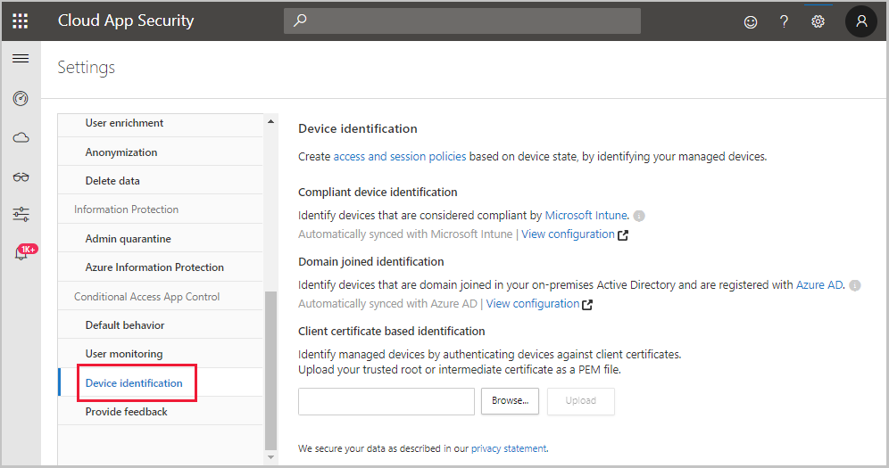

---
# required metadata

title: Protect with Microsoft Cloud App Security Conditional Access App Control
description: This article provides information about how the Cloud App Security Conditional Access App Control reverse proxy works.
keywords:
author: shsagir
ms.author: shsagir
manager: shsagir
ms.date: 9/23/2019
ms.topic: conceptual
ms.collection: M365-security-compliance
ms.prod:
ms.service: cloud-app-security
ms.technology:

# optional metadata

ms.reviewer: reutam
ms.suite: ems
ms.custom: seodec18
---
# Protect apps with Microsoft Cloud App Security Conditional Access App Control

*Applies to: Microsoft Cloud App Security*

>[!div class="step-by-step"]
[NEXT: Deploy Conditional Access App Control »](proxy-deployment-aad.md)

In today’s workplace, it’s often not enough to know what’s happening in your cloud environment after the fact. You want to stop breaches and leaks in real time, before employees intentionally or inadvertently put your data and your organization at risk. It's important to enable users in your organization to make the most of the services and tools available to them in cloud apps, and let them bring their own devices to work. At the same time, you need tools to help protect your organization from data leaks, and data theft, in real time. Together with Azure Active Directory, Microsoft Cloud App Security delivers these capabilities in a holistic and integrated experience with Conditional Access App Control.

> [!NOTE]
> To use Cloud App Security Conditional Access App Control, you need an [Azure Active Directory P1 license](https://azure.microsoft.com/pricing/details/active-directory/), and an active Microsoft Cloud App Security subscription or Office 365 E5 license. For a list of featured apps included with Office 365 E5, see [Office 365 featured apps](#O365-apps).

Office 365 E5 license. For a list of apps included with supported Office 365 E5, see Office 365 featured apps

## How it works

Conditional Access App Control uses a reverse proxy architecture and is uniquely integrated with Azure AD conditional access. Azure AD conditional access allows you to enforce access controls on your organization’s apps based on certain conditions. The conditions define *who* (user or group of users) and *what* (which cloud apps) and *where* (which locations and networks) a conditional access policy is applied to. After you’ve determined the conditions, you can route users to Microsoft Cloud App Security where you can protect data with Conditional Access App Control by applying access and session controls.

Conditional Access App Control enables user app access and sessions to be monitored and controlled in real time based on access and session policies. Access and session policies are used within the Cloud App Security portal to further refine filters and set actions to be taken on a user. With the access and session policies, you can:

- **Prevent data exfiltration**: You can block the download, cut, copy, and print of sensitive documents on, for example, unmanaged devices.

- **Protect on download**: Instead of blocking the download of sensitive documents, you can require documents to be labeled and protected with Azure Information Protection. This action ensures the document is protected and user access is restricted in a potentially risky session.

- **Prevent upload of unlabeled files**: Before a sensitive file is uploaded, distributed, and used by others, it’s important to make sure that the file has the right label and protection. You can ensure that unlabeled files with sensitive content are blocked from being uploaded until the user classifies the content.

- **Monitor user sessions for compliance**: Risky users are monitored when they sign into apps and their actions are logged from within the session. You can investigate and analyze user behavior to understand where, and under what conditions, session policies should be applied in the future.

- **Block access**: You can granularly block access for specific apps and users depending on several risk factors. For example, you can block them if they are using client certificates as a form of device management.

- **Block custom activities**: Some applications have unique scenarios that carry risk, for example, sending messages with sensitive content in applications like Microsoft Teams or Slack. In these kinds of scenarios, you can scan messages for sensitive content and block them in real time.

### How session control works

Creating a session policy with Conditional Access App Control enables you to control user sessions by redirecting the user through a reverse proxy instead of directly to the app. From then on, user requests and responses go through Cloud App Security rather than directly to the app.

When a session is protected by proxy, all the relevant URLs and cookies are replaced by Cloud App Security. For example, if the app returns a page with links whose domains end with myapp.com, the link is replaced with domains ending with something like: myapp.com.us.cas.ms

This method doesn't require you to install anything on the device making it ideal when monitoring or controlling sessions from unmanaged devices or partner users.

> [!NOTE]
> Cloud App Security leverages Azure Data Centers around the world to provide optimized performance through geolocation. This means that a user’s session may be hosted outside of a particular region, depending on traffic patterns and their location. However, to protect your privacy, no session data is stored in these data centers.

## Managed device identification

Conditional Access App Control enables you to create policies that take into account whether a device is managed or not. To identify whether a device is managed or not, the feature uses:

- Compliant devices
- Domain-joined devices
- Client certificates deployment

To configure a policy to leverage device management via client certificates:

1. Go to the settings cog and choose **Device identification**.
1. Upload one or more root or intermediate certificates.
1. After the certificate is uploaded, you can create [access policies](access-policy-aad.md) and [session policies](session-policy-aad.md) based on **Device tag** and **Valid client certificate**.

    

> [!NOTE]
> A certificate is only requested from a user if the session matches a policy that uses the valid client certificate filter.

### Compliant and domain joined devices

Azure AD conditional access enables compliant and domain-joined device information to be passed directly to Microsoft Cloud App Security. From there, an access policy or a session policy can be developed that uses device state as a filter. For more information, see the [Introduction to device management in Azure Active Directory](https://docs.microsoft.com/azure/active-directory/device-management-introduction).

> [!NOTE]
> Some browsers may require additional configuration such as installing an extension. For more information, see [Conditional Access browser support](https://go.microsoft.com/fwlink/?linkid=2102732).

### Client-certificate authenticated devices

The device identification mechanism can request authentication from relevant devices using client certificates. You can either use existing client certificates already deployed in your organization or roll out new client certificates to managed devices. You then use the presence of those certificates to set access and session policies.

SSL client certificates are verified via a trust chain. You can upload an X.509 root or intermediate certificate authority (CA) formatted in the PEM certificate format. These certificates must contain the public key of the CA, which is then used to sign the client certificates presented during a session.

Once the certificate is uploaded and a relevant policy is configured, when an applicable session traverses Conditional Access App Control, the Cloud App Security endpoint requests the browser to present the SSL client certificates. The browser serves the SSL client certificates that are installed with a private key. This combination of certificate and private key is done by using the PKCS #12 file format, typically .p12 or .pfx.

When a client certificate check is performed, Cloud App Security checks for the following conditions:

1. The selected client certificate is valid and is under the correct root or intermediate CA.
1. The certificate is not revoked (if CRL is enabled).

> [!NOTE]
> Most major browsers support performing a client certificate check. However, mobile and desktop apps often leverage built-in browsers that may not support this check and therefore affect authentication for these apps.

For information on how to deploy client certificates see [Deploy Conditional Access App Control for Azure AD apps](proxy-deployment-aad.md).

## Supported apps and clients

Conditional Access App Control currently supports SAML and Open ID Connect apps configured with single sign-on, along with web apps hosted on-premises configured with the [Azure AD App Proxy](https://docs.microsoft.com/azure/active-directory/manage-apps/application-proxy).
> [!NOTE]
> Conditional Access App Control also supports apps that are configured with identity providers other than Azure AD. For more information about this scenario, send an email to mcaspreview@microsoft.com.

**Session control is available for any browser on any major platform on any operating system**. We recommend using Internet Explorer 11, Microsoft Edge (latest), Google Chrome (latest), Mozilla Firefox (latest), or Apple Safari (latest). Access to mobile and desktop apps can also be blocked or allowed.

> [!NOTE]
> Using the **Client app** filter in access policies can cause the resulting user session to be proxied by Cloud App Security.
>
> In access policies, when using the **Client app** filter it defaults to **Mobile and desktop**. This can cause the resulting user session to be proxied by Cloud App Security. To void this behavior, set the value to **Browser**.
>
> By default, evaluating whether an app is mobile or desktop can cause the resulting user session to be proxied by Cloud App Security. To avoid this behavior, set the Client App filter in your Access policies to be equal to **Browser**.

> [!NOTE]
> Cloud App security leverages Transport Layer Security (TLS) protocols 1.2+ to provide best-in class encryption. Native client applications and browsers that do not support TLS 1.2+, will not be accessible when configured with session control. However, SaaS apps that use TLS 1.1 or lower will appear in the browser as using TLS 1.2+ when configured with Cloud App Security.

By natively integrating with Azure AD, any app that is configured with SAML or Open ID Connect you can onboard any app yourself. In addition, the following apps are featured by Cloud App Security and are already onboarded and ready to use in any tenant:

- AWS
- Azure DevOps (Visual Studio Team Services)
- Azure portal (preview)
- Box
- Concur
- CornerStone on Demand
- DocuSign
- Dropbox
- Dynamics 365 CRM (preview)
- Egnyte
- Exchange Online
- G Suite
- GitHub
- HighQ
- JIRA/Confluence
- OneDrive for Business
- LinkedIn Learning
- Power BI
- Salesforce
- ServiceNow
- SharePoint Online
- Slack
- Tableau
- Microsoft Teams (preview)
- Workday
- Workiva
- Workplace by Facebook
- Yammer (preview)

### <a id="O365-apps" />Office 365 featured apps

The following is a list of featured apps that are supported in Office 365 Cloud App Security:

- Exchange Online
- OneDrive for Business
- Power BI
- SharePoint Online
- Microsoft Teams (preview)
- Yammer (preview)

If you're interested in a specific app being featured, [send us details about the app](mailto:casfeedback@microsoft.com). Be sure to send the use case you're interested in for on-boarding it.

> [!div class="step-by-step"]
> [NEXT: Deploy Conditional Access App Control »](proxy-deployment-aad.md)

## Next steps

> [!div class="nextstepaction"]
> [Deploy Conditional Access App Control for Azure AD apps](proxy-deployment-aad.md)

[!INCLUDE [Open support ticket](includes/support.md)]
