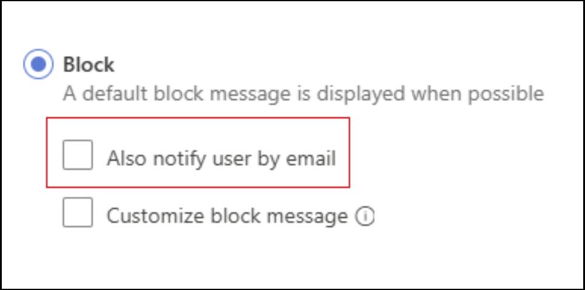

# What's new in Microsoft Defender for Cloud Apps

*Applies to: Microsoft Defender for Cloud Apps*

This article is updated frequently to let you know what's new in the latest release of Microsoft Defender for Cloud Apps.

For more information on what's new with other Microsoft Defender security products, see:

- [What's new in Microsoft Defender XDR](/microsoft-365/security/defender/whats-new)
- [What's new in Microsoft Defender for Endpoint](/microsoft-365/security/defender-endpoint/whats-new-in-microsoft-defender-endpoint)
- [What's new in Microsoft Defender for Identity](/defender-for-identity/whats-new)

For news about earlier releases, see [Archive of past updates for Microsoft Defender for Cloud Apps](release-note-archive.md).

## September 2024

### Removing the ability to email end users about blocked actions.

Effective October 1st, 2024, we will discontinue the feature that notifies end users via email when their action is blocked by session policies.

This option ensures that if a user's action is blocked, they get both a browser message and an email notification.

Admins can no longer configure this setting when creating new session policies.

Existing session policies with this setting will not trigger email notifications to end users when a block action occurs.

End users will continue to receive the block message directly through the browser and will stop receiving block notification via email.

Screenshot of the notify end user by email option:

## August 2024

### Reorganized Defender for Cloud Apps documentation

We've reorganized the Microsoft Defender for Cloud Apps documentation to highlight our main product pillars and use cases, and to align with our overall [Microsoft Defender documentation](/defender-xdr).

Use the feedback mechanisms at the top and bottom of each documentation page to send us your comments on Defender for Cloud Apps documentation.

### Large scale export of Activity logs (Preview)

A new user experience dedicated to providing users the option to export from “activity log” page up to six months back or up to 100K events.

You can filter the results using time range and various other filters and even hide private activities.

For more information, see [Export activities six months back](activity-filters-queries.md#export-activities-six-months-back-preview)

## July 2024
### Configure and embed a custom support URL in Block pages (Preview)

Customize the Microsoft Defender for Cloud Apps(MDA) block experience for apps that are blocked using Cloud Discovery.

You can set up a custom redirect URL on block pages 
- To educate and redirect end users to organization acceptable use policy 
- To guide end users on steps to follow to secure an exception for block

For more information, see  [Configure custom URL for MDA block pages](mde-govern.md#educate-users-when-accessing-blocked-apps--customize-the-block-page)

### In-browser protection for macOS users and newly supported policies (Preview)
Edge browser users from macOS, scoped to session policies, are now protected with in-browser protection.

The following session policies are now supported:
- Block and Monitor upload of sensitive files
- Block and Monitor paste
- Block and Monitor of malware upload
- Block and Monitor of malware download

See [In-browser protection](in-browser-protection.md).

  In-browser protection is supported with the last 2 stable versions of Edge (for example, if the newest Edge is 126, in-browser protection works for v126 and v125). 

See [Microsoft Edge releases](/deployedge/microsoft-edge-release-schedule#microsoft-edge-releases).

## June 2024

### Automatic redirection for the classic Defender for Cloud Apps portal - General Availability

The classic Microsoft Defender for Cloud Apps portal experience and functionality have been converged into the Microsoft Defender XDR Portal. As of June 2024, all customers using the classic Defender for Cloud Apps portal are automatically redirected to Microsoft Defender XDR, with no option to revert back to the classic portal.

For more information, see [Microsoft Defender for Cloud Apps in Microsoft Defender XDR](/microsoft-365/security/defender/microsoft-365-security-center-defender-cloud-apps).

### Microsoft Entra ID apps are automatically onboarded for Conditional Access app control (Preview)

Now, when you're creating access or session policies with Conditional Access app control, your Microsoft Entra ID apps are automatically onboarded and available for you to use in your policies.

When creating your access and session policies, select your apps by filtering for **Automated Azure AD onboarding**, for Microsoft Entra ID apps, or **Manual onboarding**, for non-Microsoft IdP apps.

For example:

:::image type="content" source="media/release-notes/onboarded-apps-filter.png" alt-text="Screenshot of the new App filter for access and session policies.":::

Extra steps for using Conditional Access app control still include:

- **Creating a Microsoft Entra ID Conditional Access policy** for the apps you want to control with Defender for Cloud Apps Conditional Access app control.
- **Manual steps to onboard non-Microsoft IdP apps**, including configuring your IdP to work with Defender for Cloud Apps.

For more information, see:

- [Protect apps with Microsoft Defender for Cloud Apps Conditional Access app control](proxy-intro-aad.md)
- [Conditional Access app control process flow](conditional-access-app-control-how-to-overview.md)
- [Create access policies](access-policy-aad.md)
- [Create session policies](session-policy-aad.md)

### Defender for Cloud Apps discovery on macOS (Preview)

Defender for Cloud Apps now supports cloud app discovery on macOS devices together with the Microsoft Defender for Endpoint integration. Defender for Cloud Apps and Defender for Endpoint together provide a seamless Shadow IT visibility and control solution.

Together with this enhancement, the **Win10 Endpoint Users** option on the **Cloud Discovery** page has been renamed to **Defender-managed endpoints**.

For more information, see:

- [Integrate Microsoft Defender for Endpoint with Microsoft Defender for Cloud Apps](mde-integration.md)
- [Investigate apps discovered by Microsoft Defender for Endpoint](mde-investigation.md)

### AKS supported for automatic log collection (Preview)

Microsoft Defender for Cloud Apps log collector now supports [Azure Kubernetes Service (AKS)](/azure/aks/) when the receiver type is `Syslog-tls`, and you can configure automatic log collection on AKS for continuous reporting with Defender for Cloud Apps.

For more information, see [Configure automatic log upload using Docker on Azure Kubernetes Service (AKS)](discovery-kubernetes.md).

### New Conditional Access app control / inline data for the advanced hunting CloudAppEvents table

Defender for Cloud Apps users who use advanced hunting in the Microsoft Defender portal can now use the new *AuditSource* and *SessionData* columns for queries and detection rules. Using this data allows for queries that consider specific audit sources, including access and session control, and queries by specific inline sessions.

For more information, see [Advanced Hunting "CloudAppEvents" Data schema](/microsoft-365/security/defender/advanced-hunting-cloudappevents-table).

### SSPM support for multiple instances of the same app is Generally Available

Defender for Cloud Apps now supports SaaS security posture management (SSPM) across multiple instances of the same app. For example, if you have multiple instances of Okta, you can configure Secure Score recommendations for each instance individually. Each instance shows up as a separate item on the **App Connectors** page. For example:

:::image type="content" source="media/security-saas-choose-secure-score-main-instance.png" alt-text="Screenshot of the Turn on Secure Score recommendations option." lightbox="media/classic-security-saas-choose-secure-score-main-instance.png":::

For more information, see [SaaS security posture management (SSPM)](security-saas.md).

## May 2024

### Defender for Cloud Apps in the Microsoft Defender portal - General Availability and advance notice for redirection

The Defender for Cloud Apps experience in the Microsoft Defender portal is generally available, and the automatic redirection from the classic portal is on by default for all customers. 

Starting June 16, 2024, the redirection toggle will no longer be available. From then on, all users accessing the classic Microsoft Defender for Cloud Apps portal will be automatically rerouted to the Microsoft Defender portal, with no option to opt out.

To prepare for this change, we recommend that any customers still using the classic portal move operations to the Microsoft Defender portal. For more information, see [Microsoft Defender for Cloud Apps in Microsoft Defender XDR](/defender-xdr/microsoft-365-security-center-defender-cloud-apps).

### Turn on preview options in the main Microsoft Defender XDR settings (Preview)

Now, preview customers can manage settings for preview features together with other Microsoft Defender XDR preview features.

Select **Settings > Microsoft Defender XDR > General > Preview** to toggle preview features on or off as needed. For example:

:::image type="content" source="media/release-notes/preview-features.png" alt-text="Screenshot of the Microsoft Defender XDR Preview features settings page.":::

Customers not yet using preview features continue to see the legacy settings under **Settings > Cloud apps > System > Preview** features.

For more information, see [Microsoft Defender XDR preview features](/microsoft-365/security/defender/preview).

### App governance available for government clouds

App governance features in Defender for Cloud Apps are now available in government clouds. For more information, see:

- [App governance in Microsoft Defender for Cloud Apps](app-governance-manage-app-governance.md)
- [Microsoft Defender for Cloud Apps for US Government offerings](editions-cloud-app-security-gcc.md)

## April 2024

### Enable data encryption from the Microsoft Defender portal

Now you can complete the process for encrypting Defender for Cloud Apps data at rest with your own key by enabling data encryption from the **Settings** area of the Microsoft Defender portal.

This feature is now limited on the classic Microsoft Defender for Cloud Apps portal, and is available only from the Microsoft Defender portal.

For more information, see [Encrypt Defender for Cloud Apps data at rest with your own key (BYOK)](ems-cloud-app-security-govt-service-byok.md).

## March 2024

### New log collector version released

We released a new version of a log collector with the latest vulnerability fixes. The new version is `columbus-0.272.0-signed.jar`, and the image name is `mcaspublic.azurecr.io/public/mcas/logcollector`, with the tag `latest/0.272.0`.

Changes include upgrading dependencies, such as:

- amazon-corretto
- ubuntu
- libssl
- oauthlib
- logback
- setuptools

For more information, see [Advanced log collector management](log-collector-advanced-management.md#update-the-log-collector-version).
 
### Podman supported for automatic log collection (Preview)

Microsoft Defender for Cloud Apps log collector now supports [Podman](https://docs.podman.io/en/latest/), and you can configure automatic log collection on Podman for continuous reporting with Defender for Cloud Apps. 

Automatic log collection is supported using a Docker container on multiple operating systems. For Linux distributions using RHEL version 7.1 and higher, you must use Podman as the container's runtime system.

For more information, see [Configure automatic log upload using Podman](discovery-linux-podman.md).

### New anomaly data for the advanced hunting CloudAppEvents table

Defender for Cloud Apps users who use advanced hunting in the Microsoft Defender portal can now use the new *LastSeenForUser* and *UncommonForUser* columns for queries and detections rules. Using this data helps to rule out false positives and find anomalies.

For more information, see [Advanced Hunting "CloudAppEvents" Data schema](/microsoft-365/security/defender/advanced-hunting-cloudappevents-table).

### New threat detections for Microsoft Copilot for Microsoft 365

Defender for Cloud Apps now provides new detections for risky user activities in Microsoft Copilot for Microsoft 365 with the Microsoft 365 connector.

- Related alerts are shown together with other Microsoft Defender XDR alerts, in the Microsoft Defender portal.
- Copilot for Microsoft 365 activities is available in the Defender for Cloud Apps activity log.
- In the Microsoft Defender portal's **Advanced hunting** page, Copilot for Microsoft 365 activities are available in the **CloudAppEvents** table, under the **Microsoft Copilot for Microsoft 365** application.

For more information, see:

- [Get started with Microsoft Copilot for Microsoft 365](/microsoft-365-copilot/microsoft-365-copilot-setup)
- [How Defender for Cloud Apps helps protect your Microsoft 365 environment](protect-office-365.md)
- [Investigate alerts in Microsoft Defender XDR](/microsoft-365/security/defender/investigate-alerts)
- [Defender for Cloud Apps Activity log](activity-filters.md)
- [Proactively hunt for threats with advanced hunting](/microsoft-365/security/defender/advanced-hunting-overview)
- [CloudAppEvents table in the advanced hunting schema](/microsoft-365/security/defender/advanced-hunting-cloudappevents-table)

### Data in motion protection for Microsoft Edge for Business users (Preview)

Defender for Cloud Apps users who use Microsoft Edge for Business and are subject to session policies are now protected directly from within the browser. In-browser protection reduces the need for proxies, improving both security and productivity.

Protected users experience a smooth experience with their cloud apps, without latency or app compatibility issues, and with a higher level of security protection.

In-browser protection is turned on by default, and is being gradually rolled out across tenants, starting early in March 2024.

For more information, see [In-browser protection with Microsoft Edge for Business (Preview)](in-browser-protection.md), [Protect apps with Microsoft Defender for Cloud Apps Conditional Access App Control](proxy-intro-aad.md), and [Session policies](session-policy-aad.md).
  
### Defender for Cloud Apps in the Microsoft Defender portal now available to all Defender for Cloud Apps roles

The Defender for Cloud Apps experience in the Microsoft Defender portal is now available for all Defender for Cloud Apps roles, including the following roles that were previously limited:

- App/Instance admin
- User group admin
- Cloud Discovery global admin
- Cloud Discovery report admin

For more information, see [Built-in admin roles in Defender for Cloud Apps](manage-admins.md#built-in-admin-roles-in-defender-for-cloud-apps).

> [!IMPORTANT]
> Microsoft recommends that you use roles with the fewest permissions. This helps improve security for your organization. Global admin is a highly privileged role that should be limited to emergency scenarios when you can't use an existing role.

## February 2024

### SSPM support for more connected apps in general availability

Defender for Cloud Apps provides you with security recommendations for your SaaS applications to help you prevent possible risks. These recommendations are shown via Microsoft Secure Score once you have a connector to an application.

Defender for Cloud Apps has now enhanced its SSPM support in general availability by including the following apps:

- [Atlassian](protect-atlassian.md)
- [Dropbox](protect-dropbox.md)
- [Zendesk](protect-zendesk.md)

SSPM is also now supported for [Google Workspace](protect-google-workspace.md) in General Availability.

> [!NOTE]
> If you already have a connector to one of these apps, your score in Secure score might automatically update accordingly.

For more information, see:

- [SaaS security posture management (SSPM)](security-saas.md)
- [User, app governance, and security configuration visibility](enable-instant-visibility-protection-and-governance-actions-for-your-apps.md#user-app-governance-and-security-configuration-visibility)
- [Microsoft Secure Score](/microsoft-365/security/defender/microsoft-secure-score)

### New App governance alerts for Credential Access and Lateral Movement

We've added the following new alerts for App governance customers:

- [Application initiating multiple failed KeyVault read activity with no success](app-governance-anomaly-detection-alerts.md#application-initiating-multiple-failed-keyvault-read-activity-with-no-success)
- [Dormant OAuth App predominantly using MS Graph or Exchange Web Services recently seen to be accessing Azure Resource Manager workloads](app-governance-anomaly-detection-alerts.md#dormant-oauth-app-predominantly-using-ms-graph-or-exchange-web-services-recently-seen-to-be-accessing-arm-workloads)

For more information, see [App governance in Microsoft Defender for Cloud Apps](app-governance-manage-app-governance.md).

## January 2024

### SSPM support for multiple instances of the same app (Preview)

Defender for Cloud Apps now supports SaaS security posture management (SSPM) across multiple instances of the same app. For example, if you have multiple instances of AWS, you can configure Secure Score recommendations for each instance individually. Each instance shows up as a separate item on the **App Connectors** page. For example:

:::image type="content" source="media/security-saas-choose-secure-score-main-instance.png" alt-text="Screenshot of the Turn on Secure Score recommendations option." lightbox="media/classic-security-saas-choose-secure-score-main-instance.png":::

For more information, see [SaaS security posture management (SSPM)](security-saas.md).

### Limitation removed for the number of files that can be controlled for uploading in session policies (Preview)

Session policies now support control over uploading folders with more than 100 files, with no limit to the number of files that can be included in the upload.

For more information, see [Protect apps with Microsoft Defender for Cloud Apps Conditional Access App Control](proxy-intro-aad.md).

### Automatic redirection for the classic Defender for Cloud Apps portal (Preview)

The classic Microsoft Defender for Cloud Apps portal experience and functionality have been converged into the Microsoft Defender XDR Portal. As of January 9, 2024, customers using the classic Defender for Cloud Apps portal with Preview features are automatically redirected to Microsoft Defender XDR, with no option to revert back to the classic portal.

For more information, see:

- [Microsoft Defender for Cloud Apps in Microsoft Defender XDR](/microsoft-365/security/defender/microsoft-365-security-center-defender-cloud-apps)
- [Microsoft Defender XDR preview features](/microsoft-365/security/defender/preview)

## Next steps

- For a description of releases prior to those listed here, see [Past releases of Microsoft Cloud App Security](release-note-archive.md).

[!INCLUDE [Open support ticket](includes/support.md)]

