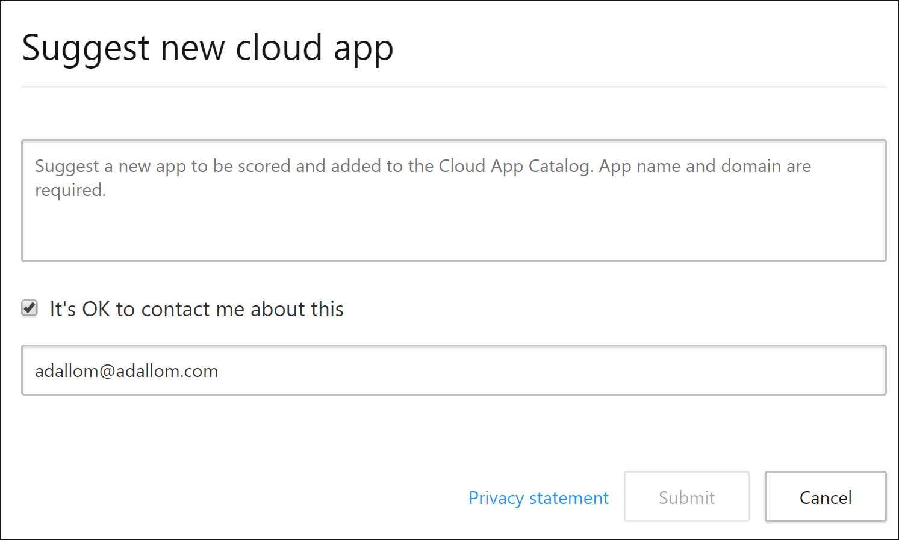
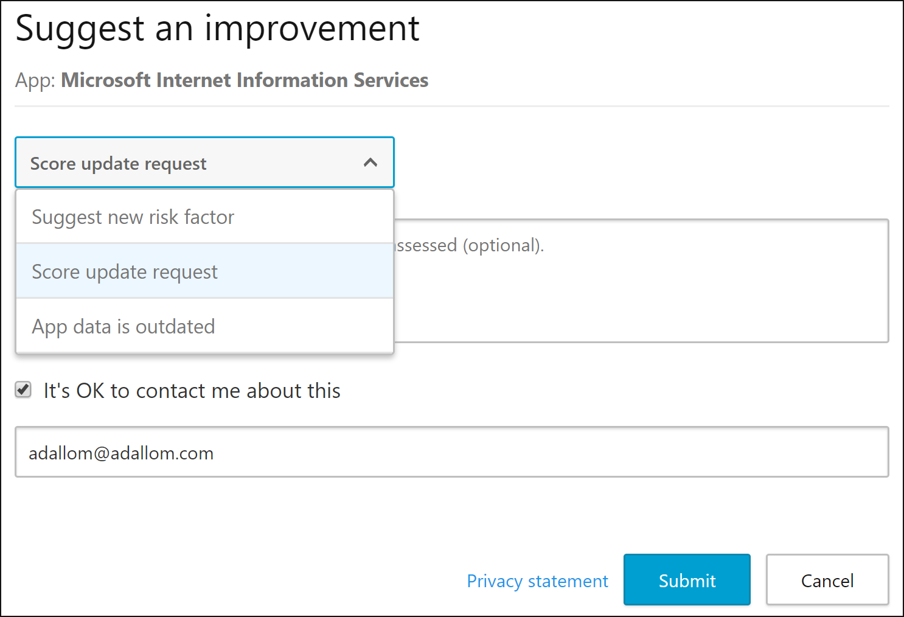
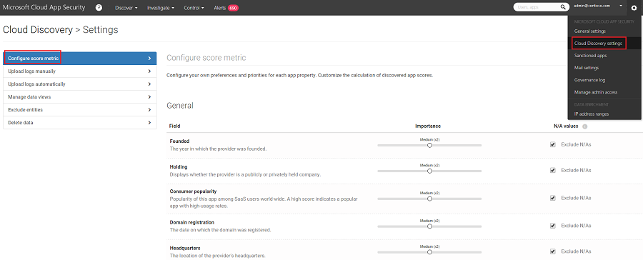
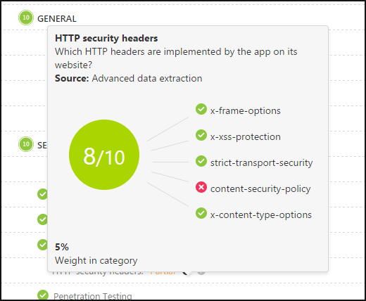
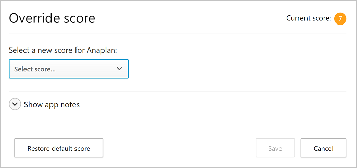

---
# required metadata

title: Working with the risk score | Microsoft Docs
description: This topic provides instructions for how to use and customize the Cloud App Security app risk score.
keywords:
author: rkarlin
ms.author: rkarlin
manager: mbaldwin
ms.date: 7/30/2017
ms.topic: article
ms.prod:
ms.service: cloud-app-security
ms.technology:
ms.assetid: 9cb3594e-5007-48be-9b4f-e1d23355d86e

# optional metadata

#ROBOTS:
#audience:
#ms.devlang:
ms.reviewer: reutam
ms.suite: ems
#ms.tgt_pltfrm:
#ms.custom:

---

# Working with the risk score  

## The Cloud App Catalog

The Cloud App Catalog gives you a full picture of what Cloud Discovery identifies. Cloud Discovery analyzes your traffic logs against Cloud App Security's cloud app catalog of over 15,000 cloud apps that are ranked and scored based on more than 60 risk factors, to provide you with ongoing visibility into cloud use, Shadow IT, and the risk Shadow IT poses into your organization.
The **Cloud app catalog** rates risk for your cloud apps based on regulatory certification, industry standards, and best practices. Four complementary processes run in the Cloud app catalog to keep it up to date:
1.  Automated data extraction directly from the cloud app (for attributes such as SOC 2 compliance).
2.  Automated advanced data extraction for data by Cloud App Security's algorithms (for attributes such as HTTP security headers).
3.  Continuous analysis by the Cloud App Security cloud analyst team (for attributes such as encryption at rest).
4.  Customer-based revision requests, based on customer submission requests for changes to the Cloud app catalog. All requests are reviewed by our cloud analyst team and updated based on their findings.
  
  

The demand by business units for cloud apps as a solution to their changing needs is growing. The Cloud app catalog enables you to wisely choose which apps fit your organization's security requirements, and the need to up to date with the latest security standards, vulnerabilities and breaches. 
For example, if you want to compare CRM apps and make sure they are adequately secured, you can use the Cloud app catalog page to filter for relevant apps you want:
In the **Cloud app catalog** page, under **Browse by category** select both **CRM**. 

Then, use the **Advanced** filters and set **Compliance risk factor** > **SOC 2** equals **True**; **Compliance risk factor** > **ISO 27001** equals **True**; **Security risk factor** > **Data at rest encryption** equals **True**; **Security risk factor** > **Data at rest encryption** equals **True**; **Security risk factor** > **Admin audit trail** equals **True** and **Security risk factor** > **User audit trail** equals **True**.

After the results are filtered, you can review the relevant apps and find the one that best fits your needs.

## Cloud App Catalog filters

There are basic and advanced Cloud App Catalog filters. To achieve a complex filter use the advanced option which includes all of the following:

- **App tags**: Tags enable you to customize the Cloud App Catalog. 
  You can select from either **Sanctioned**, **Unsanctioned** or you can create custom tags for apps. These tags can then be used as filters for deeper diving into specific types of apps that you want to investigate. 
- **Apps and domains**: Enables you to search for specific apps or apps used in specific domains. 
- **Categories**: The categories filter, which is located on the left of the page, enables you to search for types of apps according to app categories, for example Social network apps, Cloud storage apps, etc. You can select multiple categories at a time, or a single category, and then apply the basic and advanced filters on top of these.
- **Compliance risk factor**: Lets you search for a specific standards, certification and compliances that the app may comply with (HIPAA, ISO 27001, SOC 2, PCI-DSS, etc.).
- **General risk factor**: Lets you search for general risk factors such as Consumer popularity, Data center locale, etc.
- **Risk score**: Lets you filter apps by risk score so that you can focus on, for example, reviewing only very risky apps.
- **Security risk factor**: Enables you to filter based on specific security measures (such as Encryption at rest, multi-factor authentication, etc.).

## Suggesting a change

If you find a new app in your environment that hasn't been scored by Cloud App Security, a new risk factor, or a score update, or app data that is outdated, you can request a review of the app:

**To suggest a new app:**
1. At the top of the **Discovered apps** page, click the three dots and then select **Suggest new app**. 

  

2. In the **Suggest new cloud app** popup, fill in details about the new app including the name and domain of the app. 

  

3. We recommend selecting the checkbox to enable Cloud App Security analysts to contact you in case additional information about the app is needed, and so that you can be updated when the analysis is complete.

**To update a risk factor, score, or update app data:**

1. In the **Cloud App Catalog** page, in the app row you want to update, click the three dots at the end of the row and select **Request score update**.

  

2. In the **Suggest an improvement** popup, select whether you want to request a score update, suggest a new risk factor or update app data.

  

3. We recommend selecting the checkbox to enable Cloud App Security analysts to contact you in case additional information about the app is needed, and so that you can be updated when the analysis is complete.
 

## Customizing the risk score

Cloud Discovery provides you with important data regarding the credibility and reliability of the cloud apps that are used across the environment. Within the portal, each discovered app is displayed along with a total score, representing Cloud App Security's assessment of this particular app's maturity of use for enterprises. The total score of any given app is a weighted average of three sub-scores relating to the three sub-categories which Cloud App Security considers when assessing reliability:  
  
-   **General** - This category refers to basic facts about the company that produces the app, including its domain, founding year and popularity. These fields are meant to portray the company's stability on the most basic level.  
  
-   **Security** - The security category takes into account all standards dealing with the physical security of the data utilized by the discovered app. This includes fields such as multi-factor authentication, encryption, data classification and data ownership.  
  
-   **Compliance** - This category displays which common best-practice compliance standards are upheld by the company that produces the app. The list of specifications includes standards such as HIPAA, CSA and PCI-DSS.  
  
Each of the categories is comprised of many specific properties. According to our scoring algorithm, each property receives a preliminary score between 0 and 10, depending on the value. True/False values will receive 10 or 0 accordingly, whereas continuous properties such as domain age will receive a certain value within the spectrum. The score of each property is weighted against all other existing fields in the category, to create the category's sub-score. If you encounter an unscored app, it usually indicates an app whose properties are unknown and is therefore unscored.  
  
It is important to take a minute to review and modify the default weights given to the Cloud Discovery score configuration. By default, all the various parameters evaluated are given an equal weight. If there are certain parameters that are more or less important to your organization, it's important to change them as follows:  
  
1.  In the portal, under the settings icon, select **Cloud Discovery settings**.  
  
2.  Under **Configure score metric**, slide the **Importance** to change the weight of the field or the risk category to **Ignored**, **Low**, **Medium**, **High** or **Very High**.  
  
3.  In addition, you can set whether certain values are either not available or not applicable in the score calculation. When included, N/A values have a negative contribution to the calculated score.  
  
    

All the information needed in order to understand how our risk scores are stacking up is available in the Cloud App Security portal.
To better understand a risk factor’s weight in specific risk category, use the “i” button to the right of each field name in the app’s profile). This provides information about how exactly Cloud App Security scores a specific risk factor. The score is the value of the risk factor on a scale of 1-10 + its weight in the risk category:

  
In order to understand a risk category's weight in an app’s total score, hover over the risk category score:

## Overriding the risk score
You can override the risk score of an app without changing the way it is weighted so that you get immediate results for your organization. For example, if the risk score of an LOB app you use is 8 and it is sanctioned and encouraged by your organization, you might want to change the risk score to 10. 

To override the risk score, in the **Discovered apps** table or in the **Cloud app catalog**, click the three dots to the right of any app and select **Override risk score**.

After you update the score, you can include app notes to make your business justification for modifying this app score clear to other administrators. 

You can also add notes to make the justification of the change clear when anyone reviews the app.

 
## See Also  
[Daily activities to protect your cloud environment](daily-activities-to-protect-your-cloud-environment.md)   
[For technical support, please visit the Cloud App Security assisted support page.](http://support.microsoft.com/oas/default.aspx?prid=16031)   
[Premier customers can also choose Cloud App Security directly from the Premier Portal.](https://premier.microsoft.com/)  
  
  