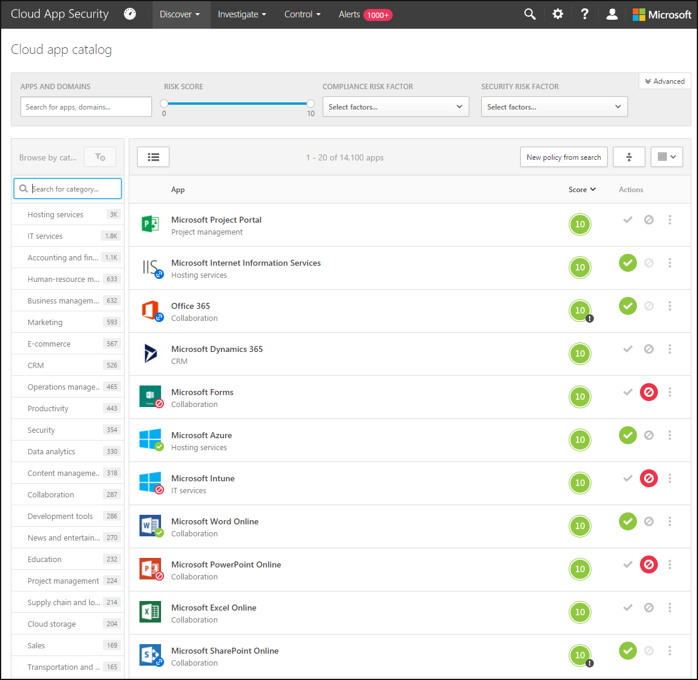
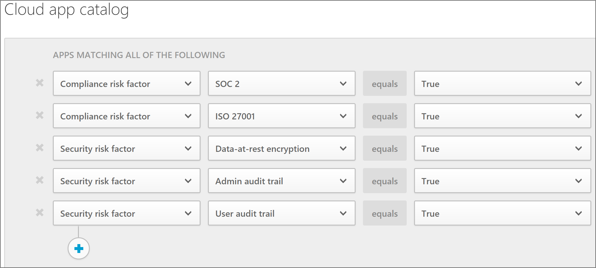
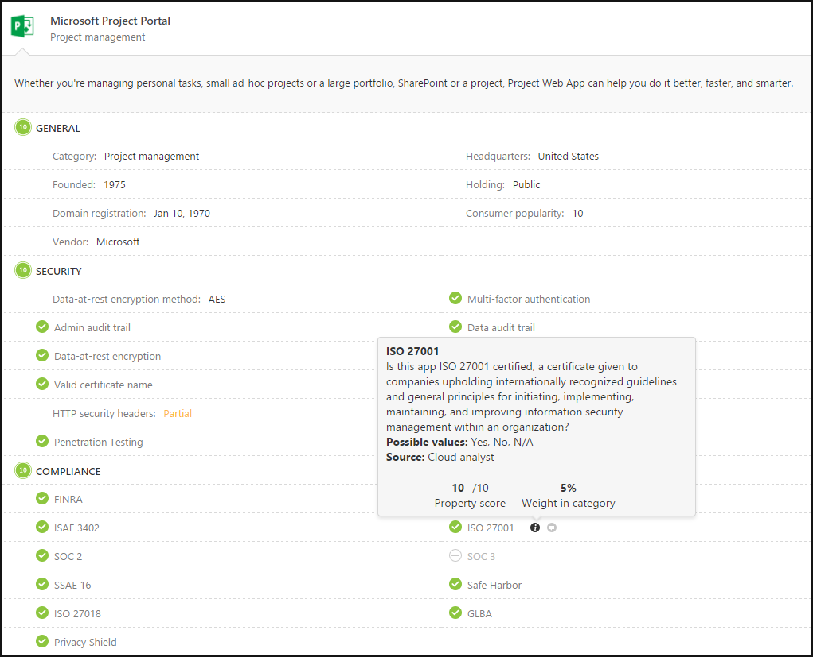
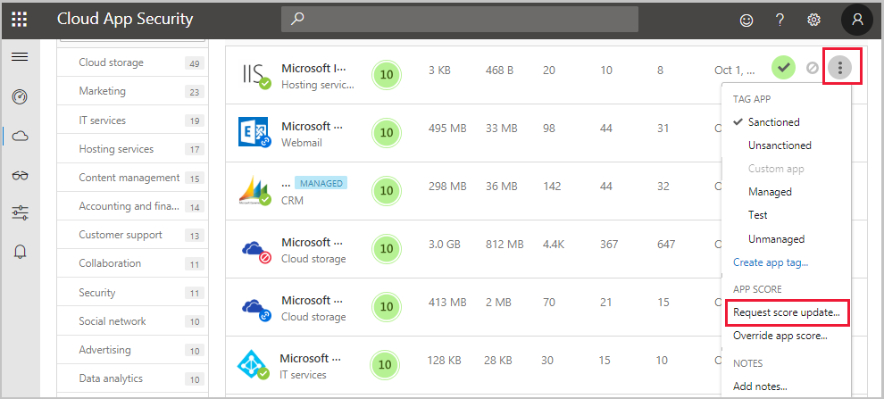
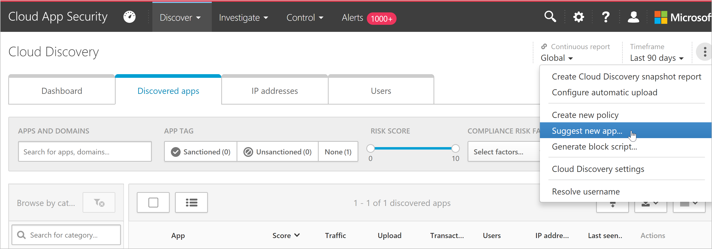

# Find your cloud app and calculate risk scores

The Microsoft Defender for Cloud Apps **Cloud app catalog** page provides a full list of over 31,000 discoverable cloud apps. Defender for Cloud Apps discovery analyzes your traffic logs against discoverable cloud apps to give you ongoing visibility into cloud use, Shadow IT, and risks posed to your organization. Use the **Cloud apps catalog** to identify the apps that fit into your organization's security requirements.

For example:

Apps in the cloud app catalog are scored based on more than 90 risk factors. This article describes how to identify apps covered by the catalog, and how to use and customize the cloud app risk scores.

>[!TIP]
> By default, Defender for Cloud Apps cannot discover apps that aren't in the catalog. To see Defender for Cloud Apps data for an app that's not currently in the catalog, we recommend that you [check our roadmap](https://www.microsoft.com/en-us/microsoft-365/roadmap?filters=Microsoft%20Defender%20for%20Identity), [suggest a new app](#suggest-a-change-to-the-cloud-app-catalog), or [create a custom app](cloud-discovery-custom-apps.md).

## Risk scoring process

Defender for Cloud Apps rates risks based on regulatory certification, industry standards, and best practices. The score represents the Defender for Cloud Apps assessment of this particular app's maturity of use for enterprises.

The total score of any given app is a weighted average of sub-scores for the following risk categories, which Defender for Cloud Apps considers when assessing reliability:

|Risk category  |Description  |
|---------|---------|
|**General**     |  Basic facts about the company that produces the app, including its domain, founding year, and popularity. These fields are meant to show the company's stability on the most basic level.       |
|**Security**     |   Accounts for all standards dealing with the security of the data used by the discovered app, and includes fields such as multi-factor authentication, encryption, data classification, and data ownership.    |
|**Compliance**     |   Accounts for the common best-practice compliance standards that are upheld by the company that produces the app. The list of specifications includes standards such as HIPAA, CSA, and PCI-DSS.      |
|**Legal**     |   Accounts for the regulations and policies in-place to ensure data protection and privacy of the app's users such as GDPR, DMCA, and data retention policy.      |

Each sub-score includes many more properties. Each property receives a preliminary score between 0 and 10, depending on the value. 

- *True*/*False* values receive 10 or 0 accordingly.
- *Continuous properties*, such as domain age, receive a certain value within the spectrum. 

The score of each property is weighted against all other existing fields in the category to create the category's subscore. If you encounter an unscored app, it usually indicates an app whose properties are unknown and is therefore unscored.

Risk scores are kept up to date using the following sources:

- **Data automatically extracted from the cloud app**, for attributes such as SOC 2 compliance, terms of service, sign-in URL, privacy policy, and HQ location.
- **Data automatically extracted using advanced Defender for Cloud App algorithms**, for attributes such as HTTP security headers.
- **Continuous analysis by the Defender for Cloud Apps analysis team**, for attributes such as encryption at rest.
- **Customer requests** for changes to the cloud app catalog. All requests are reviewed by our cloud analysis team and updated based on their findings. For information, see [Request a risk score update](#request-a-risk-score-update).

## Confirm cloud app security risk

Check the cloud app catalog to ensure that the apps used by organization fit into your organization's security requirements. For example, you might want to periodically check that CRM apps used in your organization are adequately secure. In this case, you'd use the following steps to identify your apps:

1. Sign into Microsoft 365 Defender and select **Cloud apps** > **Cloud app catalog**.

1. In the **Browse by category** list, select **CRM**. Use the search box to find a category if needed.

1. Select the **Advanced filters** toggle to configure the following advanced filter:

    - **Compliance risk factor** > **SOC 2** > **equals** > **Yes**
    - **Compliance risk factor** > **ISO 27001** > **equals** > **Yes**
    - **Security risk factor** > **Data-at-rest-encryption method** > **does not equal** > **Not supported, NA**
    - **Security risk factor** > **Admin audit trail** > **equals** > **Yes**
    - **Security risk factor** > **User audit trail** > **equals** > **Yes**

    For example:

    

1. Review the filtered apps shown in the grid and check to see that the apps you use have appropriate risk scores for your organization. Select an app to expand it for more details.

    We recommend that you review the weights given to risk factors and risk categories when scoring a specific app. In the expanded app details, scroll down and hover an **i** button next to each risk factor name to learn more. For example:

    

## Customize the risk score

By default, all the various parameters evaluated are given equal weight. If there are certain parameters that are more or less important to your organization, it's important to change them as needed.

For example:

1. Sign into Microsoft 365 Defender and select **Settings** > **Cloud Apps** > **Cloud Discovery** > **Score metrics**.

1. For each field or risk category slide the **Importance** slide to change the weight of the field or the risk category. Importance can be set to **Ignored**, **Low**, **Medium**, **High**, or **Very High**.

1. Select the **N/A values** checkbox to define whether a value is either not available or not applicable in the score calculation. When included, N/A values have a negative contribution to the calculated score.

## Override the risk score

You may want to override the risk score for a specific app without changing the way that it's weighted so that you can get immediate results for your organization. For example, if you have an app where the risk score is 8, but the app is sanctioned and encouraged by your organization, you might want to change the risk score to 10 for the selected app only.

**To override the risk score for a specific app**:

1. Sign into Microsoft 365 Defender. In the **Cloud discovery** or **Cloud app catalog** page, locate the app you want to override.

1. Select the three dot menu and then select **Override app score**. 

1. In the **Override score** dialog, select the risk score you want to apply and select **Save**.

    Clarify the change to other administrators by adding an **App note** with business justification details.

## Request a risk score update

You might want to request a review by the Defender for Cloud Apps security analysis team for a new risk factor, a score update, or app data that's outdated.

**To request a risk score change**:

1. Sign into Microsoft 365 Defender and select **Cloud apps** > **Cloud app catalog**, and locate the app your want to update.

1. In the **Cloud App Catalog** page, in the app row you want to update, select the three dots at the end of the row and choose **Request score update**. For example:

    

1. In the **Suggest an improvement** dialog, select whether you want to request a score update, suggest a new risk factor, or update app data.

1. We recommend selecting the **It's OK to contact me about this** option so that we can update you when the analysis is complete, and in case the team needs more information.

## Suggest a change to the cloud app catalog

If you find a new app in your environment that hasn't been scored by Defender for Cloud Apps, request a review of the app by our security analysis team. You might also want to request a review for new risk factor, a score update, or app data that is outdated.

**To suggest a new app:**

1. On the **Cloud Discovery** page, on the **Discovered apps** tab, select **Actions** and then choose **Suggest new app**.

    

2. In the **Suggest new cloud app** pop-up, fill in details about the new app. Include the name and domain of the app.

    

3. We recommend selecting the checkbox to enable Defender for Cloud Apps analysts to contact you in case additional information about the app is needed.

## Supported filters and categories

The **Cloud app catalog** page supports basic filters available from the dropdowns listed across the top of the page. To use advanced filters, toggle on the **Advanced filters** option at the top right.

Advanced filters include the following:

|Filter  |Description  |
|---------|---------|
|**App tags**     |    Select **Sanctioned**, **Unsanctioned**, or create custom tags to use in a customized filter.  |
|**Apps and domains**     |    Filter for specific apps or apps used in specific domains.     |
|**Categories**     |  Filter for according to app categories, listed on the left of the **Cloud app catalog** page. For more information, see [Supported Cloud app catalog categories](#supported-cloud-app-catalog-categories).       |
|**Compliance risk factor**     |   Filter for specific standards, certifications, and compliance your app may comply with. For example: HIPAA, ISO 27001, SOC 2, and PCI-DSS.      |
|**General risk factor**     |   Filter for general risk factors such as consumer popularity, data center locale, and more.      |
|**Legal risk factor**     |  Filter based on all legal regulations and policies to ensure data protection your user privacy. For example, GDPR, DMCA, and data retention policies.      |
| **Risk score**     |  Filter by a specific risk score, such as to view only risky apps.       |
|**Security risk factor**     |   Filter based on specific security measures, such as encryption at rest, multi-factor authentication, and others.      |

### Supported cloud app catalog categories

The following table lists the cloud app catalog's supported categories:

| Category                    | Description          |
| -------------------------- | --------------------- |
| **Accounting and finance**     | Cloud apps that provide financial services, such as insurance services, banking, stocks and more. |
| **Advertising**                | Cloud apps that provide advertising tools and advertising platforms. |
| **Business intelligence**      | Cloud apps that help organizations to make data-driven business decisions, as well as creating data-based reports and dashboards.     |
| **Business management**        | Cloud apps that provide business management solutions based on enterprise resource planning (ERP).           |
| **CRM**                        | Cloud apps that provide customer relationship management tools, helping organizations to build stronger relationships with their customers, boost conversations and improve revenues.             |
| **Cloud computing platform**   | Cloud apps that provide cloud computing platforms used for cloud storage, virtual computing, networking, analytics, etc.  |
| **Cloud storage**              | Cloud apps that provide data storage including uploading, downloading and sharing.    |
| **Code hosting**               | Cloud apps that allow developers to create, run, store, edit and share code projects. |
| **Collaboration**              | Cloud apps in which multiple users or organizations can engage in a shared activity with a shared data. |
| **Communications**             | Cloud apps that provide communication services, including telecommunication services. |
| **Content management**         | Cloud apps that provide tools to help organizations organize, search, and analyze content. |
| **Content sharing**            | Cloud apps that allow users to upload, download and publicly share content with others. |
| **Customer support**           | Cloud apps that provide tools for customer issue tracking, helpdesk and product user live chat. |
| **Data analytics**             | Cloud apps that provide tools for manipulating and transforming data, as well as running complex algorithms and logic on top of it. |
| **Development tools**          | Cloud apps that provide tools helping individuals to create new apps, websites and online services. |
| **E-commerce**                 | Cloud apps that provide e-commerce platforms and tools, for either purchasing or selling products. |
| **Education**                  | Cloud apps that provide education tools and platforms, such as training, test, knowledge base, quizzes and management of the studying process for individuals and organizations.  |
| **Forums**                     | Cloud apps that provide forums and blogs, helping sharing knowledge and maintaining communities. |
| **Health**                     | Cloud apps that provide health services such as fitness products, health insurance, doctors’ appointments scheduling, laboratory services and more.   |
| **Hosting services**           | Cloud apps that provide hosting services such as servers and websites hosting. |
| **Human-resource management**  | Cloud apps that are used to process and manage human resources and business processes related data. |
| **Generative AI** | Cloud apps that can generate digital media content such text, images, videos etc using generative AI models. |
| **IT services**                | Cloud apps that are used to manage organization IT procedures and operations.  |
| **Internet of Things**         | Cloud apps that are used to collect and manage data of smart physical devices connected to the internet.  |
| **Marketing**                  | Cloud apps that are used by businesses to manage product marketing strategy and operations. |
| **News and entertainment**     | Cloud apps that provide news and entertainment information. |
| **Online meetings**            | Cloud apps that are used for online audio and video conferencing.  |
| **Operations management**      | Cloud apps that are used to manage business practices of organization’s internal flows and procedures. |
| **Personal instant messaging** | Cloud apps that provide non-business real-time text correspondence using an online chat. |
| **Product design**             | Cloud apps that provide product sketching and prototyping tools. |
| **Productivity**               | Cloud apps that are used for creating, producing and modifying information and media. |
| **Project management**         | Cloud apps that are used for project planning, project scheduling and project resource management. |
| **Property management**        | Cloud apps that are used to manage business physical  resources and inventory. |
| **Sales**                      | Cloud apps that are used to track, optimize and streamline the lifecycle of selling business products.  |
| **Security**                   | Cloud apps that are used to identify, prevent, stop and repair the damage caused by others on network or endpoint devices. |
| **Social network**             | Cloud apps that enable people with similar interests to come together and communicate with each other by posting and sharing information, comments, messages and media. |
| **Supply chain and logistics** | Cloud apps that are used to execute supply chain operations and manage supplier relationships. |
| **Transportation and travel**  | Cloud apps that are used to create, track and manage personal or business travel and transportation inquiries and orders. |
| **Vendor management system**   | Cloud apps that allow business to manage and procure staffing and placement services, as well as outside contracting or contingent labor. |
| **Web analytics**              | Cloud apps that are used to analyze the use patterns and behavior of visitors to a website. Such apps allow to optimize and gain insight to attract more visitors and improve website experience. |
| **Webmail**                    | Cloud apps that are used to access email via a web browser.         |
| **Website monitoring**         | Cloud apps that are used to track website visitors, performance and operations, as well as that the website performs as expected and any issue is being handled and resolved  |

## Next steps

> [!div class="nextstepaction"]
> [Best practices for protecting your organization](best-practices.md)

[!INCLUDE [Open support ticket](includes/support.md)]
