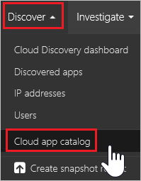
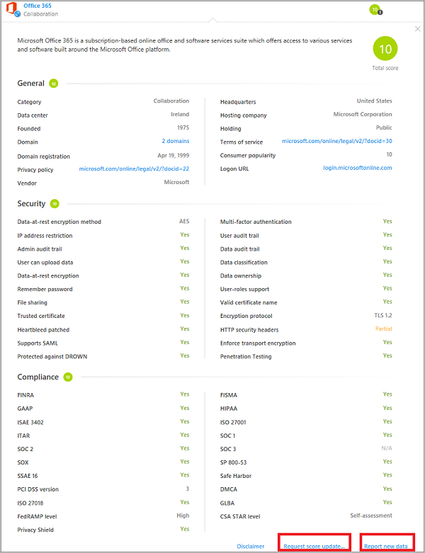
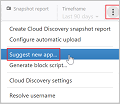

---
# required metadata

title: Working with the risk score | Microsoft Docs
description: This topic provides instructions for how to use and customize the Cloud App Security app risk score.
keywords:
author: rkarlin
ms.author: rkarlin
manager: mbaldwin
ms.date: 4/2/2017
ms.topic: article
ms.prod:
ms.service: cloud-app-security
ms.technology:
ms.assetid: 9cb3594e-5007-48be-9b4f-e1d23355d86e

# optional metadata

#ROBOTS:
#audience:
#ms.devlang:
ms.reviewer: reutam
ms.suite: ems
#ms.tgt_pltfrm:
#ms.custom:

---

# Working with the risk score  

## The Cloud app catalog

In order to better understand which cloud apps can be discovered by Cloud App Security's Cloud Discovery, use the Cloud App Catalog.

The Cloud App Catalog contains more than 14,000 SaaS applications that can be viewed (filtered) based on name, domain, risk score, category or available security features.

## Discovery requests

Information and risk scores in the Cloud app catalog are based on a variety of sources. Microsoft makes every effort to keep the information current but makes no guarantees as to the accuracy of all the data sources. 

Contact us if you believe information about an app is outdated.

-	Request score update – if you wish our team to reassess this cloud app.
-	Report new data (per specific field or general) – if you believe information about the app is outdated.

In addition, we encourage you to suggest the addition of any cloud apps that your organization uses that are not currently discoverable by Cloud Discovery.

## Customizing the risk score

Cloud Discovery provides you with important data regarding the credibility and reliability of the cloud apps that are used across the environment. Within the portal, each discovered app is displayed along with a total score, representing Cloud App Security's assessment of this particular app's maturity of use for enterprises. The total score of any given app is a weighted average of three sub-scores relating to the three sub-categories which Cloud App Security considers when assessing reliability:  
  
-   **General** - This category refers to basic facts about the company that produces the app, including its domain, founding year and popularity. These fields are meant to portray the company's stability on the most basic level.  
  
-   **Security** - The security category takes into account all standards dealing with the physical security of the data utilized by the discovered app. This includes fields such as multi-factor authentication, encryption, data classification and data ownership.  
  
-   **Compliance** - This category displays which common best-practice compliance standards are upheld by the company that produces the app. The list of specifications includes standards such as HIPAA, CSA and PCI-DSS.  
  
Each of the categories is comprised of many specific properties. According to our scoring algorithm, each property receives a preliminary score between 0 and 10, depending on the value. True/False values will receive 10 or 0 accordingly, whereas continuous properties such as domain age will receive a certain value within the spectrum. The score of each property is weighted against all other existing fields in the category, to create the category's sub-score. If you encounter an unscored app, it usually indicates an app whose properties are unknown and is therefore unscored.  
  
It is important to take a minute to review and modify the default weights given to the Cloud Discovery score configuration. By default, all the various parameters evaluated are given an equal weight. If there are certain parameters that are more or less important to your organization, it's important to change them as follows:  
  
1.  In the portal, under the settings icon, select **Cloud Discovery settings**.  
  
2.  Under **Configure score metric**, slide the **Importance** to change the weight of the field or the risk category to **Ignored**, **Low**, **Medium**, **High** or **Very High**.  
  
3.  In addition, you can set whether certain values are either not available or not applicable in the score calculation. When included, N/A values have a negative contribution to the calculated score.  
  
       

All the information needed in order to understand how our risk scores are stacking up is available in the Cloud App Security portal.
To better understand a risk factor’s weight in specific risk category, use the “i” button to the right of each field name in the app’s profile). This provides information about how exactly Cloud App Security scores a specific risk factor. The score is the value of the risk factor on a scale of 1-10 + its weight in the risk category:

  
In order to understand a risk category's weight in an app’s total score, hover over the risk category score:

 
## See Also  
[Daily activities to protect your cloud environment](daily-activities-to-protect-your-cloud-environment.md)   
[For technical support, please visit the Cloud App Security assisted support page.](http://support.microsoft.com/oas/default.aspx?prid=16031)   
[Premier customers can also choose Cloud App Security directly from the Premier Portal.](https://premier.microsoft.com/)  
  
  