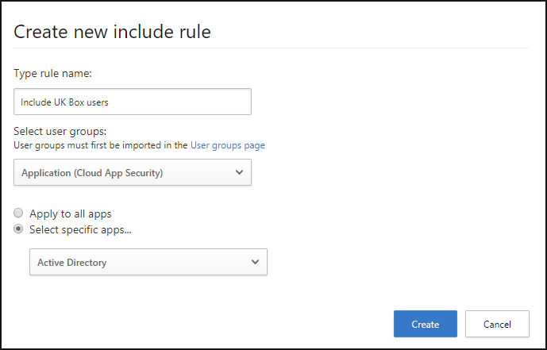
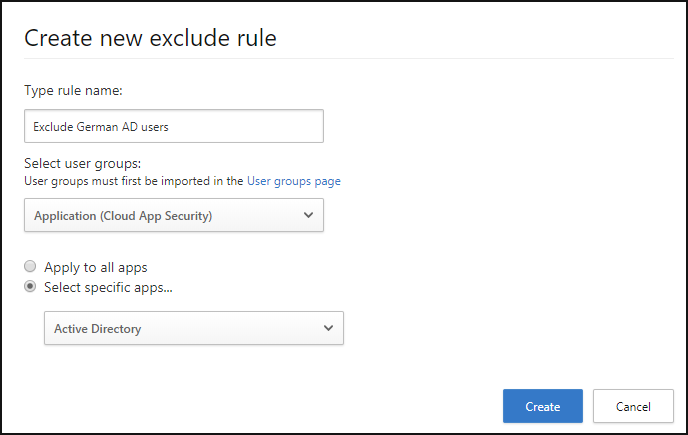

---
# required metadata

title: Scope your Microsoft Cloud App Security deployment | Microsoft Docs
description: This article provides information about how to scope your Cloud App Security deployment, including and excluding specific users or groups.
keywords:
author: rkarlin
ms.author: rkarlin
manager: mbaldwin
ms.date: 5/23/2018
ms.topic: get-started-article
ms.prod:
ms.service: cloud-app-security
ms.technology:
ms.assetid: fe2ce27b-1020-45e9-ad72-fad93d197169
# optional metadata

#ROBOTS:
#audience:
#ms.devlang:
ms.reviewer: reutam
ms.suite: ems
#ms.tgt_pltfrm:
#ms.custom:

---

*Applies to: Microsoft Cloud App Security*

# Scoped deployment  

Microsoft Cloud App Security enables you to scope your deployment so that only certain user groups are monitored, or so that specific user groups are excluded from monitoring.

You may not want to use Microsoft Cloud App Security for all the users in your organization. This is especially useful when you want to limit your deployment because of license restrictions, or because of compliance regulations that may require you not to monitor users from certain countries. Using the scoped deployment, you could, for example, only monitor US-based employees, or alternatively, avoid showing any activities for your German-based users. 

- To scope your deployment, you must first [import user groups](user-groups.md) to Microsoft Cloud App Security. By default, you will see the **Application** user group which is a built-in group that enables you to see activities performed by Office 365 and Azure AD applications and the **External users** group which consolidates all users who aren't within the [IP address ranges](ip-tags.md) you set for your organization.
- Setting an include rule will automatically exclude all groups not within the included group. For example, if you set a rule to include all members of the US-office groups, any groups who are not part of that group will not be monitored.
- Excluded user groups override included user groups. This means that if you include the user group "UK-employees" but exclude "Marketing", marketing members from teh UK will not be monitored even if they are members of the group "UK-employees".

1. In the menu bar, click the settings cog  and select **Scoped deployment**.  

2. In order to scope your deployment to include or exclude specific groups, you must first [import user groups](user-groups.md) into Microsoft Cloud App Security. 

3. To set specific groups to be monitored by Microsoft Cloud App Security, in the **Include** tab, click the plus . In the **Create new include rule** dialog, do the following:
    a. Under **Type rule name**, give the rule a descriptive name.
    b. Under **Select user groups** select all the groups you want to monitor with Cloud App Security.
    c. Select whether you want to apply this rule to all connected apps or only to **Specific apps**. If you select **Specific apps**, the rule will only affect monitoring of the apps you select. That means that if you select the group **UK-users** and **Box**, Cloud App Security will only monitor Box activity for users in the UK and for all other apps, Cloud App Security will monitor all activities for all users.
     
4. To set specific groups or users to be excluded from monitoring, in the **Exclude** tab, click the plus . In the **Create new include rule** dialog, do the following:
    a. Under **Type rule name**, give the rule a descriptive name.
    Under **Select user groups** select all the groups you do not want Cloud App Security to monitor.
    c. Select whether you want to apply this rule to all connected apps or only to **Specific apps**. If you select **Specific apps**, Cloud App Security will stop monitoring the group you selected only for the apps you select. That means that if you select the group **Germany-users** and **Active Directory**, Cloud App Security will monitor all user activity except Active Directory activities performed by users in Germany.
     

The include and exclude rules you create work together to scope the overall monitoring performed by Microsoft Cloud App Security.

Here's an example of include and exclude rules you can create, and the final result of what Microsoft Cloud App Security monitors after these rules are running:

  
    
## See Also  
[Set up Cloud Discovery](set-up-cloud-discovery.md)   

[Premier customers can also choose Cloud App Security directly from the Premier Portal.](https://premier.microsoft.com/)  
  
  