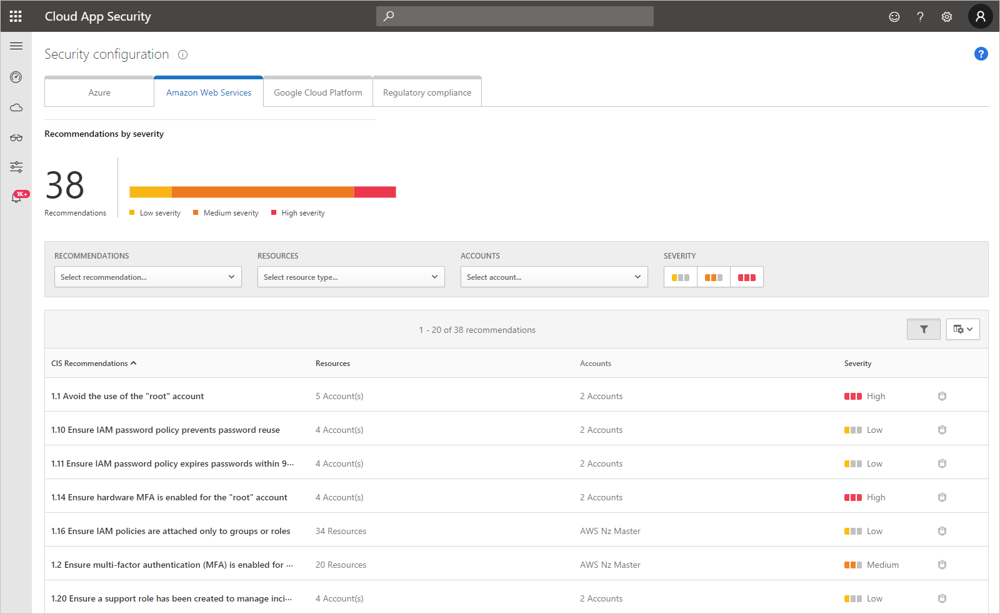

---
# required metadata

title: Get security configuration recommendations for AWS - Cloud App Security | Microsoft Docs
description: This article provides information about how to Get security configuration recommendations in Cloud App Security by integrating with Amazon Web Services.
keywords:
author: shsagir
ms.author: shsagir
manager: shsagir
ms.date: 8/1/2019
ms.topic: conceptual
ms.collection: M365-security-compliance
ms.prod:
ms.service: cloud-app-security
ms.technology:
ms.assetid: c6d8f8af-867b-43ab-adee-f06520577fe7

# optional metadata

#ROBOTS:
#audience:
#ms.devlang:
ms.reviewer: reutam
ms.suite: ems
#ms.tgt_pltfrm:
ms.custom: seodec18

---
# Security configuration for AWS

*Applies to: Microsoft Cloud App Security*

Microsoft Cloud App Security provides you with a security configuration assessment of your Amazon Web Services environment. This assessment provides fundamental security recommendations based on the Center for Internet Security (CIS) benchmark for AWS.

## Prerequisites

- AWS Security Hub must be set up for all your AWS account regions. For more information, see [Setting Up AWS Security Hub](https://go.microsoft.com/fwlink/?linkid=2100208).
    > [!NOTE]
    > If this is the first time you’re enabling Security Hub, it can take several hours for the initial data to become available.
- Your Amazon Web Services must be connected to Cloud App Security. For more information, see [Connect AWS to Microsoft Cloud App Security](connect-aws-to-microsoft-cloud-app-security.md).

## How to view AWS security recommendation

1. In Cloud App Security, browse to **Investigate** > **Security configuration**, and then select the **Amazon Web Services** tab.
    - Microsoft Cloud App Security provides recommendations for only the top 50 subscriptions.
    - It might take up to 15 minutes before your changes take effect.

     

1. You can filter the recommendations by type, by resource, and by accounts. Additionally, you can click on the security configuration icon  to open the recommendation in Amazon Security Hub for more information and to deep dive into the recommendation.

   

## Next steps 
[Control cloud apps with policies](control-cloud-apps-with-policies.md)

[!INCLUDE [Open support ticket](includes/support.md)]  
  
