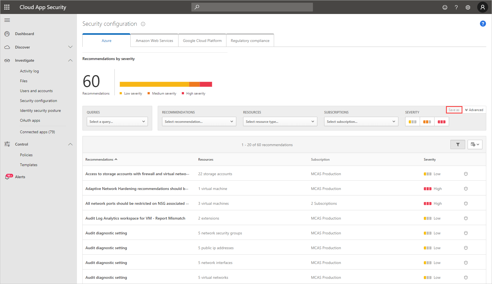

# Security configuration for Azure

[!INCLUDE [Banner for top of topics](includes/banner.md)]

Microsoft Cloud App Security provides you with a security configuration assessment of your Azure environment. The assessment, powered by Azure Security Center, provides recommendations for missing configuration and security controls.

## Prerequisites

Your organization must have Azure Security Center licenses for all subscriptions that you want to provide Azure security configuration assessments.

## How to enable Azure security recommendations

To enable security configuration recommendations in Cloud App Security, activate your Azure Security Center subscription by navigating to the <a href="https://ms.portal.azure.com/#blade/Microsoft_Azure_Security/SecurityMenuBlade/0" target="_blank">portal</a>.

## How to view Azure security recommendations

1. In Cloud App Security, browse to **Investigate** > **Security configuration**, and then select the **Azure** tab.

    > [!NOTE]
    > It might take up to 15 minutes before your changes take effect.

    

1. You can filter the recommendations by type, by resource, and by subscription. Additionally, you can click on the security configuration icon  to open the recommendation in Azure Security Center for more information and to deep dive into the recommendation.

    > [!NOTE]
    > To make investigation even simpler, you can create custom queries and save them for later use. After you've finished building your query, click the **Save as** button in the top right corner of the filters.  In the **Save query** pop-up, name your query.

    

For information about how to implement security recommendations, see [Managing security recommendations in Azure Security Center](/azure/security-center/security-center-recommendations).

## Next steps

> [!div class="nextstepaction"]
> [Control cloud apps with policies](control-cloud-apps-with-policies.md)

[!INCLUDE [Open support ticket](includes/support.md)]