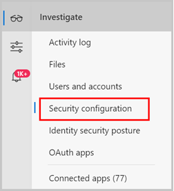
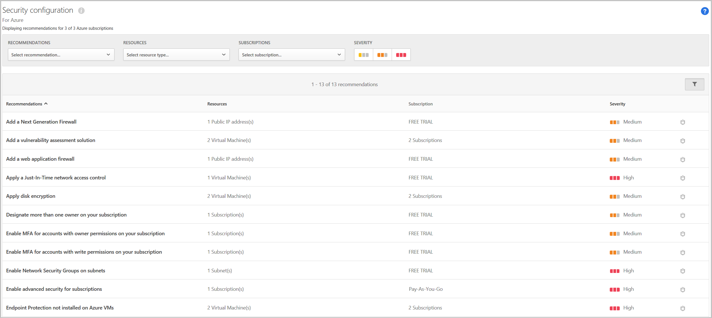

---
# required metadata

title: Get security configuration recommendations - Cloud App Security | Microsoft Docs
description: This article provides information about how to Get security configuration recommendations in Cloud App Security by integrating with Azure Security Center.
keywords:
author: rkarlin
ms.author: rkarlin
manager: rkarlin
ms.date: 12/10/2018
ms.topic: conceptual
ms.collection: M365-security-compliance
ms.prod:
ms.service: cloud-app-security
ms.technology:
ms.assetid: c6d8f8af-867b-43ab-adee-f06520577fe7

# optional metadata

#ROBOTS:
#audience:
#ms.devlang:
ms.reviewer: reutam
ms.suite: ems
#ms.tgt_pltfrm:
ms.custom: seodec18

---
# Security configuration

*Applies to: Microsoft Cloud App Security*

Microsoft Cloud App Security provides you with a security configuration assessment of your Azure environment. The assessment, powered by Azure Security Center, provides recommendations for missing configuration and security control.

## Enable security configuration recommendations

To use this feature, you need the appropriate permissions in Azure AD and in the Azure portal. By default, the Azure AD Global administrator role doesn't provide you with access to Azure subscriptions. Elevate your permissions to grant access to Azure subscriptions for yourself and other users.

> [!IMPORTANT]
> We recommend that you disable the elevation after you complete the following process.

To enable security configuration recommendations in Microsoft Cloud App Security:

1. <a href="https://docs.microsoft.com/azure/security-center/security-center-management-groups" target="_blank">Gain tenant-wide visibility for Azure Security Center</a>. This process includes:
   - Granting yourself and all the other Microsoft Cloud App Security administrators you want to grant access to this page, the role of Reader for all subscriptions.
   - Assigning the role on the root management group in Azure Security Center
   - Elevating your Azure AD Global administrator to grant access to Azure subscriptions.
   - The article describes the process for becoming a Security administrator. For this integration to work, the minimum permissions you need are **Reader**.

2. Make sure to open <a href="https://ms.portal.azure.com/#blade/Microsoft_Azure_Security/SecurityMenuBlade/0" target="_blank">Azure Security Center</a> for the changes to take effect.

3. In the Microsoft Cloud App Security portal, go to **Investigate** and then **Security configuration**. 
    - Microsoft Cloud App Security provides recommendations for only the top 50 subscriptions. 
    - It might take up to 15 minutes before your changes take effect.

     

4. You can filter the recommendations by type, by resource, and by subscription. Additionally, you can click on the security configuration icon  to open the recommendation in Azure Security Center for more information and to deep dive into the recommendation. 

For information about how to implement security recommendations, see [Managing security recommendations in Azure Security Center](https://docs.microsoft.com/azure/security-center/security-center-recommendations).

   

## Next steps 
[Control cloud apps with policies](control-cloud-apps-with-policies.md)

[Premier customers can also create a new support request directly in the Premier Portal.](https://premier.microsoft.com/)  
  
