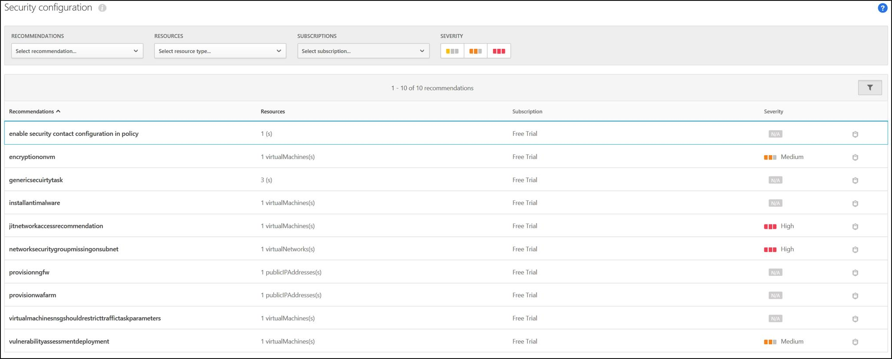

---
# required metadata

title: Get security configuration recommendations in Cloud App Security | Microsoft Docs
description: This article provides information about how to Get security configuration recommendations in Cloud App Security by integrating with Azure Security Center.
keywords:
author: rkarlin
ms.author: rkarlin
manager: mbaldwin
ms.date: 6/25/2018
ms.topic: article
ms.prod:
ms.service: cloud-app-security
ms.technology:
ms.assetid: c6d8f8af-867b-43ab-adee-f06520577fe7

# optional metadata

#ROBOTS:
#audience:
#ms.devlang:
ms.reviewer: reutam
ms.suite: ems
#ms.tgt_pltfrm:
#ms.custom:

---

*Applies to: Microsoft Cloud App Security*

# Security configuration

Microsoft Cloud App Security provides you with a security configuration assessment of your Azure environment, and provides recommendations for missing configuration and security control, powered by Azure Security Center. 

In order to use this feature you have to have the appropriate permissions in Azure AD and in the Azure portal.
 
By default, the Azure AD Global administrator role doesn't provide you with access to Azure subscriptions. Because of this, you need to elevate your permissions so that you can grant yourself and other users access to Azure subscriptions. 

> [!NOTE]
> We recommend that you disable the elevation after you complete the following process.

To enable security configuration recommendations in Microsoft Cloud App Security:

1. Elevate your Azure AD Global administrator to grant access to Azure subscriptions. Instructions for how to do this can be found in [Elevate access for a global administrator in Azure Active Directory](https://docs.microsoft.com/azure/role-based-access-control/elevate-access-global-admin). 

2. After you are elevated, grant yourself, and all the other Microsoft Cloud App Security administrators to whom you want to grant access to this page, the role of Reader for all subscriptions. This is done by integrating with [management groups in Azure Security Center](https://docs.microsoft.com/azure/security-center/security-center-azure-policy#management-groups) 

   > [!NOTE]
   > The article describes the process for becoming a Security administrator. For this integration to work, the minimum permissions you need are Security reader.

3. Open [Azure Security Center](https://ms.portal.azure.com/#blade/Microsoft_Azure_Security/SecurityMenuBlade/0) once for the changes to take effect.

4. In the Microsoft Cloud App Security portal, go to **Investigate** and then **Security configuration**. 

   

   > [!NOTE]
   > Microsoft Cloud App Security provides recommendations for only the top 50 subscriptions.
   > It might take up to 15 minutes before your changes take effect.

5. You can filter the recommendations by type, by resource and by subscription. In addition, you can click on the security configuration icon  to open the recommendation in Azure Security Center for more information and to deep dive into the recommendation.     For information about how to implement security recommendations, see [Managing security recommendations in Azure Security Center](https://docs.microsoft.com/azure/security-center/security-center-recommendations).

 
   

 

## See Also  
[Control cloud apps with policies](control-cloud-apps-with-policies.md)   

[Premier customers can also choose Cloud App Security directly from the Premier Portal.](https://premier.microsoft.com/)  
  
