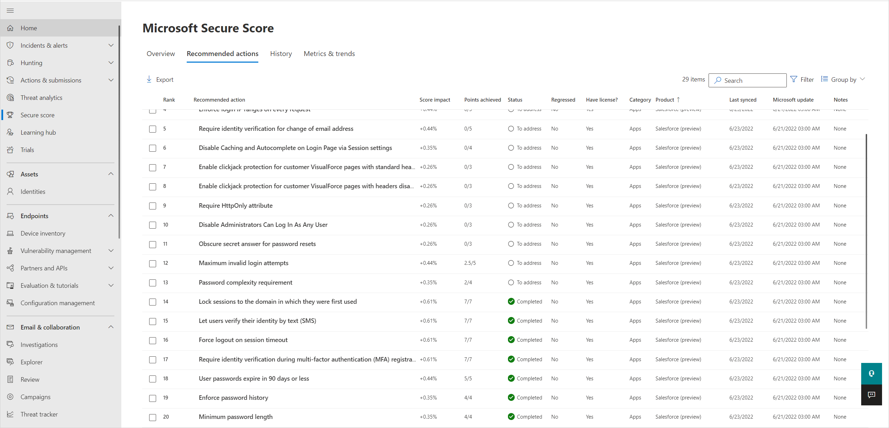
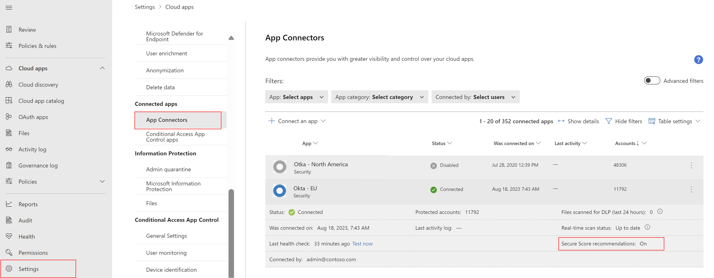
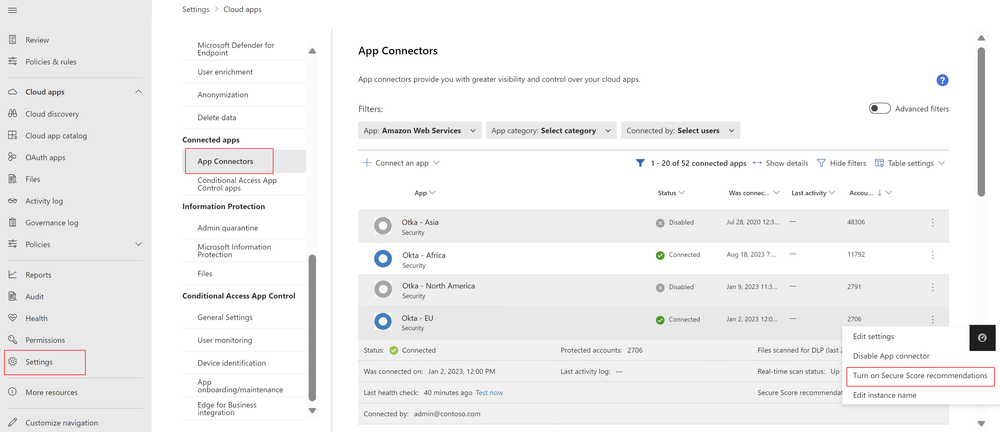
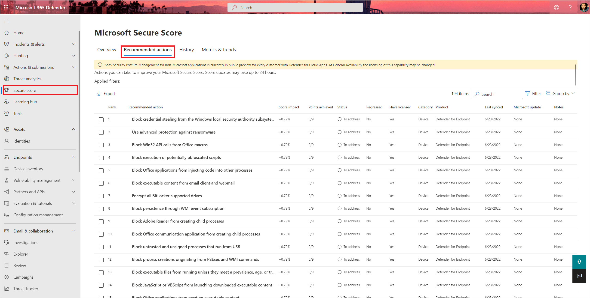

# Security posture management for SaaS apps

[!INCLUDE [Banner for top of topics](includes/banner.md)]

Your SaaS application environments may be configured in a risky posture. Microsoft Defender for Cloud Apps provides you with risk security configuration assessments for your SaaS applications to make sure you prevent possible risks. These recommendations are shown via [Microsoft Secure Score](/microsoft-365/security/defender-endpoint/tvm-security-recommendation) once you have a connector to an application.

   

## Prerequisites

Your organization must have Microsoft Defender for Cloud Apps licenses.

## How to enable SaaS apps security posture management

1. You should connect the app that you want to manage to Defender for Cloud Apps. For connection guides to every app, see the [connecting an app pages](enable-instant-visibility-protection-and-governance-actions-for-your-apps.md).

    >[!NOTE]
    >
    > - Currently only Salesforce and ServiceNow are supported with SaaS Security Posture Management Capabilities.
    > - It's possible to configure one instance for each app.

1. After you connected the application via Defender for Cloud Apps, make sure the connector is set to show data in Microsoft Secure Score. To verify it, in the Microsoft 365 Defender portal, select **Settings**. Then choose **Cloud Apps**. Under **Connected apps**, choose **App Connectors**. Then open the instance drawer and make sure there is a field **Secure Score insights: Main instance**.

    

1. If the instance is not set as the Secure Score main instance, you can set it by selecting the three dots and selecting **Set as Microsoft Secure Score instance**.

    

## How to manage your SaaS apps security posture

1. The security recommendations will be shown automatically in [Microsoft Secure Score](/microsoft-365/security/defender/microsoft-secure-score). Navigate to the [Microsoft 365 Defender portal](https://security.microsoft.com). Under the navigation bar, select **Secure score**, and go to **Recommended actions** tab.

    

1. Filter the desired **product** to see its security controls.
1. When selecting the control, you'll find its description and status.
1. To see a step-by-step remediation guide for risky controls, go to the **Implementation** tab in the control side pane.

    

>[!NOTE]
>
> - The recommendations are based on Microsoft benchmarks.
> - Score updates may take up to 24 hours.

## Next steps

> [!div class="nextstepaction"]
> [Control cloud apps with policies](control-cloud-apps-with-policies.md)

[!INCLUDE [Open support ticket](includes/support.md)]
