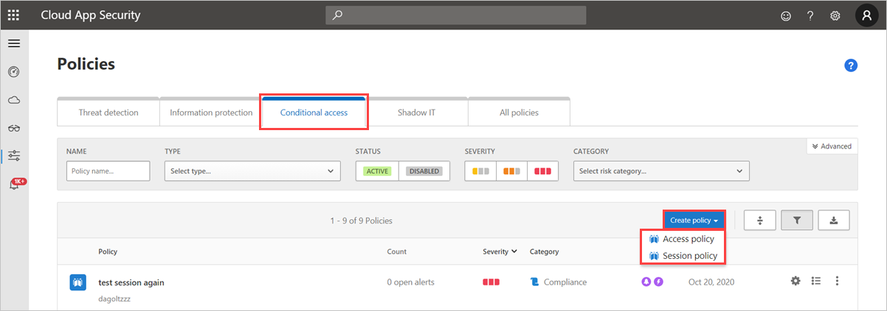
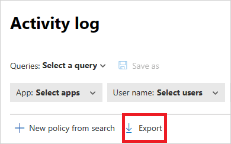
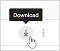

# Session policies

[!INCLUDE [Banner for top of topics](includes/banner.md)]

Microsoft Defender for Cloud Apps session policies enable real-time session-level monitoring, affording you granular visibility into cloud apps and the ability to take different actions depending on the policy you set for a user session. Instead of [allowing or blocking access completely](access-policy-aad.md), with session control you can allow access while monitoring the session and/or limit specific session activities using the reverse proxy capabilities of Conditional Access App Control.

For example, you can decide that from unmanaged devices, or for sessions coming from specific locations, you want to allow the user to access the app but also limit the download of sensitive files or require that certain documents be protected upon download. Session policies enable you to set these user-session controls and allow access and enables you to:

* [Monitor all activities](#monitor-session)
* [Block all downloads](#block-download)
* [Block specific activities](#block-activities)
* [Require step-up authentication (authentication context)](#require-step-up-authentication-authentication-context)
* [Protect files on download](#protect-download)
* [Protect uploads of sensitive files](#protect-upload)
* [Block malware on upload](#block-malware-on-upload)
* [Educate users to protect sensitive files](#educate-protect)

> [!NOTE]
> - There is no limit to the number of policies that can be applied.
> - There's no connection between a policy that you create for a host app and any related resource apps. For example, session policies that you create for Teams, Exchange, or Gmail, are not connected to Sharepoint, OneDrive, or Google Drive. If you need a policy for the resource app in addition to the host app, create a separate policy.

## Prerequisites to using session policies

* Defender for Cloud Apps license (stand-alone or part of another license)
* A license for Azure AD Premium P1 (as a stand-alone license or as an E5 license), or the license required by your identity provider (IdP) solution
* The relevant apps should be [deployed with Conditional Access App Control](proxy-deployment-aad.md)
* Make sure you've configured your IdP solution to work with Defender for Cloud Apps, as follows:
  * For [Azure AD Conditional Access](/azure/active-directory/conditional-access/overview), see [Configure integration with Azure AD](proxy-deployment-aad.md#configure-integration-with-azure-ad)
  * For other IdP solutions, see [Configure integration with other IdP solutions](proxy-deployment-featured-idp.md#configure-integration-with-other-idp-solutions)

## Create a Defender for Cloud Apps session policy

To create a new session policy, follow this procedure:

1. In the Microsoft 365 Defender portal, under **Cloud Apps**, go to **Policies** -> **Policy management**. Then select the **Conditional access** tab.

1. Select **Create policy** and select **Session policy**.

1.  

1. In the **Session policy** window, assign a name for your policy, such as *Block Download of Sensitive Documents in Box for Marketing Users*.

1. In the **Session control type** field:

   - Select **Monitor only** if you only want to monitor activities by users. This selection will create a Monitor only policy for the apps you selected where all sign-ins.
   - Select **Control file download (with inspection)** if you want to monitor user activities. You can take additional actions like block or protect downloads for users.
   - Select **Block activities** to block specific activities, which you can select using the **Activity type** filter. All activities from selected apps  will be monitored (and reported in the Activity log). The specific activities you select will be blocked if you select the **Block** action. The specific activities you selected will raise alerts if you select the **Test** action and have alerts turned on.
   1. Under **Activity source** in the **Activities matching all of the following** section, select additional activity filters to apply to the policy. These filters can include the following options:

    * **Device tags**: Use this filter to identify unmanaged devices.
    * **Location**: Use this filter to identify unknown (and therefore risky) locations.
    * **IP address**: Use this filter to filter per IP addresses or use previously assigned IP address tags.
    * **User agent tag**: Use this filter to enable the heuristic to identify mobile and desktop apps. This filter can be set to equals or doesn't equal **Native client**. This filter should be tested against your mobile and desktop apps for each cloud app.
    * **Activity type**: Use this filter to select specific activities to be controlled, such as:
      * Print
      * Clipboard actions: Copy, Cut and Paste
      * Send items in apps such as Teams, Slack and Salesforce
      * Share and unshare items in various apps
      * Edit items in various apps
          > [!NOTE]
          > Session policies don't support mobile and desktop apps. Mobile apps and desktop apps can also be blocked or allowed by creating an access policy.
    1. If you selected the option to **Control file download (with inspection)**:

       - Under **Activity source** in the **Files matching all of the following** section, select additional file filters to apply to the policy. These filters can include the following options:

            * **Sensitivity label** - Use this filter if your organization uses Microsoft Purview Information Protection and your data has been protected by its sensitivity labels. You can filter files based on the sensitivity label you applied to them. For more information about integration with Microsoft Purview Information Protection, see [Microsoft Purview Information Protection integration](azip-integration.md).
                  * **File name** - Use this filter to apply the policy to specific files.
                        * **File type** - Use this filter to apply the policy to specific file types, for example, block download for all .xls files.
                        
   . In the **Content inspection** section, set whether you want to enable the DLP engine to scan documents and file content.

   . Under **Actions**, select one of the following items:

      * **Test (Monitor all activities)**: Set this action to explicitly allow download according to the policy filters you set.
      * **Block (Block file download and monitor all activities)**: Set this action to explicitly block download according to the policy filters you set. For more information, see [How block download works](#block-download).
      * **Protect (Apply sensitivity label to download and monitor all activities)**: This option is only available if you selected **Control file download (with inspection)** under **Session policy**. If your organization uses Microsoft Purview Information Protection, you can set an **Action** to apply a sensitivity label set in Microsoft Purview Information Protection to the file. For more information, see [How protect download works](#protect-download).
      1. You can **Create an alert for each matching event with the policy's severity** and set an alert limit. Select if you want the alert as an email.

      1. **Notify users**: When you create a session policy, each user session that matches the policy is redirected to session control rather than to the app directly. The user will see a monitoring notice to let them know that their sessions are being monitored.

            If you don't want to notify the user that they're being monitored, you can disable the notification message.

               1. In the Microsoft 365 Defender portal, select **Settings**. Then choose **Cloud Apps**.

                  1. Then, under **Conditional Access App Control** select **User monitoring** and unselect the **Notify users** checkbox.

      1. **Monitor logs**
            To keep the user within the session, Conditional Access App Control replaces all the relevant URLs, Java scripts, and cookies within the app session with Microsoft Defender for Cloud Apps URLs. For example, if the app returns a page with links whose domains end with myapp.com, Conditional Access App Control replaces the links with domains ending with something like `myapp.com.mcas.ms`. This way the entire session is monitored by Microsoft Defender for Cloud Apps.

            Conditional Access App Control records the traffic logs of every user session that is routed through it. The traffic logs include the time, IP, user agent, URLs visited, and the number of bytes uploaded and downloaded. These logs are analyzed and a continuous report, **Defender for Cloud Apps Conditional Access App Control**, is added to the list of Cloud Discovery reports in the Cloud Discovery dashboard.

            To export these logs:

               1. In the Microsoft 365 Defender portal, select **Settings**. Then choose **Cloud Apps**. Under **Connected apps**, select **Conditional Access App Control**.

               1. Above the table, select the export button.

               1.  

                  1. Select the range of the report and select **Export**. This process may take some time.

                  To download the exported log:

                        1. After the report is ready, in the Microsoft 365 Defender portal go to ***Reports** -> **Cloud Apps** and then **Exported reports**.

                        1. In the table, select the relevant report from the list of **Conditional Access App Control traffic logs** and select **Download**.

                        1.  

      ## Monitor all

      **Monitor all** activity will monitor only one activity, "Login". No alerts will be sent. In order to monitor all the activities, use the 'monitor all activities' template. The activities in this case will be monitored & logged, regardless of whether the policy matches or not. There must be at least one block\test policy per activity for the 'Monitor all activities' policy to work.

      ## Block all downloads

      When **Block** is set as the **Action** you want to take in the Defender for Cloud Apps session policy, Conditional Access App Control prevents a user from downloading a file per the policy's file filters. A download event is recognized by Microsoft Defender for Cloud Apps for each app when a user starts a download. Conditional Access App Control intervenes in real time to prevent it from running. When the signal is received that a user has initiated a download, Conditional Access App Control returns a **Download restricted** message to the user and replaces the downloaded file with a text file. The text file's message to the user can be configured and customized from the session policy.

      ## Require step-up authentication (authentication context)

      When **Session control type** is set to **Block activities, Control file download (with inspection), Control file upload (with inspection)**, you can select an **Action** of **Require step-up authentication**. When this action is selected, Defender for Cloud Apps will redirect the session to Azure AD Conditional Access for policy re-evaluation, whenever the selected activity occurs. Based on the configured authentication context in Azure AD, claims such as multi-factor authentication and device compliance can be checked during a session.

      ## Block specific activities

      When **Block activities** is set as the **Activity type**, you can select specific activities to block in specific apps. All activities from selected apps will be monitored and reported in the Activity log. The specific activities you select will be blocked if you select the **Block** action. The specific activities you selected will raise alerts if you select the **Test** action and have alerts turned on.

      Examples of blocked activities include:

      * **Send Teams message**: Use it to block messages sent from Microsoft Teams, or block Teams messages containing specific content
* **Print**: Use it to block Print actions
* **Copy**: Use it to block copy to clipboard actions or only block copy for specific content

      **Block specific activities** and apply it to specific groups to create a comprehensive read-only mode for your organization.

      ## Protect files on download

      Select **Block activities** to block specific activities, which you can find using the **Activity type** filter. All activities from selected apps will be monitored (and reported in the Activity log). The specific activities you select will be blocked if you select the **Block** action. The specific activities you selected will raise alerts if you select the **Test** action and have alerts turned on.

      When **Protect** is set as the **Action** to be taken in the Defender for Cloud Apps session policy, Conditional Access App Control enforces the labeling and subsequent protection of a file per the policy's file filters. Labels are configured in the Microsoft Purview compliance portal and the label must be configured to apply encryption for it to appear as an option in the Defender for Cloud Apps policy. When a label is selected, and a file is downloaded that meets the criteria of the Defender for Cloud Apps policy, the label, and corresponding protection (with permissions) is applied to the file upon download. The original file remains as-is in the cloud app while the downloaded file is now protected. Users who try to access the file must meet the permission requirements determined by the protection applied.

      Defender for Cloud Apps currently supports applying [sensitivity labels from Microsoft Purview Information Protection](azip-integration.md) for the following file types:

      * Word: docm, docx, dotm, dotx
* Excel: xlam, xlsm, xlsx, xltx
* PowerPoint: potm, potx, ppsx, ppsm, pptm, pptx
* PDF
  > [!NOTE]
  > For PDF, you must use unified labels.

      ## Protect uploads of sensitive files

      When **Control file upload (with inspection)** is set as the **Session Control type** in the Defender for Cloud Apps session policy, Conditional Access App Control prevents a user from uploading a file per the policy's file filters. When an upload event is recognized, Conditional Access App Control intervenes in real time to determine whether the file is sensitive and needs protection. If the file has sensitive data and doesn't have a proper label, the file upload is blocked.

      For example, you can create a policy that scans the content of a file to determine if it contains a sensitive content match such as a social security number. If it contains sensitive content and isn't labeled with a Microsoft Purview Information Protection confidential label, the file upload is blocked. When the file is blocked, you can [display a custom message to the user](#educate-protect) instructing them on how to label the file in order to upload it. By doing so, you ensure that files stored in your cloud apps comply with your policies.

      ## Block malware on upload

      When **Control file upload (with inspection)** is set as the **Session Control type** and **Malware Detection** is set as the **Inspection Method** in the Defender for Cloud Apps session policy, Conditional Access App Control prevents a user from uploading a file in real time if malware is detected. Files are scanned using the Microsoft threat intelligence engine.

      You can view the files flagged as potential malware using the **Potential Malware Detected** filter in the activity log.

      You can also configure session policies to block malware on download.

      ## Educate users to protect sensitive files

      It's important to educate users when they are in violation of a policy so that they learn how to comply with your organizational policies. Since every enterprise has unique needs and policies, Defender for Cloud Apps allows you to customize a policy's filters and the message it displays to the user when a violation is detected. You can give specific guidance to your users such as providing instructions on how to appropriately label a file, or how to enroll an unmanaged device, to ensure files are uploaded successfully.

      For example, if a user uploads a file without a sensitivity label, a message can be displayed explaining that the file contains sensitive content that requires an appropriate label. Similarly, if a user attempts to upload a document from an unmanaged device, a message with instructions on how to enroll that device or one that provides further explanation of why the device must be enrolled, can be displayed.

      ## Conflicts between policies

      When there is a conflict between two policies, the more restrictive policy wins. 
For example:
      - If a user session is scoped to a **Block download** policy and to a **Label upon download** policy, the file download action will be blocked.

      - If a user session is scoped to a **Block download** policy and to an **Audit download** policy, the file download action will be blocked.

      ## Related videos

      > [!div class="nextstepaction"]
> [Conditional Access App Control webinar](webinars.md#on-demand-webinars)

      ## Next steps

      >[!div class="nextstepaction"]
> [« PREVIOUS: Onboard and deploy Conditional Access App Control for any app »](proxy-deployment-any-app.md)

      >[!div class="nextstepaction"]
> [NEXT: How to create an access policy »](access-policy-aad.md)

      > [!div class="nextstepaction"]
> [Troubleshooting access and session controls](troubleshooting-proxy.md)

      ## See also

      > [!div class="nextstepaction"]
> [Blocking downloads on unmanaged devices using Azure AD Conditional Access App Control](use-case-proxy-block-session-aad.md)

      [!INCLUDE [Open support ticket](includes/support.md)]
