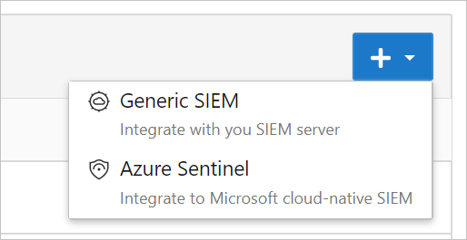
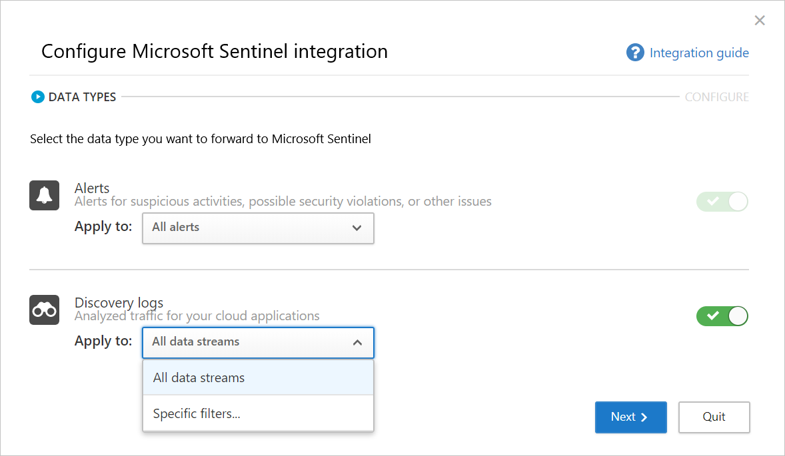
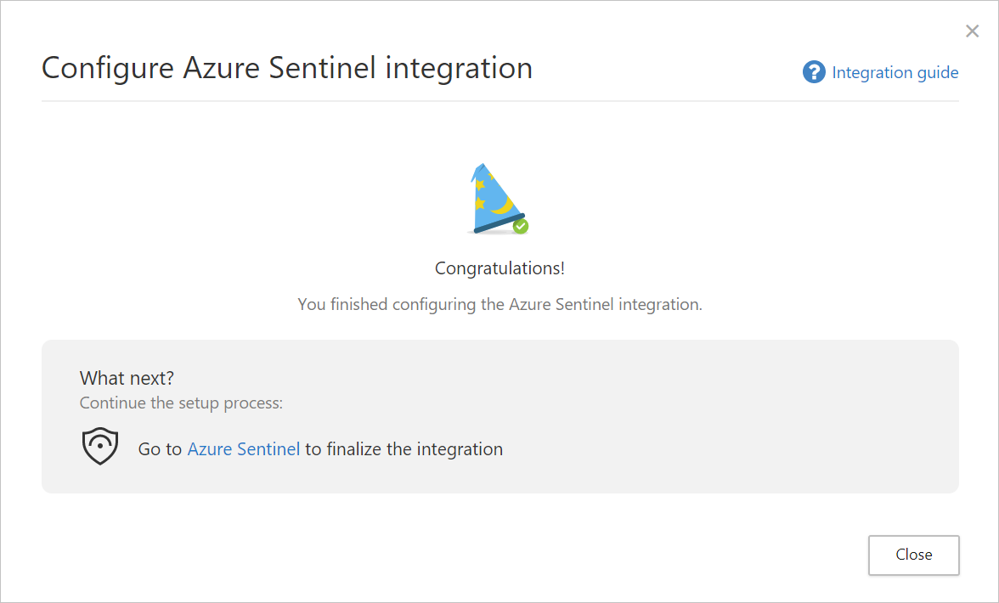
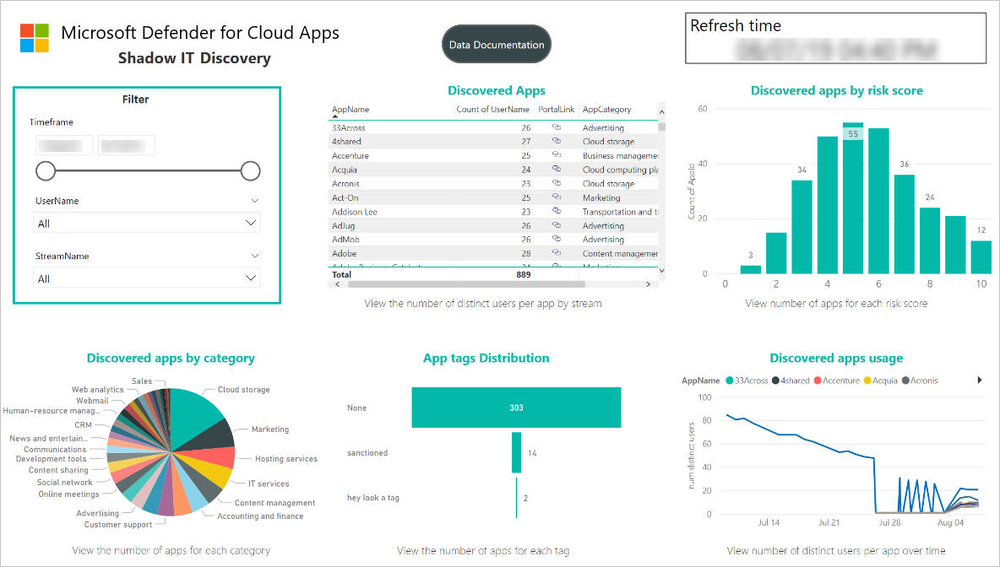
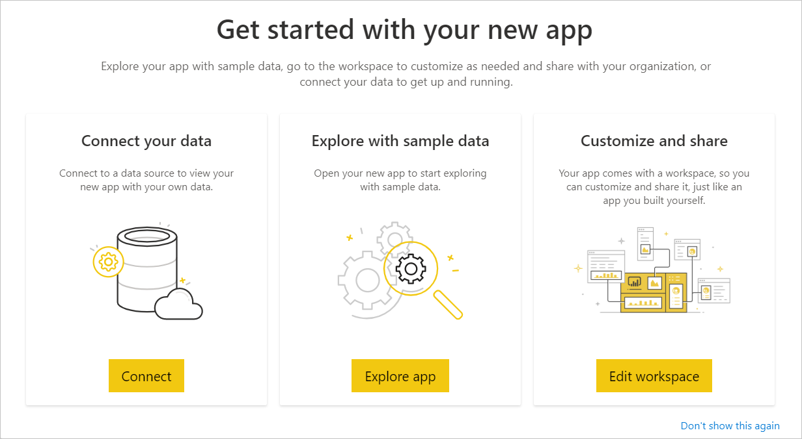
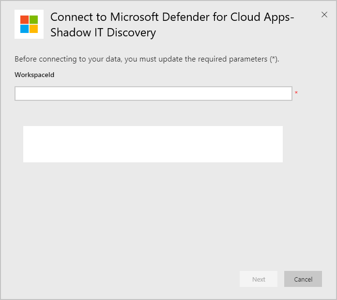
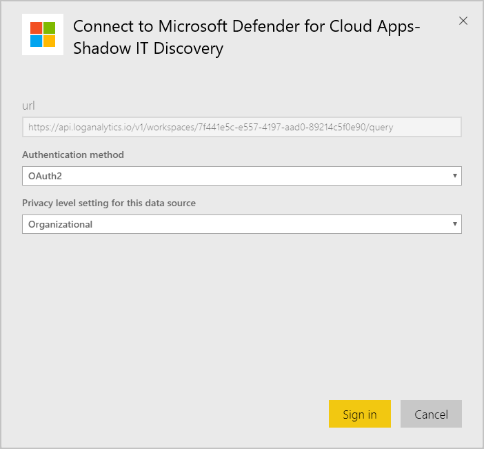

# Microsoft Sentinel integration (Preview)

[!INCLUDE [Banner for top of topics](includes/banner.md)]

You can integrate Microsoft Defender for Cloud Apps with Microsoft Sentinel (a scalable, cloud-native SIEM and SOAR) to enable centralized monitoring of alerts and discovery data. Integrating with Microsoft Sentinel allows you to better protect your cloud applications while maintaining your usual security workflow, automating security procedures, and correlating between cloud-based and on-premises events.

Benefits of using Microsoft Sentinel include:

* Longer data retention provided by Log Analytics.
* Out-of-the-box visualizations.
* Use tools such as Microsoft Power BI or Microsoft Sentinel workbooks to create your own discovery data visualizations that fit your organizational needs.

Additional integration solutions include:

* **Generic SIEMs** - Integrate Defender for Cloud Apps with your generic SIEM server. For information in integrating with a Generic SIEM, see [Generic SIEM integration](siem.md).
* **Microsoft security graph API** - An intermediary service (or broker) that provides a single programmatic interface to connect multiple security providers. For more information, see [Security solution integrations using the Microsoft Graph Security API](/graph/security-integration#list-of-connectors-from-microsoft).

Integrating with Microsoft Sentinel includes configuration in both Defender for Cloud Apps and Microsoft Sentinel.

## Prerequisites

To integrate with Microsoft Sentinel:

* You must have a valid Microsoft Sentinel license
* You must be a Global Administrator or a Security Administrator in your tenant.

### US Government support

The direct Defender for Cloud Apps - Microsoft Sentinel integration is available to commercial customers only.

However, all Defender for Cloud Apps data is available in Microsoft 365 Defender, and therefore available in Microsoft Sentinel via the Microsoft 365 Defender connector.

We recommend that GCC, GCC High, and DoD customers who are interested in seeing Defender for Cloud Apps data in Microsoft Sentinel install the Microsoft 365 Defender solution.

For more information, see:

- [Microsoft 365 Defender integration with Microsoft Sentinel](/azure/sentinel/microsoft-365-defender-sentinel-integration)
- [Microsoft Defender for Cloud Apps for US Government offerings](editions-cloud-app-security-gcc.md)

### Integrating with Microsoft Sentinel

1. In the Microsoft 365 Defender portal, select **Settings > Cloud Apps**.

1. Under **System**, select **SIEM agents > Add SIEM agent > Sentinel**. For example:

    

    > [!NOTE]
    > The option to add Microsoft Sentinel is not available if you have previously performed the integration.

1. In the wizard, select the data types you want to forward to Microsoft Sentinel. You can configure the integration, as follows:
    - **Alerts**: Alerts are automatically turned on once Microsoft Sentinel is enabled.
    - **Discovery logs**: Use the slider to enable and disable them, by default, everything is selected, and then use the **Apply to** drop-down to filter which discovery logs are sent to Microsoft Sentinel.

    For example:

    

1. Select **Next**, and continue to Microsoft Sentinel to finalize the integration. For information on configuring Microsoft Sentinel, see [the Microsoft Sentinel data connector for Defender for Cloud Apps](/azure/sentinel/data-connectors-reference#microsoft-defender-for-cloud-apps). For example:

    

> [!NOTE]
> New discovery logs will usually appear in Microsoft Sentinel within 15 minutes of configuring them in the Defender for Cloud Apps portal. However, it may take longer depending on system environment conditions. For more information, see [Handle ingestion delay in analytics rules](/azure/sentinel/ingestion-delay).

## Alerts and discovery logs in Microsoft Sentinel

Once the integration is completed, you can view Defender for Cloud Apps alerts and discovery logs in Microsoft Sentinel.

In Microsoft Sentinel, under **Logs**, under **Security Insights**, you can find the logs for the Defender for Cloud Apps data types, as follows:

| Data type | Table |
| --- | --- |
| Discovery logs | McasShadowItReporting |
| Alerts | SecurityAlert |

The following table describes each field in the **McasShadowItReporting** schema:

| Field | Type | Description | Examples |
| --- | --- | --- | --- |
| **TenantId** | String | Workspace ID | b459b4u5-912x-46d5-9cb1-p43069212nb4 |
| **SourceSystem** | String | Source system – static value | Azure |
| **TimeGenerated [UTC]** | DateTime | Date of discovery data | 2019-07-23T11:00:35.858Z |
| **StreamName** | String | Name of the specific stream | Marketing Department |
| **TotalEvents** | Integer | Total number of events per session | 122 |
| **BlockedEvents** | Integer | Number of blocked events | 0 |
| **UploadedBytes** | Integer | Amount of uploaded data | 1,514,874 |
| **TotalBytes** | Integer | Total amount of data | 4,067,785 |
| **DownloadedBytes** | Integer | Amount of downloaded data | 2,552,911 |
| **IpAddress** | String | Source IP address | 127.0.0.0 |
| **UserName** | String | User name | `Raegan@contoso.com` |
| **EnrichedUserName** | String | Enriched user name with Azure AD username | `Raegan@contoso.com` |
| **AppName** | String | Name of cloud app | Microsoft OneDrive for Business |
| **AppId** | Integer | Cloud app identifier | 15600 |
| **AppCategory** | String | Category of cloud app | Cloud storage |
| **AppTags** | String array | Built-in and custom tags defined for the app | ["sanctioned"] |
| **AppScore** | Integer | The risk score of the app in a scale 0-10, 10 being  a score for a non-risky app | 10 |
| **Type** | String | Type of logs – static value | McasShadowItReporting |

## Use Power BI with Defender for Cloud Apps data in Microsoft Sentinel

Once the integration is completed, you can also use the Defender for Cloud Apps data stored in Microsoft Sentinel in other tools.

This section describes how you can use Microsoft Power BI to easily shape and combine data to build reports and dashboards that meet the needs of your organization.

To get started:

1. In Power BI, import queries from Microsoft Sentinel for Defender for Cloud Apps data. For more information, see [Import Azure Monitor log data into Power BI](/azure/azure-monitor/logs/log-powerbi).
1. [Install the Defender for Cloud Apps Shadow IT Discovery app](https://aka.ms/MCASShadowITReporting) and [connect it](#connect-the-defender-for-cloud-apps-app) to your discovery log data to view the built-in Shadow IT Discovery dashboard.

    > [!NOTE]
    > Currently, the app is not published on Microsoft AppSource. Therefore, you may need to contact your Power BI admin for permissions to install the app.

    For example:
    
    

1. Optionally, build custom dashboards in Power BI Desktop and tweak it to fit the visual analytics and reporting requirements of your organization.

### Connect the Defender for Cloud Apps app

1. In Power BI, select **Apps > Shadow IT Discovery** app.

1. On the **Get started with your new app** page, select **Connect**. For example:

    

1. On the workspace ID page, enter your Microsoft Sentinel workspace ID as displayed in your log analytics overview page, and then select **Next**. For example:

    

1. On the authentication page, specify the authentication method and privacy level, and then select **Sign in**. For example:

    

1. After connecting your data, go to the workspace **Datasets** tab and select **Refresh**. This will update the report with your own data.

[!INCLUDE [Open support ticket](includes/support.md)]
