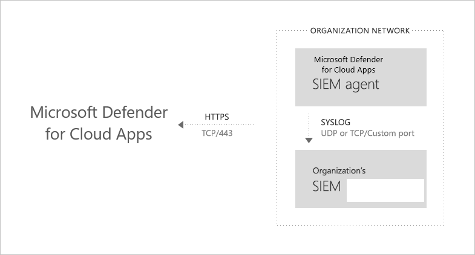
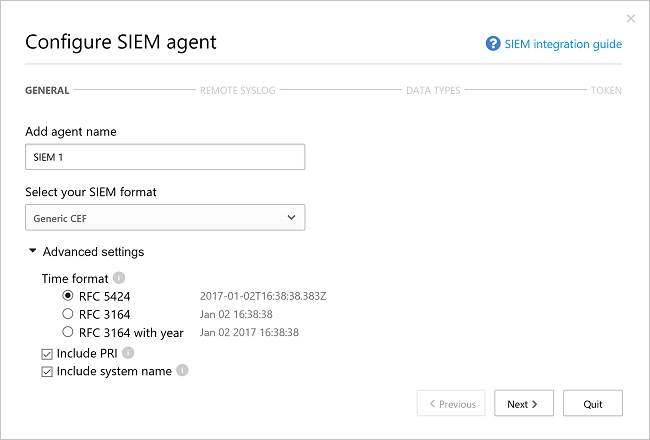
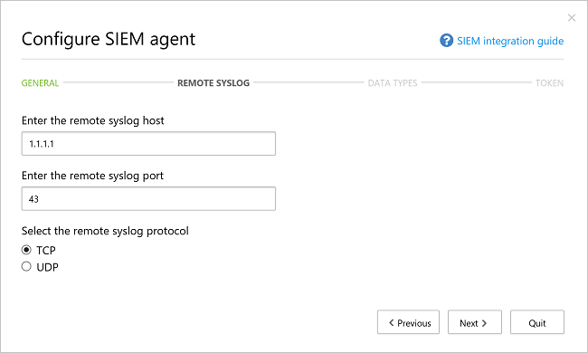
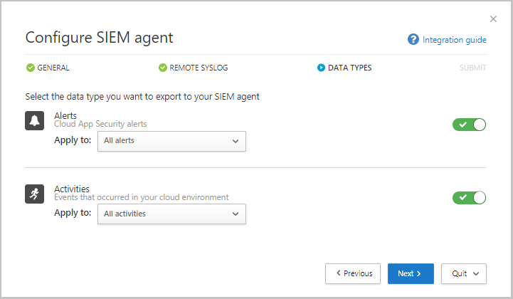
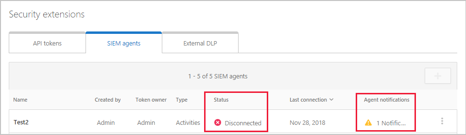
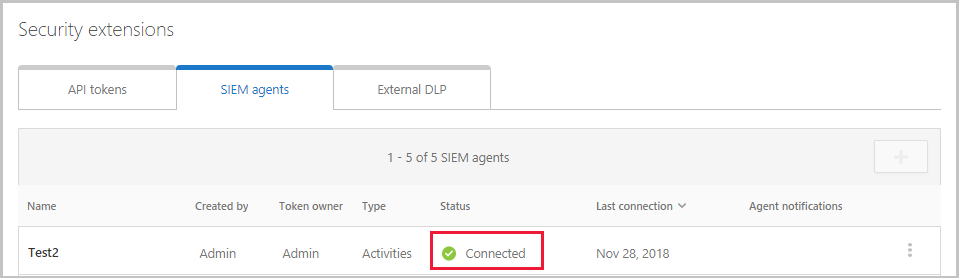
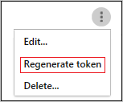
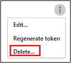

---
# required metadata

title: SIEM integration with Cloud App Security | Microsoft Docs
description: This topic provides information integrating your SIEM with Cloud App Security.
keywords:
author: rkarlin
ms.author: rkarlin
manager: mbaldwin
ms.date: 7/23/2017
ms.topic: article
ms.prod:
ms.service: cloud-app-security
ms.technology:
ms.assetid: 4649423b-9289-49b7-8b60-04b61eca1364


# optional metadata

#ROBOTS:
#audience:
#ms.devlang:
ms.reviewer: reutam
ms.suite: ems
#ms.tgt_pltfrm:
#ms.custom:

---

# SIEM integration
    
You can now integrate Cloud App Security with your SIEM server to enable centralized monitoring of Office 365 alerts and activities. As new activities and events are supported by Office 365, visibility into them is then rolled out into Cloud App Security. Integrating with a SIEM service allows you to better protect your cloud applications while maintaining your usual security workflow, automating security procedures and correlating between cloud-based and on-premises events. The Cloud App Security SIEM agent runs on your server and pulls alerts and activities from Cloud App Security and streams them into the SIEM server.

When you first integrate your SIEM with Cloud App Security, activities and alerts from the last two days will be forwarded to the SIEM and all activities and alerts (based on the filter you select) from then on. Additionally, if you disable this feature for an extended period, when you enable it again it will forward the past two days of alerts and activities and then all alerts and activities from then on.

## SIEM integration architecture

The SIEM agent is deployed in your organization’s network. When deployed and configured, it pulls the data types that were configured (alerts and activities) using Cloud App Security RESTful APIs.
The traffic is then sent over an encrypted HTTPS channel on port 443.

Once the SIEM agent retrieves the data from Cloud App Security, it sends the Syslog messages to your local SIEM using the network configurations you provided during the setup (TCP or UDP with a custom port). 




## How to integrate

Integrating with your SIEM is accomplished in three steps:
1. Set it up in the Cloud App Security portal. 
2. Download the JAR file and run it on your server.
3. Validate that the SIEM agent is working.

### Prerequisites

- A standard Windows or Linux server (can be a virtual machine).
- The server must be running Java 8; earlier versions are not supported.

## Integrating with your SIEM

### Step 1: Set it up in the Cloud App Security portal

1. In the Cloud App Security portal, under the Settings cog, click **Security extensions** and then click on the **SIEM agents** tab.

2. Click the plus icon to start the **Add SIEM agent** wizard.
3. In the wizard, click **Add SIEM agent**.	
4. In the wizard, fill in a name, and **Select your SIEM format** and set any **Advanced settings** that are relevant to that format. 
Click **Next**.

   

5. Type in the IP address or hostname of the **Remote syslog host** and the **Syslog port number**. Select TCP or UDP as the Remote Syslog protocol.
You can work with your security admin to get these details if you don't have them.
Click **Next**.
  

6. Select which data types, **Alerts** and **Activities** you want to export to your SIEM server. 
Use the slider to enable and disable them, by default, everything is selected. You can use the **Apply to** drop-down to set filters to send only specific alerts and activities to your SIEM server.
You can click **Edit and preview results** to check that the filter works as expected. 
Click **Next**. 

  

7. Copy the token and save it for later. 
After you click Finish and leave the Wizard, back in the SIEM page, you can see the SIEM agent you added in the table. It will show that it's **Created** until it’s connected later.

### Step 2: Download the JAR file and run it on your server

1. [Download the .zip file from the Microsoft Download Center](https://go.microsoft.com/fwlink/?linkid=838596) and unzip it.

2. Extract the .jar file from the zip file and run it on your server.
 After running the file, run the following:
    
      java -jar mcas-siemagent-0.87.20-signed.jar [--logsDirectory DIRNAME] [--proxy ADDRESS[:PORT]] --token TOKEN
> [!NOTE]
> - The file name may differ depending on the version of the SIEM agent.
> - Parameters in brackets [] are optional, and should be used only if relevant.

Where the following variables are used:
- DIRNAME is the path to the directory you want to use for local agent debug logs.
- ADDRESS[:PORT] is the proxy server address and port that the server uses to connect to the Internet.
- TOKEN is the SIEM agent token you copied in the previous step.

You can type -h at any time to get help.

The following are sample activity logs sent to your SIEM:
```
    2017-07-11T19:14:55.895Z CEF:0|MCAS|SIEM_Agent|0.102.17|EVENT_CATEGORY_LOGIN|Log on|0|externalId=1499800495894_e453bc33-a7c1-48f7-8397-8ae8e2758183 start=1499800495895 end=1499800495895 msg=Log on suser=admin@contoso.com destinationServiceName=Microsoft Exchange Online dvc=13.82.149.151 requestClientApplication=Mozilla/5.0 (Windows NT 10.0; Win64; x64) AppleWebKit/537.36 (KHTML, like Gecko) Chrome/59.0.3071.115 Safari/537.36 machine_id_149980022970038514 cs1Label=portalURL cs1=https://cloud-app-security.com/#/audits?activity.id\=eq(1499800495894_e453bc33-a7c1-48f7-8397-8ae8e2758183,) cs2Label=uniqueServiceAppIds cs2=APPID_OUTLOOK cs3Label=targetObjects cs3=admin@contoso.com c6a1Label="Device IPv6 Address" c6a1=
    2017-07-11T19:14:56.781Z CEF:0|MCAS|SIEM_Agent|0.102.17|EVENT_CATEGORY_DOWNLOAD_FILE|Download file|0|externalId=1499800496781_2e50118e-dee7-40d7-b912-b81a10feed28 start=1499800496781 end=1499800496781 msg=Download file: file name50280117yyct6t.xlsx suser=roy@adallom.com.test destinationServiceName=Salesforce dvc=13.82.149.151 requestClientApplication=Mozilla/5.0 (Windows NT 10.0; Win64; x64) AppleWebKit/537.36 (KHTML, like Gecko) Chrome/59.0.3071.115 Safari/537.36 machine_id_149979855250880034 cs1Label=portalURL cs1=https://cloud-app-security/#/audits?activity.id\=eq(1499800496781_2e50118e-dee7-40d7-b912-b81a10feed28,) cs2Label=uniqueServiceAppIds cs2=APPID_SALESFORCE cs3Label=targetObjects cs3=name50280117yyct6t.xlsx c6a1Label="Device IPv6 Address" c6a1=
    2017-07-11T19:16:04.666Z CEF:0|MCAS|SIEM_Agent|0.102.17|EVENT_CATEGORY_SSO_LOGIN|Single sign-on log on|0|externalId=1499800564666_06496600-edde-4d81-a995-7632e70fb24f start=1499800564666 end=1499800564666 msg=Single sign-on log on suser=admin@contoso.com destinationServiceName=Microsoft Online Services dvc=13.82.149.151 requestClientApplication=Mozilla/5.0 (Windows NT 10.0; Win64; x64) AppleWebKit/537.36 (KHTML, like Gecko) Chrome/59.0.3071.115 Safari/537.36 machine_id_149980039637481908 cs1Label=portalURL cs1=https://cloud-app-security.com/#/audits?activity.id\=eq(1499800564666_06496600-edde-4d81-a995-7632e70fb24f,) cs2Label=uniqueServiceAppIds cs2=APPID_11394 cs3Label=targetObjects cs3=admin@contoso.com c6a1Label="Device IPv6 Address" c6a1=
    2017-07-12T13:28:29.067Z CEF:0|MCAS|SIEM_Agent|0.102.17|EVENT_CATEGORY_DOWNLOAD_FILE|Download file|0|externalId=1499866109067_8e3fae2c-ca5b-4163-84b6-fb9a03c4d052 start=1499866109067 end=1499866109067 msg=Download file: file CC004.txt suser=admin@box-contoso.com destinationServiceName=Box dvc=194.69.102.134 requestClientApplication=Mozilla/5.0 (Linux; Android 7.0; SAMSUNG SM-G930F Build/NRD90M) AppleWebKit/537.36 (KHTML, like Gecko) SamsungBrowser/5.0 Chrome/51.0.2704.106 Mobile Safari/537.36 cs1Label=portalURL cs1=https://cloud-app-security.com/#/audits?activity.id\=eq(1499866109067_8e3fae2c-ca5b-4163-84b6-fb9a03c4d052,) cs2Label=uniqueServiceAppIds cs2=APPID_BOX cs3Label=targetObjects cs3=CC004.txt c6a1Label="Device IPv6 Address" c6a1=
    2017-07-12T14:15:33.901Z CEF:0|MCAS|SIEM_Agent|0.102.17|EVENT_CATEGORY_UPLOAD_FILE|Upload file|0|externalId=1499868933901_72c21ebe-c206-4d8c-a41b-224035868d09 start=1499868933901 end=1499868933901 msg=Upload file: file response.txt suser=user1@test15-adallom.com destinationServiceName=Google Drive dvc=194.69.102.134 requestClientApplication=Mozilla/5.0 (Windows NT 10.0; WOW64; Trident/7.0; Touch; rv:11.0) like Gecko cs1Label=portalURL cs1=https://cloud-app-security.com/#/audits?activity.id\=eq(1499868933901_72c21ebe-c206-4d8c-a41b-224035868d09,) cs2Label=uniqueServiceAppIds cs2=APPID_26069 cs3Label=targetObjects cs3=response.txt c6a1Label="Device IPv6 Address" c6a1=
    2017-07-12T18:53:16.519Z CEF:0|MCAS|SIEM_Agent|0.102.17|EVENT_CATEGORY_LOGIN|Log on|0|externalId=1499885596519_ed261269-9b07-4418-9ded-8cad464d677f start=1499885596519 end=1499885596519 msg=Log on suser=admin@contoso.com destinationServiceName=Office 365 dvc=13.82.149.151 requestClientApplication=Mozilla/5.0 (Windows NT 10.0; Win64; x64) AppleWebKit/537.36 (KHTML, like Gecko) Chrome/59.0.3071.115 Safari/537.36 machine_id_149988543613557447 cs1Label=portalURL cs1=https://cloud-app-security.com/#/audits?activity.id\=eq(1499885596519_ed261269-9b07-4418-9ded-8cad464d677f,) cs2Label=uniqueServiceAppIds cs2=APPID_O365 cs3Label=targetObjects cs3=admin@contoso.com c6a1Label="Device IPv6 Address" c6a1=
```
As well as the following alerts logfile example:
```
  2017-07-15T20:42:30.531Z CEF:0|MCAS|SIEM_Agent|0.102.17|ALERT_CABINET_EVENT_MATCH_AUDIT|myPolicy|3|externalId=596a7e360c204203a335a3fb start=1500151350531 end=1500151350531 msg=Activity policy ''myPolicy'' was triggered by ''admin@box-contoso.com'' suser=admin@box-contoso.com destinationServiceName=Box cn1Label=riskScore cn1= cs1Label=portalURL cs1=https://cloud-app-security.com/#/alerts/596a7e360c204203a335a3fb cs2Label=uniqueServiceAppIds cs2=APPID_BOX cs3Label=relatedAudits cs3=1500151288183_acc891bf-33e1-424b-a021-0d4370789660
  2017-07-16T09:36:26.550Z CEF:0|MCAS|SIEM_Agent|0.102.17|ALERT_CABINET_EVENT_MATCH_AUDIT|test-activity-policy|3|externalId=596b339b0c204203a33a51ae start=1500197786550 end=1500197786550 msg=Activity policy ''test-activity-policy'' was triggered by ''user@contoso.com'' suser=user@contoso.com destinationServiceName=Salesforce cn1Label=riskScore cn1= cs1Label=portalURL cs1=https://cloud-app-security.com/#/alerts/596b339b0c204203a33a51ae cs2Label=uniqueServiceAppIds cs2=APPID_SALESFORCE cs3Label=relatedAudits cs3=1500197720691_b7f6317c-b8de-476a-bc8f-dfa570e00349
  2017-07-16T09:17:03.361Z CEF:0|MCAS|SIEM_Agent|0.102.17|ALERT_CABINET_EVENT_MATCH_AUDIT|test-activity-policy3|3|externalId=596b2fd70c204203a33a3eeb start=1500196623361 end=1500196623361 msg=Activity policy ''test-activity-policy3'' was triggered by ''admin@contoso.com'' suser=admin@contoso.com destinationServiceName=Office 365 cn1Label=riskScore cn1= cs1Label=portalURL cs1=https://cloud-app-security.com/#/alerts/596b2fd70c204203a33a3eeb cs2Label=uniqueServiceAppIds cs2=APPID_O365 cs3Label=relatedAudits cs3=1500196549157_a0e01f8a-e29a-43ae-8599-783c1c11597d
  2017-07-16T09:17:15.426Z CEF:0|MCAS|SIEM_Agent|0.102.17|ALERT_CABINET_EVENT_MATCH_AUDIT|test-activity-policy|3|externalId=596b2fd70c204203a33a3eec start=1500196635426 end=1500196635426 msg=Activity policy ''test-activity-policy'' was triggered by ''admin@contoso.com'' suser=admin@contoso.com destinationServiceName=Microsoft Office 365 admin center cn1Label=riskScore cn1= cs1Label=portalURL cs1=https://cloud-app-security.com/#/alerts/596b2fd70c204203a33a3eec cs2Label=uniqueServiceAppIds cs2=APPID_O365_PORTAL cs3Label=relatedAudits cs3=1500196557398_3e102b20-d9fa-4f66-b550-8c7a403bb4d8
  2017-07-16T09:17:46.290Z CEF:0|MCAS|SIEM_Agent|0.102.17|ALERT_CABINET_EVENT_MATCH_AUDIT|test-activity-policy4|3|externalId=596b30200c204203a33a4765 start=1500196666290 end=1500196666290 msg=Activity policy ''test-activity-policy4'' was triggered by ''admin@contoso.com'' suser=admin@contoso.com destinationServiceName=Microsoft Exchange Online cn1Label=riskScore cn1= cs1Label=portalURL cs1=https://cloud-app-security.com/#/alerts/596b30200c204203a33a4765 cs2Label=uniqueServiceAppIds cs2=APPID_OUTLOOK cs3Label=relatedAudits cs3=1500196587034_a8673602-7e95-46d6-a1fe-c156c4709c5d
  2017-07-16T09:41:04.369Z CEF:0|MCAS|SIEM_Agent|0.102.17|ALERT_CABINET_EVENT_MATCH_AUDIT|test-activity-policy2|3|externalId=596b34b10c204203a33a5240 start=1500198064369 end=1500198064369 msg=Activity policy ''test-activity-policy2'' was triggered by ''user2@test15-adallom.com'' suser=user2@test15-adallom.com destinationServiceName=Google cn1Label=riskScore cn1= cs1Label=portalURL cs1=https://cloud-app-security.com/#/alerts/596b34b10c204203a33a5240 cs2Label=uniqueServiceAppIds cs2=APPID_33626 cs3Label=relatedAudits cs3=1500197996117_fd71f265-1e46-4f04-b372-2e32ec874cd3
```

### Step 3: Validate that the SIEM agent is working

1. Make sure the status of the SIEM agent in the Cloud App Security portal is not **Connection error** or **Disconnected** and there are no agent notifications. It will show up as **Connection error** if the connection is down for more than two hours and as **Disconnected** if the connection is down for over 12 hours.
 
 
   Instead, the status should be connected, as seen here:
    

2. In your Syslog/SIEM server, make sure you see activities and alerts arriving from Cloud App Security.


## Regenerating your token
If you lose the token, you can always regenerate it by clicking the three dots at the end of the row for the SIEM agent in the table, and selecting **Regenerate token**.

 

## Editing your SIEM agent 
If you need to edit the SIEM agent in the future, you can click on the three dots at the end of the row for the SIEM agent in the table, and select **Edit**. If you edit the SIEM agent, you do not need to rerun the .jar file, it updates automatically.


## Deleting your SIEM agent
If you need to delete the SIEM agent in the future, you can click on the three dots at the end of the row for the SIEM agent in the table, and select **Delete**.



> [!NOTE]
> This feature is in public preview.

## High availability options

The SIEM agent is a single endpoint that supports recovery of up to two days of downtime. Additional measure of high availability can be achieved by having a load balancer as the customer endpoint.

## See Also  
[Troubleshooting SIEM integration issues](troubleshooting-siem.md)   
[For technical support, please visit the Cloud App Security assisted support page.](http://support.microsoft.com/oas/default.aspx?prid=16031)   
[Premier customers can also choose Cloud App Security directly from the Premier Portal.](https://premier.microsoft.com/)  
  
  