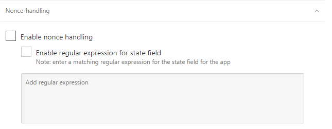

---
# required metadata

title: Troubleshoot Conditional Access App Control
description: This article provides a list of possible Conditional Access App Control issues and provides possible resolutions.
keywords:
author: shsagir
ms.author: shsagir
manager: shsagir
ms.date: 6/30/2019
ms.topic: conceptual
ms.collection: M365-security-compliance
ms.prod:
ms.service: cloud-app-security
ms.suite: ems
---
# Troubleshooting Conditional Access App Control

*Applies to: Microsoft Cloud App Security*

This article prohvides a list of possible Conditional Access App Control issues and provides possible resolutions.

## Troubleshooting onboarded apps

### The sign in to the app is not working

1. In Cloud App Security, in the menu bar, click the settings cog  and select **Conditional Access App Control**.
1. In the list of apps, on the row in which the app you are configuring appears, choose the three dots at the end of the row, and then choose **Edit app**.
1. Click **Nonce-handling** to expand the section and then select **Enable nonce handling**.

    

    > [!NOTE]
    > If you experience problem navigating to app pages other than the home page, see [Troubleshooting subsequent visits to the app do not go to the expected page](#unexpected-page)

### Subsequent visits to the app do not go to the expected page

The following steps are based on using Fiddler as the traffic logging tool. The experience may be different for other tools. For more information about using Fiddler, see [Easy way to collect fiddler log](https://blogs.msdn.microsoft.com/maheshk/2016/05/03/easy-way-to-collect-fiddler-log-fiddlercap/).

1. Copy the URL of page in the app that doesn't go to the expected page - you need it later.

    > [!NOTE]
    > Ensure that the domain doesn't include the Cloud App Security URL suffix (e.g. *.us2.cas.ms*)

1. Use a traffic logging tool such as Fiddler to monitor the page.
1. Go to the URL that you copied earlier, and authenticate if required.
1. In the traffic logging tool, search for the request matching the domain and path based on to the protocol you are using.

    | Protocol | Domain | Path | State field name |
    | --- | --- | --- | --- |
    | OIDC | `https://login.microsoftonline.com` | /common/oauth2/authorize | state |
    | SAML 2.0 | `https://login.microsoftonline.com` | /*id*/saml2 | RelayState |

1. Select the request, and then in the **Inspectors** tab, select **WebForms**.
1. Create a regex string based on the 

## Next steps

[Deploy Cloud Discovery](set-up-cloud-discovery.md)

[Premier customers can also choose Cloud App Security directly from the Premier Portal](https://premier.microsoft.com/)
