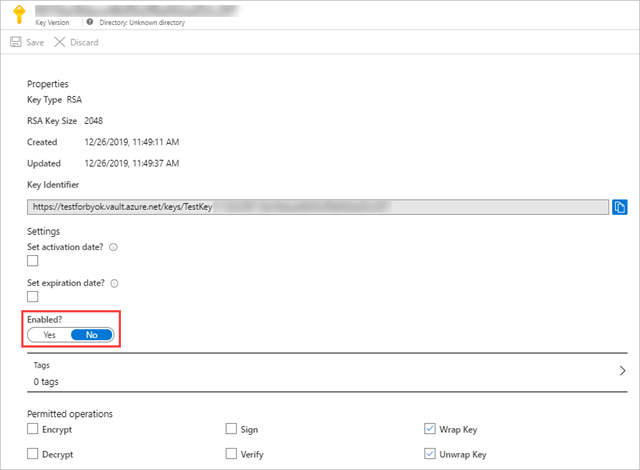
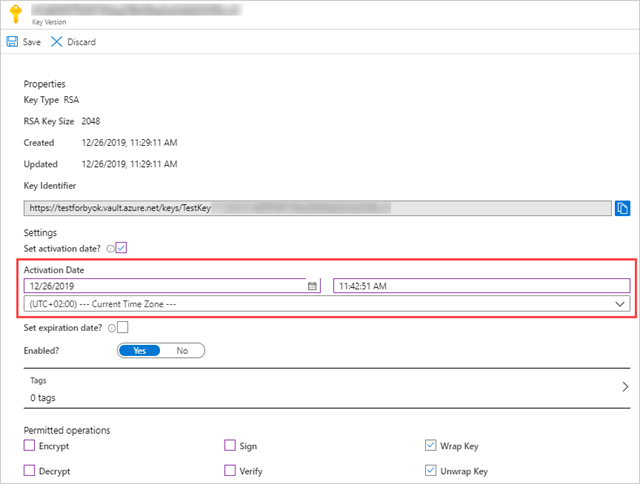
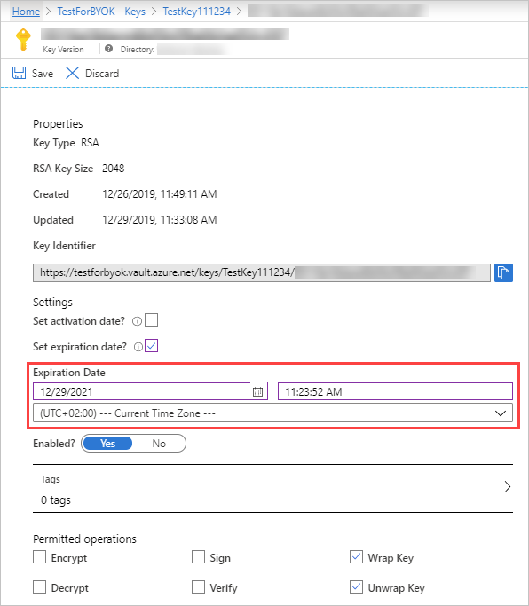

---
# required metadata

title: Troubleshooting data encryption with your own key
description: This article provides a list of content inspection statuses and their meanings.
keywords:
author: shsagir
ms.author: shsagir
manager: shsagir
ms.date: 01/15/2020
ms.topic: conceptual
ms.collection: M365-security-compliance
ms.prod:
ms.service: cloud-app-security
ms.technology:

# optional metadata

#ROBOTS:
---
# Troubleshooting data encryption with your own key

*Applies to: Microsoft Cloud App Security*

This article provides a list of problems that can prevent Cloud App Security from accessing your Azure Key Vault key used to encrypt collected data at rest.

> [!IMPORTANT]
> If there is a problem accessing your Azure Key Vault key, Cloud App Security will fail to encrypt your data and your tenant will be lock down within an hour. When your tenant is locked down, all access to it will be blocked until the cause has been resolved. Once your key is accessible again, full access to your tenant will be restored

## Troubleshooting

The following table lists the possible scenarios that can cause data encryption to fail and the actions you can take to resolve them:

| Scenario | Actions |
| --- | --- |
| **Missing Key Vault permissions** | In the selected Key Vault, under access policy, make sure that the following key permissions are selected: Under **Key management operations** - List Under **Cryptographic operations** - Wrap key - Unwrap key |
| **Azure Key Vault firewall blocking access to key** | In the selected Key Vault, make sure that the filewall is configured with the following IP addresses: **// Require list of Cloud App Security IP addresses** |
| **Missing key permissions** | In the selected key, make sure that the following operations are permitted: - Wrap key - Unwrap key  |
| **Encryption key is not enabled** | In the selected key, make sure that the key is enabled.  |
| **Encryption key is not active** | In the selected key, make sure that the activation date and time is prior to the current date and time.  |
| **Encryption key has expired** | In the selected key, make sure that the expiration date and time has not passed.  |
| **Encryption key not found or deleted** | Verify that the selected key exists in your Key Vault. If key was deleted, recover and enable it again. If the key was moved to another Key Vault, move it back to the selected Key Vault. |

[!INCLUDE [Open support ticket](includes/support.md)]
