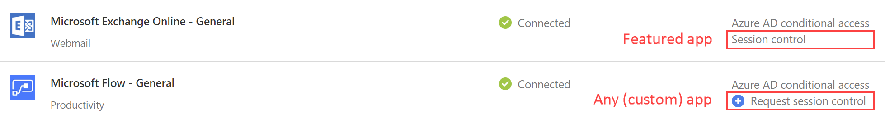
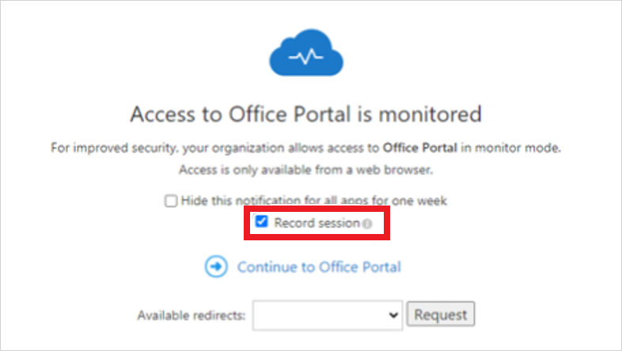
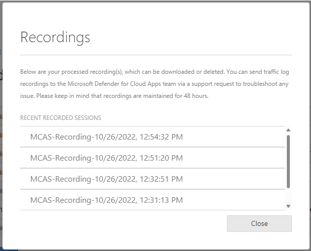
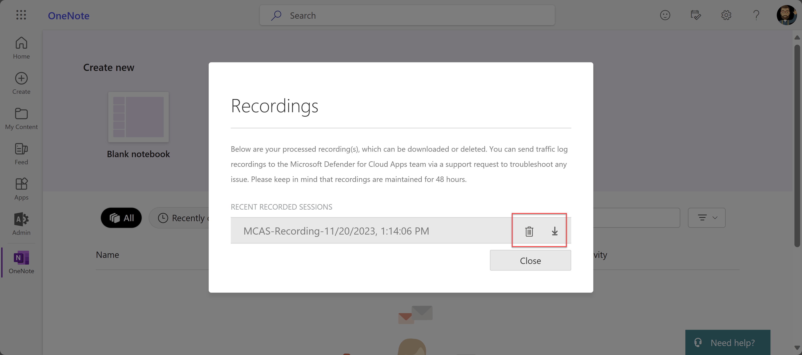
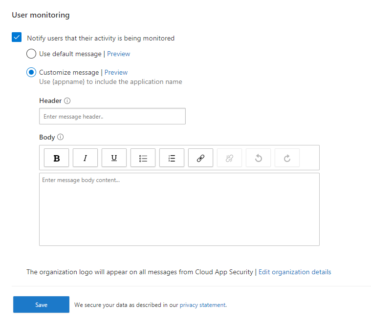
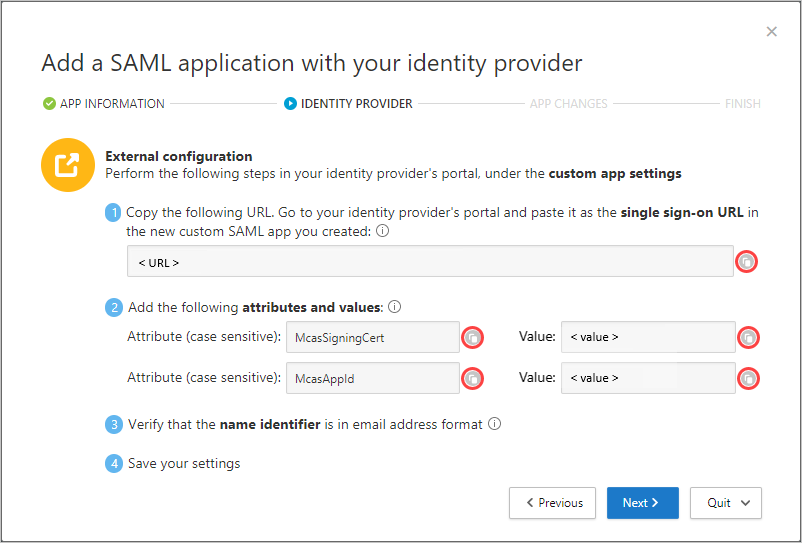
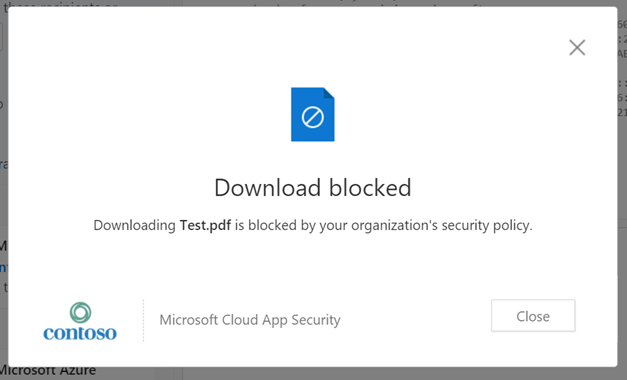

# Troubleshooting access and session controls

[!INCLUDE [Banner for top of topics](includes/banner.md)]

This article provides admins with guidance on how to investigate and resolve common access and session control issues as experienced by [admins](#issues-experienced-by-admins) and [end users](#issues-experienced-by-end-users).

Before you continue, make sure your environment meets the following minimum general requirements for access and session controls.

- **Licensing**: Make sure you have a valid [license](https://aka.ms/M365EnterprisePlans).
- **Single Sign-On (SSO)**: Apps must be configured with one of the supported SSO solutions.
  - Azure Active Directory (Azure AD) using SAML 2.0 or OpenID Connect 2.0
  - Non-Microsoft IdP using SAML 2.0
- **Browser support**: Session controls are available for browser-based sessions on these supported browsers: Microsoft Edge (latest), Google Chrome (latest), Mozilla Firefox (latest), or Apple Safari (latest)
- **Downtime**: Defender for Cloud Apps allows you to define the default behavior to apply if there's a service disruption, such as a component not functioning correctly. You can choose to harden (block) or bypass (allow) users from taking actions on potentially sensitive content when the normal policy controls cannot be enforced. This default behavior during system downtime can be configured in the Microsoft 365 Defender portal, as follows: **Settings** > **Conditional Access App Control** > **Default behavior** > **Allow** or **Block** access.

## Issues experienced by admins

This section is for admins configuring access and session controls with Defender for Cloud Apps and helps identify common situations that may arise in the following areas:

|Section|Issues|
|---|---|
|[Network conditions](#network-conditions)|- [Network errors when navigating to a browser page](#network-errors-when-navigating-to-a-browser-page)<br />- [Slow login](#slow-login)<br />- [Additional considerations](#network-conditions-additional-considerations)|
|[Device identification](#device-identification)|- [Misidentified Intune Compliant or Hybrid Azure AD joined devices](#misidentified-intune-compliant-or-hybrid-azure-ad-joined-devices)<br />- [Client certificates are not prompting when expected](#client-certificates-are-not-prompting-when-expected)<br />- [Client certificates are prompting at every login](#client-certificates-are-prompting-at-every-login)<br />- [Additional considerations](#device-identification-additional-considerations)|
|[Onboarding an app](#onboarding-an-app)|- [App does not appear on the **Conditional Access App Control apps** page](#app-does-not-appear-on-the-conditional-access-app-control-apps-page)<br />- [App status: Continue Setup](#app-status-continue-setup)<br />- [Cannot configure controls for native apps](#cannot-configure-controls-for-native-apps)<br />- [**App is not recognized** page appears](#something-went-wrong-page-appears)<br />- [**Request session control** option appears](#request-session-control-option-appears)<br />- [Additional considerations](#onboarding-apps-additional-considerations)|
|[Creating access and session policies](#creating-access-and-session-policies)|- [In Conditional Access policies, you cannot see the **Conditional Access App Control** option](#in-conditional-access-policies-you-cannot-see-the-conditional-access-app-control-option)<br />- [Error message when creating a policy: You don't have any apps deployed with Conditional Access App Control](#error-message-when-creating-a-policy-you-dont-have-any-apps-deployed-with-conditional-access-app-control)<br />- [Cannot create session policies for an app](#cannot-create-session-policies-for-an-app)<br />- [Cannot choose **Inspection Method**: **Data Classification Service**](#cannot-choose-inspection-method-data-classification-service)<br />- [Cannot choose **Action**: **Protect**](#cannot-choose-action-protect)<br />- [Additional considerations](#policies-additional-considerations)|

### Network conditions

Common network condition issues you may encounter include:

- [Network errors when navigating to a browser page](#network-errors-when-navigating-to-a-browser-page)
- [Slow login](#slow-login)
- [Additional considerations](#network-conditions-additional-considerations)

#### Network errors when navigating to a browser page

When you're first setting up Defender for Cloud Apps access and session controls for an app, common network errors that may arise include: "This site is not secure" and "There is no internet connection". These messages can indicate a general network configuration error.

**Recommended steps**

1. Configure your firewall to work with Defender for Cloud Apps using the Azure IP addresses and DNS names relevant to your environment.
    1. Add **outbound port 443** for the following IP addresses and DNS names for your [Defender for Cloud Apps data center](network-requirements.md#access-and-session-controls).
    1. Restart your device and your browser session
    1. Verify that the login is working as expected
1. Enable TLS 1.2 in your browser's internet options.

   > [!NOTE]
   >
   > - Defender for Cloud Apps leverages Transport Layer Security (TLS) protocols 1.2+ to provide best-in-class encryption. Native client apps and browsers that don't support TLS 1.2+ won't be accessible when configured with session control. However, SaaS apps that use TLS 1.1 or lower will appear in the browser as using TLS 1.2+ when configured with Defender for Cloud Apps.
   >
   > - While session controls are built to work with any browser on any major platform on any operating system, we support Microsoft Edge (latest), Google Chrome (latest), Mozilla Firefox (latest), or Apple Safari (latest). Access to mobile and desktop apps can also be blocked or allowed.

 | Browser | Steps |
 |---|---|
 | Microsoft Internet Explorer | 1. Open Internet Explorer<br />2. Select **Tools** > **Internet Options** > **Advance** tab<br />3. Under **Security**, select **TLS 1.2**<br />4. Select **Apply**, and then select **OK**<br />5. Restart your browser and verify that you can access the app |
 | Microsoft Edge / Edge Chromium | 1. Open search from the taskbar and search for "Internet Options"<br />2. Select **Internet Options**<br />3. Under **Security**, select **TLS 1.2**<br />4. Select **Apply**, and then select **OK**<br />5. Restart your browser and verify that you can access the app |
 | Google Chrome | 1. Open Google Chrome<br />2. At the top-right, click **More** (3 vertical dots) > **Settings**<br />3. At the bottom, click **Advanced**<br />4. Under **System**, click **Open proxy settings**<br />5. On the **Advanced** tab, under **Security**, select **TLS 1.2**<br />6. Click **OK**<br />7. Restart your browser and verify that you're able to access the app |
 | Mozilla Firefox | 1. Open Mozilla Firefox<br />2. In the address bar and search for "about:config"<br />3. In the Search box, search for "TLS"<br />4. Double-click the entry for **security.tls.version.min**<br />5. Set the integer value to 3 to force TLS 1.2 as the minimum required version<br />6. Click **Save** (check mark to the right of the value box)<br />7. Restart your browser and verify that you're able to access the app |
 | Safari | If you're using Safari version 7 or greater, TLS 1.2 is automatically enabled |

#### Slow login

Proxy chaining and nonce-handling are some of the common issues that could result in slow login performance.

**Recommended steps**

1. Configure your environment to remove firewall and forward proxy chaining, connecting two or more proxy servers to navigate to the intended page, and other external factors that can cause slowness in the login process.
    1. Identify if proxy chaining is occurring in your environment
    1. Remove additional forward proxies where possible
1. Turn off nonce-handling for your apps that don't use nonce.

1. > [!NOTE]
   > Some apps use a nonce hash during authentication to prevent replay attacks. By default, Defender for Cloud Apps assumes an app uses a nonce. If the app you're working with doesn't use nonce, you can disable nonce-handling for this app in Defender for Cloud Apps.

    1. In the Microsoft 365 Defender portal, select **Settings**. Then choose **Cloud Apps**. Under **Connected apps**, select **Conditional Access App Control apps**.
    1. In the list of apps, on the row in which the app you're configuring appears, choose the three dots at the end of the row, and then choose **Edit** app.
    1. Click **Nonce-handling** to expand the section and then clear **Enable nonce handling**.
    1. Log out of the app and close out all browser sessions.
    1. Restart your browser and login to the app and verify that the login is working as expected.

<a name="network-conditions-additional-considerations"></a>

#### Additional considerations

While troubleshooting network conditions, there are some additional things to consider about the Defender for Cloud Apps proxy.

- **Session is being routed to another data center**

    Defender for Cloud Apps leverages Azure Data Centers around the world to optimize performance through geolocation. This means that a user's session may be hosted outside of a region, depending on traffic patterns and their location. However, to protect your privacy, no session data is stored in these data centers.

- **Proxy performance**

  Deriving a performance baseline depends on many factors outside of the Defender for Cloud Apps proxy, such as:

  - What other proxies or gateways sit in series with this proxy
  - Where the user is coming from
  - Where the targeted resource resides
  - Specific requests on the page

  In general, any proxy will add latency. The advantages of the Defender for Cloud Apps proxy are:

  - Leveraging the global availability of Azure domain controllers to geolocate users to the nearest node and reduce their round-trip distance, on a scale that few services around the world have.
  - Leveraging the integration with Azure AD Conditional Access to only route the sessions you want to proxy to our service, instead of all users in all situations.

### Device identification

Defender for Cloud Apps provides the following options for identifying a device's management state.

1. Microsoft Intune compliance
1. Hybrid Azure AD Domain joined
1. Client certificates

For more information on device identification, see [Managed Device Identification](proxy-intro-aad.md#managed-device-identification).

Common device identification issues you may encounter include

- [Misidentified Intune Compliant or Hybrid Azure AD joined devices](#misidentified-intune-compliant-or-hybrid-azure-ad-joined-devices)
- [Client certificates are not prompting when expected](#client-certificates-are-not-prompting-when-expected)
- [Client certificates are prompting at every login](#client-certificates-are-prompting-at-every-login)
- [Additional considerations](#device-identification-additional-considerations)

#### Misidentified Intune Compliant or Hybrid Azure AD joined devices

Azure AD Conditional Access enables Intune compliant and Hybrid Azure AD joined device information to be passed directly to Defender for Cloud Apps, where the device state can be used as a filter for access or session policies. For more information, see [Introduction to device management in Azure Active Directory](/azure/active-directory/devices/overview).

**Recommended steps**

1. In the Microsoft 365 Defender portal, select **Settings**. Then choose **Cloud Apps**.
1. Under **Conditional Access App Control**, select **Device identification**. This page shows the device identification options available in Defender for Cloud Apps.
1. For **Intune compliant device identification** and **Hybrid Azure AD joined identification** respectively, click **View configuration** and verify that the services are set up.

   > [!NOTE]
   > These are automatically synced from Azure AD and Intune respectively.

1. Create an access or session policy with the **Device Tag** filter equal to **Hybrid Azure AD joined**, **Intune compliant**, or both.
1. In a browser, log in to a device that is Hybrid Azure AD joined or Intune compliant based on your policy filter.
1. Verify that activities from these devices are populating the log. In Defender for Cloud Apps, on the **Activity log** page, [filter](activity-filters.md) on **Device Tag** equal to **Hybrid Azure AD joined**, **Intune compliant**, or both based on your policy filters.
1. If activities are not populating in the Defender for Cloud Apps activity log, go to Azure AD and do the following:
    1. Under **Monitoring** > **Sign-ins**, verify that there are sign-in activities in logs.
    1. Select the relevant log entry for the device you logged into.
    1. In the **Details** pane, on the **Device info** tab, verify that the device is **Managed** (Hybrid Azure AD joined) or **Compliant** (Intune compliant). If you can't verify either state, try another log entry or ensure that your device data is configured correctly in Azure AD.
    1. For Conditional Access, some browsers may require additional configuration such as installing an extension. Use the information in the [Conditional Access browser support](/azure/active-directory/conditional-access/concept-conditional-access-conditions#supported-browsers) guide to configure your browser.
    1. If you still don't see the device information in the **Sign-ins** page, open a support ticket for Azure AD.

#### Client certificates are not prompting when expected

The device identification mechanism can request authentication from relevant devices using client certificates. You can upload an X.509 root or intermediate certificate authority (CA) formatted in the PEM certificate format. These certificates must contain the public key of the CA, which is then used to sign the client certificates presented during a session. For more information about client certificates, see [Client-certificate authenticated devices](proxy-intro-aad.md#client-certificate-authenticated-devices).

**Recommended steps**

1. In the Microsoft 365 Defender portal, select **Settings**. Then choose **Cloud Apps**.
1. Under **Conditional Access App Control**, select **Device identification**. This page shows the device identification options available in Defender for Cloud Apps.
1. Verify that you uploaded an X.509 root or intermediate CA. You must upload the CA that is used to sign your relevant certificate authority.
1. Create an access or session policy with the **Device Tag** filter equal to **Valid client certificate**.
1. Make sure that your client certificate is:
    - Deployed using the PKCS #12 file format, typically a .p12 or .pfx file extension
    - Installed in the user store, not the device store, of the device you're using for testing
1. Restart your browser session
1. When logging in to the protected app
    - Verify that you're redirected to the URL `<https://*.managed.access-control.cas.ms/aad_login>`
    - If you're using iOS, make sure you're using the Safari browser
    - If you're using Firefox, you must also add the certificate to Firefox's own certificate store. All other browsers use the same default certificate store. Learn [how to add a certificate to the Firefox certificate store](https://www.jscape.com/blog/firefox-client-certificate).
1. Validate that the client certificate prompted in your browser.
    - If it doesn't appear, try a different browser. Most major browsers support performing a client certificate check. However, mobile and desktop apps often leverage built-in browsers that may not support this check and therefore affect authentication for these apps.
1. Verify that activities from these devices are populating the log. In Defender for Cloud Apps, on the **Activity log** page, [filter](activity-filters.md) on **Device Tag** equal to **Valid client certificate**.
1. If you still don't see the prompt, open a [support ticket](support-and-ts.md) and include the following information:
    - The details of the browser or native app where you experienced the problem
    - The operating system version (ex. iOS/Android/Windows 10)
    - Mention if the prompt is working on Edge Chromium

#### Client certificates are prompting at every login

If you're experiencing the client certificate popping up after opening a new tab, this might be due to settings hidden within **Internet Options**.

| Browser | Steps |
|---|---|
| Microsoft Internet Explorer | 1. Open Internet Explorer<br />2. Select **Tools** > **Internet Options** > **Advance** tab<br />3. Under **Security**, select **Don't prompt for Client Certificate selection when only one certificate exists**<br />4. Select **Apply**, and then select **OK**<br />5. Restart your browser and verify that you can access the app without the additional prompts |
| Microsoft Edge / Edge Chromium | 1. Open search from the taskbar and search for "Internet Options"<br />2. Select **Internet Options**<br />3. Select **Security**, select **Local intranet**, and then click **Custom level**<br />4. Under **Miscellaneous** > **Don't prompt for Client Certificate selection when only one certificate exists**, select **Disable**<br />5. Click **OK** to close the custom level dialog box<br />6. Click **Apply**, and then select **OK** to close Internet options<br />7. Restart your browser and verify that you can access the app without the additional prompts |

<a name="device-identification-additional-considerations"></a>

#### Additional considerations

While troubleshooting device identification, there are some additional things to consider.

- **Client Certificate Revocation Protocol**

    You can require certificate revocation for Client Certificates. Certificates that have been revoked by the CA no longer be trusted. Selecting this option will require all certificates to pass the CRL protocol. If your client certificate doesn't contain a CRL endpoint, you won't be able to connect from the managed device.

### Onboarding an app

You can onboard the following types of apps for access and session controls:

- Catalog apps: Apps that come with session controls out-of-the-box as indicated by the **Session control** label

- Any (custom) apps: Custom line-of-business (LOB) or on-premises apps can be onboarded to session controls by an admin



When onboarding an app, it is crucial to make sure that you follow each step in the proxy deployment guides:

1. [Deploy catalog apps with session controls](proxy-deployment-aad.md)
1. [Deploy custom LOB apps, non-featured SaaS apps, and on-premises apps hosted via the Azure AD app proxy with session controls](proxy-deployment-any-app.md)

Common scenarios you may encounter while onboarding an app include:

- [App does not appear on the **Conditional Access App Control apps** page](#app-does-not-appear-on-the-conditional-access-app-control-apps-page)
- [App status: Continue Setup](#app-status-continue-setup)
- [Cannot configure controls for native apps](#cannot-configure-controls-for-native-apps)
- [**App is not recognized** page appears](#something-went-wrong-page-appears)
- [**Request session control** option appears](#request-session-control-option-appears)
- [Additional considerations](#onboarding-apps-additional-considerations)

#### App does not appear on the Conditional Access App Control apps page

When onboarding an app to Conditional Access App Control, the final step in the deployment guides is to have the end user navigate to the app. The recommendations listed below are steps that can be done if the app isn't appearing after having gone through the guides.

**Recommended steps**

1. Make sure your app meets the Conditional Access app prerequisites

| Identity provider | Validations |
|---|---|
| Azure AD | 1. Make sure you have a valid license for Azure AD Premium P1 in addition to a Defender for Cloud Apps license<br />2. Make sure that the app uses the SAML 2.0  or the OpenID Connect protocol<br />3. Make sure that the app SSO in Azure AD |
| Non-Microsoft | 1. Make sure you have a valid Defender for Cloud Apps license<br />2. Create a duplicate app<br />3. Make sure that the app uses the SAML protocol<br />4. Validate that you have fully onboarded the app and the status of the app is **Connected** |

1. In your Azure AD policy, under the **Session**, make sure that the session is forced to route to Defender for Cloud Apps, which will in turn allow the app to appear in on the **Conditional Access App Control apps** page, as follows:
    1. Conditional Access App Control is selected
    1. In the built-in policies drop-down, make sure **Monitor only** is selected
1. Make sure to navigate to the app in a new browser session by using a new incognito mode or by signing in again.

#### App status: Continue Setup

An app's status can vary from **Continue Setup**, **Connected**, and **No Activities**.

For apps connected via non-Microsoft identity providers (IdP), if the setup isn't complete, when accessing the app you will see a page with the status of **Continue Setup**. Use the following steps complete the setup.

**Recommended steps**

1. Click **Continue Setup**.
1. Go through the [deployment guide](proxy-deployment-any-app.md) and verify that you have completed all the steps. Pay particular attention to the following:
    1. Make sure you create a new custom SAML app. You need this to change the URLs and SAML attributes that might not be available in gallery apps.
    1. If your identity provider doesn't allow the reuse of the same identifier (also known as Entity ID or Audience), change the identifier of the original app.

#### Cannot configure controls for native apps

Native apps can be detected heuristically and you can use access policies to monitor or block them. Use the following steps to configure controls for native apps.

**Recommended steps**

1. In an access policy, add a **Client app** filter, and set it equal to **Mobile and desktop**.
1. Under Actions, select **Block**.
1. Optionally, customize the blocking message that your users get when they're unable to download files, for example, "You must use a web browser to access this app".
1. Test and validate that the control is working as expected.

#### App is not recognized page appears

Defender for Cloud Apps can recognize over 31,000 apps through the **Cloud App Catalog**. If you're using a custom app that is configured through Azure AD SSO that is NOT one of the 31,000 apps, you will come across an **App is not recognized** page. To resolve the issue, you must configure the app on the Conditional Access App Control.

**Recommended steps**

1. In the Microsoft 365 Defender portal, select **Settings**. Then choose **Cloud Apps**. Under **Connected apps**, select **Conditional Access App Control apps**.
1. In the banner, select **View new apps**.
1. In the list of new apps, locate the app that you are onboarding, click on the **+** sign, and then click **Add**.
    1. Select whether the app is a **custom** or **standard** app.
    1. Continue through the wizard, make sure that specified **User-defined domains** are correct for the app you're configuring.
1. Verify the app appears in the **Conditional Access App Control apps** page.

#### Request session control option appears

After adding an app, you may see the **Request session control** option. This occurs because only catalog apps have out-of-the-box session controls. For any other app, you must go through a self-onboarding process.

**Recommended steps**

1. In the Microsoft 365 Defender portal, select **Settings**. Then choose **Cloud Apps**.
1. Under **Conditional Access App Control**, select **App onboarding/maintenance**.
1. Enter the user principal name or email for the users that will be onboarding the app, and then select **Save**.
1. Go to the app that you're deploying. The page you see depends on whether the app is recognized. Do one of the following:

    | App status | Description | Steps |
    | --- | --- | --- |
    | Not recognized | You will see an app not recognized page prompting you to configure your app. | 1. [Add the app to Conditional Access App Control](proxy-deployment-any-app.md).<br /> 2. [Add the domains for the app](proxy-deployment-any-app.md), and then return to the app and refresh the page.<br /> 3. [Install the certificates for the app](proxy-deployment-any-app.md). |
    | Recognized | You will see an onboarding page prompting you to continue the app configuration process. | - [Install the certificates for the app](proxy-deployment-any-app.md). <br /><br /> **Note:** Make sure the app is configured with all domains required for the app to function correctly. To configure additional domains, proceed to [Add the domains for the app](proxy-deployment-any-app.md), and then return to the app page. |

<a name="onboarding-apps-additional-considerations"></a>

#### Additional considerations

While troubleshooting onboarding apps, there are some additional things to consider.

- **Apps in Conditional Access App Control don't align with Azure AD apps**

    The app names in Azure AD and Defender for Cloud Apps might differ based on the ways the products identify apps. Defender for Cloud Apps identifies apps using the app's domains and adds them to the [cloud app catalog](risk-score.md#the-cloud-app-catalog), where we have over 31,000 apps. Within each app, there you can view or add to the subset of domains. In contrast, Azure AD identifies apps using service principals. For more information, see [app and service principal objects in Azure AD](/azure/active-directory/develop/app-objects-and-service-principals).

    In practice, it means that selecting **SharePoint Online** in Azure AD is equivalent to selecting apps, such as Word Online and Teams, in Defender for Cloud Apps because the apps use the `sharepoint.com` domain.

### Creating access and session policies

Defender for Cloud Apps provides the following configurable policies:

1. [Access policies](access-policy-aad.md): To monitor or block access to browser, mobile, and/or desktop apps
1. [Session policies](session-policy-aad.md). To monitor, block, and perform specific actions to prevent data infiltration and exfiltration scenarios in the browser

To use these policies in Defender for Cloud Apps, you must first configure a policy in Azure AD Conditional Access to extend session controls, as follows: In the Azure AD policy, under **Access controls**, click **Session**, select **Use Conditional Access App Control** and choose a built-in policy (**Monitor only** or **Block downloads**) or **Use custom policy** to set an advanced policy in Defender for Cloud Apps, and then click **Select**.

Common scenarios you may encounter while configuring these policies include:

- [In Conditional Access policies, you cannot see the **Conditional Access App Control** option](#in-conditional-access-policies-you-cannot-see-the-conditional-access-app-control-option)
- [Error message when creating a policy: You don't have any apps deployed with Conditional Access App Control](#error-message-when-creating-a-policy-you-dont-have-any-apps-deployed-with-conditional-access-app-control)
- [Cannot create session policies for an app](#cannot-create-session-policies-for-an-app)
- [Cannot choose **Inspection Method**: **Data Classification Service**](#cannot-choose-inspection-method-data-classification-service)
- [Cannot choose **Action**: **Protect**](#cannot-choose-action-protect)
- [Additional considerations](#policies-additional-considerations)

#### In Conditional Access policies, you cannot see the Conditional Access App Control option

To route sessions to Defender for Cloud Apps, Azure AD Conditional Access policies must be configured to include Conditional Access App Control session controls.

**Recommended steps**

- If you don't see the **Conditional Access App Control** option in your Conditional Access policy, make sure that you have a valid license for Azure AD Premium P1 as well as a valid Defender for Cloud Apps license.

#### Error message when creating a policy: You don't have any apps deployed with Conditional Access App Control

When creating an access or session policy, you may see the following error message: "You don't have any apps deployed with Conditional Access App Control". This error indicates that the app has not been deployed.

**Recommended steps**

1. In the Microsoft 365 Defender portal, select **Settings**. Then choose **Cloud Apps**. Under **Connected apps**, select **Conditional Access App Control apps**.

1. If you see the message **No apps connected**, use the following guide to deploy apps:

    - [Deploy catalog apps that have session control enabled](proxy-deployment-aad.md)
    - [Deploy custom line-of-business apps, non-featured SaaS apps, and on-premises apps](proxy-deployment-any-app.md) hosted via the Azure Active Directory (Azure AD) Application Proxy with session controls
1. If you run into any issues while deploying the app, see [Onboarding an app](#onboarding-an-app).

#### Cannot create session policies for an app

After adding a custom app, in the **Conditional Access App Control apps** page, you may see the option: **Request session control**.

> [!NOTE]
> [Catalog apps](proxy-intro-aad.md#session-controls) have out-of-the-box session controls. For any other apps, you must go through a self-onboarding process.

**Recommended steps**

1. Use the following self-onboarding guide to deploy any app to session control: [Deploy custom line-of-business apps, non-featured SaaS apps, and on-premises apps](proxy-deployment-any-app.md) hosted via the Azure Active Directory (Azure AD) Application Proxy with session controls.
1. Create a session policy, select the **App** filter, make sure that your app is now listed in the dropdown list.

#### Cannot choose Inspection Method: Data Classification Service

In session policies, when using the **Control file download (with inspection)** session control type, you can use the **Data Classification Service** inspection method to scan your files in real time and detect sensitive content that matches any of the criteria you have configured. If the **Data Classification Service** inspection method isn't available, use the following steps to investigate the issue.

**Recommended steps**

1. Verify that the **Session control type** is set to **Control file download (with inspection)**.

   > [!NOTE]
   > The **Data Classification Service** inspection method is only available for the **Control file download (with inspection)** option.

1. Determine whether the **Data Classification Service** feature is available in your [region](dcs-inspection.md).
    1. If the feature isn't available in your region, use the **Built-in DLP** inspection method.
    1. If the feature is available in your region but you still can't see the **Data Classification Service** inspection method, open a [support ticket](support-and-ts.md).

#### Cannot choose Action: Protect

In session policies, when using the **Control file download (with inspection)** session control type, in addition to the **Monitor** and **Block** actions, you can specify the **Protect** action. This action enables you to permit file downloads with the option to encrypt or apply permissions to the file based on conditions, content inspection, or both. If the **Protect** action isn't available, use the following steps to investigate the issue.

**Recommended steps**

1. If the **Protect** action isn't available or is greyed out, verify that you have the Azure Information Protection (AIP) Premium P1 license. For more information, see [Microsoft Information Protection integration](azip-integration.md).
1. If the **Protect** action is available, but aren't seeing the appropriate labels.
    1. In Defender for Cloud Apps, in the menu bar, click the settings cog, select **Microsoft Information Protection**, and verify that the integration is enabled.
    1. For Office labels, in the AIP portal, make sure **Unified Labeling** is selected.

<a name="policies-additional-considerations"></a>

#### Additional considerations

While troubleshooting onboarding apps, there are some additional things to consider.

- **Understanding the difference between the Azure AD Conditional Access policy settings: "Monitor only", "Block downloads", and "Use custom policy"**

    In Azure AD Conditional Access policies, you can configure the following built-in Defender for Cloud Apps controls: **Monitor only** and **Block downloads**. This applies and enforces the Defender for Cloud Apps proxy feature for cloud apps and conditions configured in Azure AD. For more complex policies, select **Use custom policy**, which allows you to configure access and session policies in Defender for Cloud Apps.

- **Understanding the "Mobile and desktop" client app filter option in access policies**

    In Defender for Cloud Apps access policies, unless the **Client app** filter is specifically set to **Mobile and desktop**, the resulting access policy will only apply to browser sessions. The reason for this, is to prevent inadvertently proxying user sessions, which may be a byproduct of using this filter.

## Admin View toolbar

The Admin View toolbar provides tools for an admin to diagnose and troubleshoot issues with Conditional Access App Control.

To enable the Admin View toolbar for specific admin users, you first must add admins to the app onboarding/maintenance list.

1. In the Microsoft 365 Defender portal, select **Settings**. Then choose **Cloud Apps**.

1. Under **Conditional Access App Control**, select **App onboarding/maintenance**.

1. Enter the user principal name or email address for the admin users that will be onboarding the app.
1. Check the box for **Enable these users to bypass Conditional Access App Control from inside a proxied session**.
1. Select **Save**.

    

When those users next start a session of an application, the Admin View toolbar will be available.

### Bypass proxy session

If you have difficulty accessing or loading your application, and you'd like to see if the problem is with the Conditional Access proxy, you can use the **Bypass session** button in the Admin View toolbar. It will appear for users who have the [Admin View toolbar](#admin-view-toolbar) enabled.

Once you select **Bypass session**, the application will run without the Conditional Access proxy.

You can confirm the session is bypassed by noting that the URL isn't [suffixed](proxy-intro-aad.md#how-session-control-works).

In the next session of the application, the Conditional Access proxy will be used.

### Session recording

You can help the root cause analysis of problems by providing session recordings to Microsoft support engineers. To record a session, you must enable the [Admin View toolbar](#admin-view-toolbar).

> [!NOTE]
> All personal data is removed from the recordings.

To record a session, follow these steps:

1. 1. From the Admin View toolbar, select **Record session**.

   
1. After selecting **Record session**, accept the terms by selecting **Continue** in the next window:

    

1. You can also start recording when signing in to the application. To do so, select **Record session** when this window appears:

    

1. Sign in to the application to begin the scenario simulation.
1. When you finish the scenario simulation, select **Stop recording** in the Admin View toolbar.

    

1. After you've finished recording, you can view the recorded sessions by selecting **Session recordings** in the Admin View toolbar. A list of recorded sessions from the previous 48 hours will appear.

   

1. Each recorded session can be downloaded or deleted.

    

## Issues experienced by end users

This section is for end users using apps protected by Defender for Cloud Apps and helps identify common situations that may arise in the following areas:

- [User monitoring page is not appearing](#user-monitoring-page-is-not-appearing)
- [Not able to access app from a non-Microsoft Identity Provider](#not-able-to-access-app-from-a-non-microsoft-identity-provider)
- [**Something Went Wrong** page appears](#something-went-wrong-page-appears)
- [Clipboard actions or file controls are not being blocked](#clipboard-actions-or-file-controls-are-not-being-blocked)
- [Downloads are not being protected](#downloads-are-not-being-protected)
- [Navigating to a particular URL of a suffixed app and landing on a generic page](#navigating-to-a-particular-url-of-a-suffixed-app-and-landing-on-a-generic-page)
- [Blocking downloads cause PDF previews to be blocked](#blocking-downloads-cause-pdf-previews-to-be-blocked)
- [Similar site warning appears](#similar-site-warning-appears)
- [Additional considerations](#app-additional-considerations)

### User monitoring page is not appearing

When routing a user through the Defender for Cloud Apps, you can notify the user that their session will be monitored. By default, the user monitoring page is enabled.

**Recommended steps**

1. In the Microsoft 365 Defender portal, select **Settings**. Then choose **Cloud Apps**.
1. Under **Conditional Access App Control**, select **User monitoring**. This page shows the user monitoring options available in Defender for Cloud Apps.

    

1. Verify that the **Notify users that their activity is being monitored** option is selected.
1. Choose whether you want to use the default message or provide a custom message.

    | Message type | Details |
    | --- | --- |
    | Default | **Header**:<br />Access to [App Name Will Appear Here] is monitored<br />**Body**:<br />For improved security, your organization allows access to [App Name Will Appear Here] in monitor mode. Access is only available from a web browser. |
    | Custom | **Header**:<br />Use this box to provide a custom heading to inform users they are being monitored.<br />**Body**:<br />Use this box to add additional custom information for the user, such as who to contact with questions, and supports the following inputs: plain text, rich text, hyperlinks. |
1. Click **Preview** to verify the user monitoring page that appears before accessing an app.
1. Click **Save**.

### Not able to access app from a non-Microsoft Identity Provider

If an end user is receiving a general failure after logging into an app from a non-Microsoft Identity Provider, validate the non-Microsoft IdP configuration.

**Recommended steps**

1. In the Microsoft 365 Defender portal, select **Settings**. Then choose **Cloud Apps**. Under **Connected apps**, select **Conditional Access App Control apps**.
1. In the list of apps, on the row in which the app you can't access appears, choose the three dots at the end of the row, and then choose **Edit app**.
    1. Validate that the SAML certificate that was uploaded is correct.
    1. Verify that valid SSO URLs have been provided in the app configuration.
    1. Validate that the attributes and values in the custom app are reflected in identity provider settings
        .
1. If you still can't access the app, open a [support ticket](support-and-ts.md).

### Something Went Wrong page appears

Sometimes during a proxied session, the **Something Went Wrong** page may appear. This can happen when:

1. A user logs in after being idle for a while
1. Refreshing the browser and the page load takes longer than expected
1. The non-Microsoft IdP app isn't configured correctly

**Recommended steps**

1. If the end user is trying to access an app that is configured using a non-Microsoft IdP, see [Not able to access app from a non-Microsoft IdP](#not-able-to-access-app-from-a-non-microsoft-identity-provider) and [App status: Continue Setup](#app-status-continue-setup).
1. If the end user unexpectedly reached this page, do the following:
    1. Restart your browser session
    1. Clear history, cookies, and cache from the browser

### Clipboard actions or file controls are not being blocked

The ability to block clipboard actions such as cut, copy, paste, and file controls such as download, upload, and print is required to prevent data exfiltration and infiltration scenarios. This ability enables companies to balance security and productivity for end users. If you're experiencing problems with these features, use the following steps to investigate the issue.

> [!NOTE]
> Cut, copy, and paste aren't blocked for data within the same Excel document. Only copying to external locations is blocked.

**Recommended steps**

If the session is being proxied, use the following steps to verify the policy:

1. In the Microsoft 365 Defender portal, under **Cloud Apps**, select **Activity log**.
1. Use the advanced filter, select **Applied action** and set its value equal to **Blocked**.
1. Verify that there are blocked file activities.
    1. If there's an activity, expand the activity drawer by clicking on the activity
    1. On the activity drawer's **General** tab, click the matched policies link, to verify the policy you enforced is present.
    1. If you don't see your policy, see [Creating access and session policies](#creating-access-and-session-policies).
    1. If you see **Access blocked/allowed due to Default Behavior**, this indicates that the system was down and the default behavior was applied.
        1. To change the default behavior, in the Microsoft 365 Defender portal, select **Settings**. Then choose **Cloud Apps**. Then under **Conditional Access App Control**, select **Default Behavior**, and set the default behavior to **Allow** or **Block** access.
        1. Go to the [Microsoft 365 admin portal]https://admin.microsoft.com/AdminPortal/Home?#/servicehealth) and monitor notifications about system downtime.
1. If you still not able to see blocked activity, open a [support ticket](support-and-ts.md).

### Downloads are not being protected

As an end user, downloading sensitive data on an unmanaged device might be necessary. In these scenarios, you can protect documents with Microsoft Information Protection. If the end user was not able to successfully encrypt the document, use the following steps to investigate the issue.

**Recommended steps**

1. In the Microsoft 365 Defender portal, under **Cloud Apps**, select **Activity log**.
1. Use the advanced filter, select **Applied action** and set its value equal to **Protected**.
1. Verify that there are blocked file activities.
    1. If there's an activity, expand the activity drawer by clicking on the activity
    1. On the activity drawer's **General** tab, click the matched policies link, to verify the policy you enforced is present.
    1. If you don't see your policy, see [Creating access and session policies](#creating-access-and-session-policies).
    1. If you see **Access blocked/allowed due to Default Behavior**, this indicates that the system was down and the default behavior was applied.
        1. To change the default behavior, in the Microsoft 365 Defender portal, select **Settings**. Then choose **Cloud Apps**. Then under **Conditional Access App Control**, select **Default Behavior**, and set the default behavior to **Allow** or **Block** access.
        1. Go to `https://status.cloudappsecurity.com/` and monitor notifications about system downtime.
    1. If you're protecting the file with an AIP label or custom permissions, in the **Activity description**, make sure the file extension is one of the following supported file types:
        - Word: docm, docx, dotm, dotx
        - Excel: xlam, xlsm, xlsx, xltx
        - PowerPoint: potm, potx, ppsx, ppsm, pptm, pptx
        - PDF* if Unified Labeling is enabled
    - If the file type isn't supported, in the session policy, you can select **Block download of any file that in unsupported by native protection or where native protection is unsuccessful**.
1. If you still not able to see blocked activity, open a [support ticket](support-and-ts.md).

### Navigating to a particular URL of a suffixed app and landing on a generic page

In some scenarios, navigating to a link may result in the user landing on the app's home page rather than the full path of the link.

Here's [a list of apps](/defender-cloud-apps/proxy-intro-aad#known-limitations) known to suffer from context loss.

**Recommended steps**

This issue can be resolved by appending  `.mcas.ms` to the original URL.

For example, if the original URL is:

`https://www.github.com/organization/threads/threadnumber`, change it to
`https://www.github.com.mcas.ms/organization/threads/threadnumber`

For apps experiencing context loss, open a [support ticket](support-and-ts.md).

<a name="app-additional-considerations"></a>

### Blocking downloads cause PDF previews to be blocked

Occasionally when previewing or printing PDF files, apps initiate a download of the file. This causes Defender for Cloud Apps to intervene to ensure the download is blocked and that data isn't leaked from your environment. For example, if you created a session policy to block downloads for Outlook Web Access (OWA), then previewing or printing PDF files may be blocked, with a message like this:



To allow the preview, an Exchange administrator should perform the following steps:

1. Download the [Exchange Online PowerShell Module](https://www.powershellgallery.com/packages/ExchangeOnlineManagement/2.0.4).
1. Connect to the module using the commands described in [Connect to Exchange Online PowerShell](/powershell/exchange/connect-to-exchange-online-powershell#connect-to-exchange-online-powershell-using-mfa-and-modern-authentication).
1. After you've connected to the Exchange Online PowerShell, use the [Set-OwaMailboxPolicy](/powershell/module/exchange/set-owamailboxpolicy) cmdlet to update the parameters in the policy:

    ```powershell
    Set-OwaMailboxPolicy -Identity OwaMailboxPolicy-Default -DirectFileAccessOnPrivateComputersEnabled $false -DirectFileAccessOnPublicComputersEnabled $false
    ```

    >[!NOTE]
    >The **OwaMailboxPolicy-Default** policy is the default OWA policy name in Exchange Online. Some customers may have deployed additional or created a custom OWA policy with a different name. If you have multiple OWA policies, they may be applied to specific users. Therefore, you'll need to also update them to have complete coverage.

1. After these parameters have been set, run a test on OWA with a PDF file and a session policy configured to block downloads. The **Download** option should be removed from the dropdown and you can preview the file.

    

### Similar site warning appears

Malicious actors can craft URLs that are similar to other sites' URLs in order to impersonate and trick users to believe they're browsing to another site. Some browsers try to detect this behavior and warn users before accessing the URL or block access. In some rare cases, users under session control will receive a message from the browser indicating suspicious site access. The reason for this is the browser treats the suffixed domain (for example:  `.mcas.ms`) as suspicious.

In Microsoft Edge:

  

In Chrome:

  

If you receive a message like this, contact Microsoft’s support, who will address it with the relevant browser vendor.

### Additional considerations

While troubleshooting apps, there are some additional things to consider.

- **Session controls support for modern browsers**

    Defender for Cloud Apps session controls now includes support for the new Microsoft Edge browser based on Chromium. While we'll continue supporting the most recent versions of Internet Explorer and the legacy version of Microsoft Edge, the support will be limited and we recommend using the new Microsoft Edge browser.

- **Double login**

    A double login occurs due to the presumed use of a nonce, a cryptographic token used by apps to prevent replay attacks. By default, Defender for Cloud Apps assumes an app uses a nonce. If you're confident the app doesn't use a nonce, you can disable this by editing the app in Defender for Cloud Apps and the issue will be resolved. For steps to disable nonce, see [Slow login](#slow-login).

    If the app uses a nonce and this feature cannot be disabled, the second login may be transparent to users, or they may be prompted to log in again.

