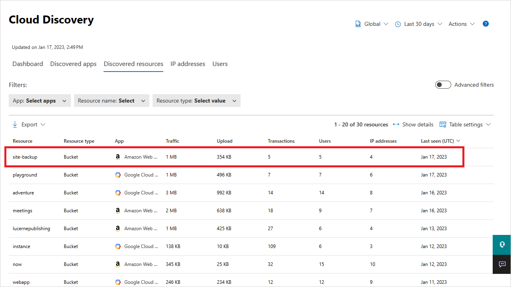
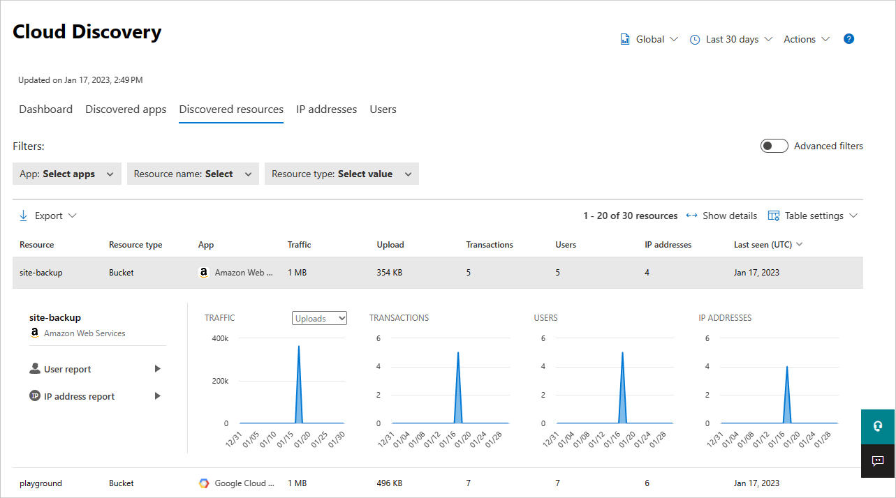
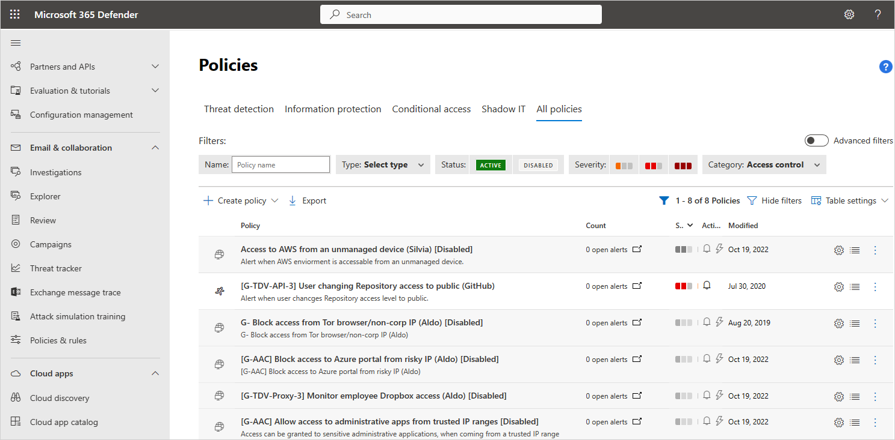

# Tutorial: Manage cloud platform security

[!INCLUDE [Banner for top of topics](includes/banner.md)]

Remote work often leads to extensive use of cloud apps and cloud platforms for common business tasks and surfaces the need to secure cloud environments and the adoption of cloud security products. According to the [shared responsibility model](/azure/security/fundamentals/shared-responsibility), an organization is responsible for managing and securing its cloud platform: Identity Access Management (IAM), Virtual Machines (VM) and their compute resources, data and storage, network resources, and more.

## How does security posture management help?

Having the appropriate security tools in place to protect resources that might haven't been properly protected is critical. Organizations must gain visibility to their cloud resources posture, have discovery capabilities to learn about the actual usage of each platform, be able to monitor suspicious activities, assess, and review configurations and compliance statuses, and be enabled to deploy real-time protection mechanisms.

Cloud Security Posture Management (CSPM) also extends beyond IaaS and PaaS security posture, to cover SaaS configurations as well. For example, GitHub repository with a public access level, or OAuth apps that have access to my SaaS apps like Office 365, Google Workspace or Sales Force. The SaaS CSPM is a new and growing domain of CSPM, which is a native expansion of the Defender for Cloud Apps product.

## Protecting multiple clouds from a single management portal

The modern complexity of organizations, many of whom use several cloud platforms for different purposes, and different deployment scales and statuses, requires the ability to track the multicloud environment regularly.  The deployment status of some services may change over time, and not necessarily with full notification of the changes to the security teams. By uniting these signals in one portal, the administration experience is streamlined for even more efficient time and resource management, both the people doing the monitoring and the people using the cloud resources.

Organizational security posture encompasses all cloud platforms in an organization and this new functionality is designed for use by security architects, central security admins, or compliance analysts. From this feature, admins can review subscriptions with non-compliant resources and drive remediation of each by the resource owner.

In this tutorial, you'll learn how to use Defender for Cloud Apps to secure your Azure, AWS, and GCP cloud platforms:

> [!div class="checklist"]
>
> - [Discover multi-cloud resources, usage, and Shadow IT](#phase-1-discover-multicloud-resources-usage-and-shadow-it)
> - [Monitor activities and alerts to detect suspicious behavior across workloads](#phase-2-monitor-activities-and-alerts-to-detect-suspicious-behavior-across-workloads)
> - [Automate protection and policy enforcement for cloud resources in real time](#phase-3-automate-protection-and-policy-enforcement-for-cloud-resources-in-real-time)

## How to secure your multicloud environment

To avoid critical cloud platform misconfigurations, it's important for organizations to get multicloud tenant-level visibility into their cloud configuration status and be able to improve their security posture based on security benchmark and compliance recommendations. Use the following process to secure your organization's multicloud environment.

### Phase 1: Discover multicloud resources, usage, and Shadow IT

**Identify security posture**: Start by identifying your organization's cloud security posture by running Cloud Discovery to see what's happening in your network and evaluate the actual resource usage in your cloud platforms. You can achieve this by [setting up Cloud Discovery](set-up-cloud-discovery.md) to monitor and analyze your network traffic  in Defender for Cloud Apps. Web traffic logs analysis with the Defender for Cloud Apps Shadow IT discovery  provide improved visibility over your Shadow IT usage of cloud resources, identifying anomalous activities using either the Machine Learning anomaly detection engine or by using custom policies that you define:

- **Discover**: Discover usage across your organization's resource-hosting cloud platforms. For example, evaluate the actual volume of data that was downloaded from your storage resources and identify suspicious resource use that may indicate attempts at data exfiltration. Similarly, identify suspicious upload activities that may indicate an attempt to compromise your environment by injecting malicious code onto a target.
- **Investigate**: Use the **Discovered resources** page to view access to data across resources including storage accounts, infrastructure, and custom apps hosted on Azure, AWS, and GCP. Ask questions such as: Was there a suspicious number of transactions in accessing a specific resource?

    

    To investigate further, you can drill down into each resource to see the types of transactions that occurred, who accessed it, and then drill down to investigate the users even further.

    

### Phase 2: Monitor activities and alerts to detect suspicious behavior across workloads

Track suspicious activities that may indicate a breach, like an IAM (Identity & Access Management) role change, or CloudTrail configuration change. For example, use our predefined **publicly accessible AWS S3 buckets** [policy template](policy-template-reference.md) to track S3 bucket configuration changes.

Monitoring audit logs for suspicious changes is a great place to apply anomaly detection tools, alerting on possible breaches by identifying multiple failed login attempts, or multiple deleted VM activities in combination with an impossible travel scenario.

:::image type="content" source="media/tutorial-cloud-platform-security-view-alerts.png" alt-text="View alerts." lightbox="media/tutorial-cloud-platform-security-view-alerts.png":::

Use what you learn from the alerts to tune user activity detections to identify true compromises and reduce alert fatigue resulting from handling large volumes of false positive detections. Consider tuning the following policy parameters:

- Configure [IP address ranges](tutorial-suspicious-activity.md#phase-1-configure-ip-address-ranges)
- Tune [anomaly detection policies](tutorial-suspicious-activity.md#phase-2-tune-anomaly-detection-policies), like unusual administrative activities, unusual multiple file download activities, ransomware activity, and failed sign-in activities to cloud platforms
- Tune [cloud discovery anomaly detection policies](tutorial-suspicious-activity.md#phase-3-tune-cloud-discovery-anomaly-detection-policies) by adjusting usage monitoring and alerts sensitivity
- Tune [rule-based detection policies and activity policies](tutorial-suspicious-activity.md#phase-4-tune-rule-based-detection-activity-policies), including publicly accessible AWS S3 buckets
- Configure [alerts](tutorial-suspicious-activity.md#phase-5-configure-alerts)
- [Investigate and remediate](tutorial-suspicious-activity.md#phase-6-investigate-and-remediate)

### Phase 3: Automate protection and policy enforcement for cloud resources in real time

Protect your organization's resources from data leaks and theft in real time by applying access and session controls policies. For more information, see [Protect apps in real time](tutorial-proxy.md).

- Prevent data exfiltration by [blocking downloads](session-policy-aad.md#block-download) to unmanaged or risky devices, protect on download in a risky session.
- Prevent [upload of malicious files](session-policy-aad.md#block-malware-on-upload) to your cloud platforms and block access for specific users based on many risk factors.

## See also

> [!div class="nextstepaction"]
> [Protect your Azure environment](protect-azure.md)

> [!div class="nextstepaction"]
> [Protect your AWS environment](protect-aws.md)

> [!div class="nextstepaction"]
> [Protect your GCP environment](protect-gcp.md)

[!INCLUDE [Open support ticket](includes/support.md)]
