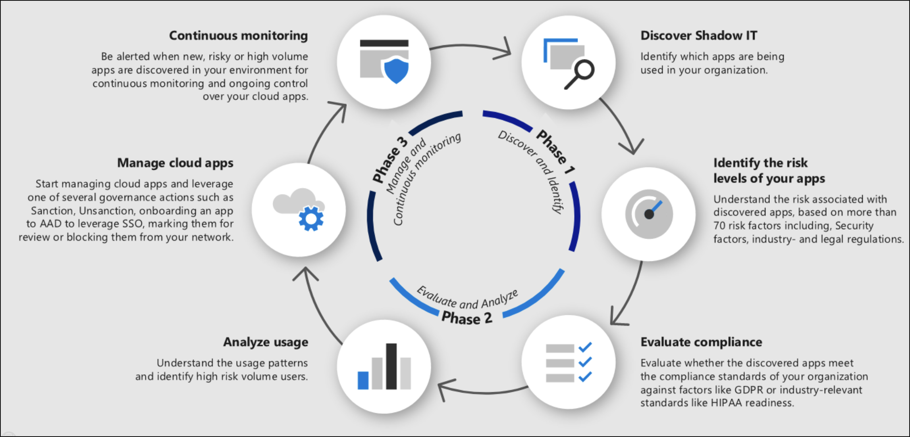

# Tutorial: Discover and manage shadow IT

[!INCLUDE [Banner for top of topics](includes/banner.md)]

When IT admins are asked how many cloud apps they think their employees use, on average they say 30 or 40, when in reality, the average is over 1,000 separate apps being used by employees in your organization. Shadow IT helps you know and identify which apps are being used and what your risk level is. 80% of employees use non-sanctioned apps that no one has reviewed, and may not be compliant with your security and compliance policies. And because your employees can access your resources and apps from outside your corporate network, it's no longer enough to have rules and policies on your firewalls.

In this tutorial, you'll learn how to use Cloud Discovery to discover which apps are being used, explore the risk of these apps, configure policies to identify new risky apps that are being used, and to unsanction these apps in order to block them natively using your proxy or firewall appliance

> [!div class="checklist"]
>
> - [Discover and identify Shadow IT](#phase-1-discover-and-identify-shadow-it)
> - [Evaluate and analyze](#phase-2-evaluate-and-analyze)
> - [Manage your apps](#phase-3-manage-your-apps)
> - [Advanced Shadow IT discovery reporting](#phase-4-advanced-shadow-it-discovery-reporting)
> - [Control sanctioned apps](#phase-5-control-sanctioned-apps)

>[!TIP]
> By default, Defender for Cloud Apps cannot discover apps that aren't in the catalog. 
> 
> To see Defender for Cloud Apps data for an app that's not currently in the catalog, we recommend that you [check our roadmap](https://www.microsoft.com/en-us/microsoft-365/roadmap?filters=Microsoft%20Defender%20for%20Identity) or [create a custom app](cloud-discovery-custom-apps.md).

## How to discover and manage Shadow IT in your network

Use this process to roll out Shadow IT Cloud Discovery in your organization.

### Phase 1: Discover and identify Shadow IT

1. **Discover Shadow IT**: Identify your organization's security posture by running Cloud Discovery in your organization to see what's actually happening in your network. For more information, see [Set up cloud discovery](set-up-cloud-discovery.md). This can be done using any of the following methods:

    - Get up and running quickly with Cloud Discovery by integrating with [Microsoft Defender for Endpoint](mde-integration.md). This native integration enables you to immediately start collecting data on cloud traffic across your Windows 10 and Windows 11 devices, on and off your network.

    - For coverage on all devices connected to your network, it's important to deploy the [Defender for Cloud Apps log collector](discovery-docker.md) on your firewalls and other proxies to collect data from your endpoints and send it to Defender for Cloud Apps for analysis.

    - Integrate Defender for Cloud Apps with your proxy. Defender for Cloud Apps natively integrates with some third-party proxies, including [Zscaler](zscaler-integration.md).

    Because policies are different across user groups, regions and business groups, you might want to create a dedicated Shadow IT report for each of these units. For more information, see [Create custom continuous reports](discovery-docker-windows.md#optional---create-custom-continuous-reports).

    Now that Cloud Discovery is running on your network, look at the continuous reports that are generated and look at the [Cloud Discovery dashboard](working-with-cloud-discovery-data.md) to get a full picture of what apps are being used in your organization. It's a good idea to look at them by category, because you'll often find that non-sanctioned apps are being used for legitimate work-related purposes that weren't addressed by a sanctioned app.

1. **Identify the risk levels of your apps**: Use the Defender for Cloud Apps catalog to dive deeper into the risks that are involved with each discovered app. The Defender for Cloud App Catalog includes over 31,000 apps that are assessed using over 90 risk factors. The risk factors start from general information about the app (where are the app's headquarters, who is the publisher), and through security measures and controls (support for encryption at rest, provides an audit log of user activity). For more information, see [Working with risk score](risk-score.md),

    - In the [Microsoft 365 Defender portal](https://security.microsoft.com/), under **Cloud Apps**, select **Cloud Discovery**. Then go to the **Discovered apps** tab. Filter the list of apps discovered in your organization by the risk factors you're concerned about. For example, you can use **Advanced filters** to find all apps with a risk score lower than 8.

    - You can drill down into the app to understand more about its compliance by selecting the app name and then selecting the **Info** tab to see details about the app's security risk factors.

### Phase 2: Evaluate and analyze

1. **Evaluate compliance**: Check whether the apps are certified as compliant with your organization's standards, such as HIPAA or SOC2.

    - In the [Microsoft 365 Defender portal](https://security.microsoft.com/), under **Cloud Apps**, select **Cloud Discovery**. Then go to the **Discovered apps** tab. Filter the list of apps discovered in your organization by the compliance risk factors you're concerned about. For example, use the suggested query to filter out non-compliant apps.

    - You can drill down into the app to understand more about its compliance by selecting the app name and then selecting the **Info** tab to see details about the app's compliance risk factors.

1. **Analyze usage**: Now that you know whether or not you want the app to be used in your organization, you want to investigate how and who is using it. If it's only used in a limited way in your organization maybe it's ok, but maybe if the use is growing you want to be notified about it so you can decide if you want to block the app.

    - In the [Microsoft 365 Defender portal](https://security.microsoft.com/), under **Cloud Apps**, select **Cloud Discovery**. Then go to the **Discovered apps** tab, and then drill down by selecting the specific app you want to investigate. The **Usage** tab lets you know how many active users are using the app and how much traffic it's generating. This can already give you a good picture of what's happening with the app. Then, if you want to see who, specifically, is using the app, you can drill down further by selecting **Total active users**. This important step can give you pertinent information, for example, if you discover that all the users of a specific app are from the Marketing department, it's possible that there's a business need for this app, and if it's risky you should talk to them about an alternative before blocking it.

    - Dive even deeper when investigating use of discovered apps. View subdomains and resources to learn about specific activities, data access, and resource usage in your cloud services. For more information, see [Deep dive into Discovered apps](discovered-apps.md#deep-dive-into-discovered-apps) and [Discover resources and custom apps](discovered-apps.md#discover-resources-and-custom-apps).

1. **Identify alternative apps**: Use the Cloud App Catalog to identify safer apps that achieve similar business functionality as the detected risky apps, but do comply with your organization's policy. You can do this by using the advanced filters to find apps in the same category that meet with your different security controls.

### Phase 3: Manage your apps

- **Manage cloud apps**: Defender for Cloud Apps helps you with the process for managing app use in your organization. After you identified the different patterns and behaviors used in your organization, you can create new custom app tags in order to classify each app according to its business status or justification. These tags can be then used for specific monitoring purposes, for example, identify high traffic that is going to apps that are tagged as risky cloud storage apps. App tags can be managed under **Settings** > **Cloud Apps** > **Cloud Discovery** > **App tags**. These tags can then be used later for filtering in the Cloud Discovery pages and creating policies using them.

- **Manage discovered apps using Azure Active Directory (Azure AD) Gallery**: Defender for Cloud Apps also uses its native integration with Azure AD to enable you to manage your discovered apps in Azure AD Gallery. For apps that already appear in the Azure AD Gallery, you can apply single sign-on and manage the app with Azure AD. To do so, on the row where the relevant app appears, choose the three dots at the end of the row, and then choose **Manage app with Azure AD**.

    :::image type="content" source="media/manage-app-in-azure-ad-gallery.png" alt-text="Manage app in Azure AD gallery." lightbox="media/manage-app-in-azure-ad-gallery.png":::

- **Continuous monitoring**: Now that you've thoroughly investigated the apps, you might want to set policies that monitor the apps and provide control where needed.

Now it's time to create policies so you can be automatically alerted when something happens that you're concerned about. For example, you might want to create an **App discovery policy** that lets you know when there's a spike in downloads or traffic from an app you're concerned about. To achieve this, you should enable **Anomalous behavior in discovered users policy**, **Cloud storage app compliance check**, and **New risky app**. You should also set the policy to notify you by email. For more information, see [policy template reference](policy-template-reference.md),  more about [Cloud Discovery policies](cloud-discovery-policies.md) and Configure [App discovery policies](cloud-discovery-policies.md).

Look at the alerts page and use the **Policy type** filter to look at app discovery alerts. For apps that were matched by your app discovery policies, it's recommended that you do an advanced investigation to learn more about the business justification for using the app, for example, by contacting the users of the app. Then, repeat the steps in Phase 2 to evaluate the risk of the app. Then determine next steps for the application, whether you approve use of it in the future or want to block it the next time a user accesses it, in which case you should tag it as unsanctioned so it can be blocked using your firewall, proxy, or secure web gateway. For more information, see [Integrate with Microsoft Defender for Endpoint](mde-govern.md), [Integrate with Zscaler](zscaler-integration.md), [Integrate with iboss](iboss-integration.md), and [Block apps by exporting a block script](governance-discovery.md#block-apps-by-exporting-a-block-script).

### Phase 4: Advanced Shadow IT discovery reporting

In addition to the reporting options available in Defender for Cloud Apps, you can integrate Cloud Discovery logs into Microsoft Sentinel for further investigation and analysis. Once the data is in Microsoft Sentinel, you can view it in dashboards, run queries using Kusto query language, export queries to Microsoft Power BI, integrate with other sources, and create custom alerts. For more information, see [Microsoft Sentinel integration](siem-sentinel.md).

### Phase 5: Control sanctioned apps

1. To enable app control via APIs, [connect apps via API](enable-instant-visibility-protection-and-governance-actions-for-your-apps.md) for continuous monitoring.

2. Protect apps using [Conditional Access App Control](proxy-intro-aad.md).

The nature of cloud apps means that they're updated daily and new apps appear all the time. Because of this, employees are continuously using new apps and it's important to keep tracking and reviewing and updating your policies, checking which apps your users are using, as well as their usage and behavior patterns. You can always go to the Cloud Discovery dashboard and see what new apps are being used, and follow the instructions in this article again to make sure your organization and your data are protected.

## Next steps

> [!div class="nextstepaction"]
> [Best practices for protecting your organization](best-practices.md)

[!INCLUDE [Open support ticket](includes/support.md)]

## Learn more

- Try our interactive guide: [Discover and manage cloud app usage with Microsoft Defender for Cloud Apps](https://mslearn.cloudguides.com/guides/Discover%20and%20manage%20cloud%20app%20usage%20with%20Microsoft%20Cloud%20App%20Security)
