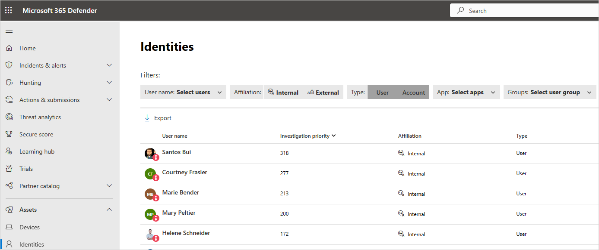
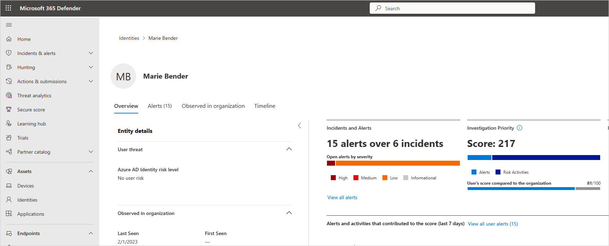
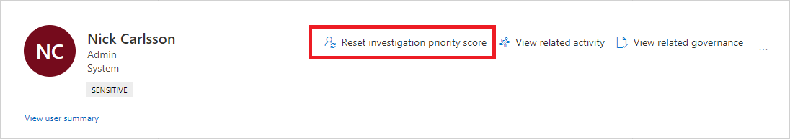

# Tutorial: Investigate risky users

> [!IMPORTANT]
> Starting November 2024, **Investigate risky users** support for Microsoft Defender for Cloud Apps is retired. As such, the legacy procedure presented in this article is provided for informational purposes only.
> 

Security operations teams are challenged to monitor user activity, suspicious or otherwise, across all dimensions of the identity attack surface, using multiple security solutions that often aren't connected. While many companies now have hunting teams to proactively identify threats in their environments, knowing what to look for across the vast amount of data can be a challenge. Microsoft Defender for Cloud Apps removes the need to create complex correlation rules, and lets you look for attacks that span across your cloud and on-premises network.

To help you focus on user identity, Microsoft Defender for Cloud Apps provides user entity behavioral analytics (UEBA) in the cloud. UEBA can be extended to your on-premises environment by integrating with Microsoft Defender for Identity, after which you'll also gain context around user identity from its native integration with Active Directory.

Whether your trigger is an alert you see in the Defender for Cloud Apps dashboard, or whether you have information from a third-party security service, start your investigation from the Defender for Cloud Apps dashboard to deep dive into risky users.

In this tutorial, you learn how to use Defender for Cloud Apps to investigate risky users:

> [!div class="checklist"]
>
> - [Connect to the apps you want to protect](#connect-apps-protect)
> - [Identify top risky users](#identify)
> - [Further investigate users](#investigate)
> - [Protect your organization](#protect)

## Understand the investigation priority score

The **investigation priority score** is a score that Defender for Cloud Apps gives to each user to let you know how risky the user is, relative to other users in your organization. Use the investigation priority score to determine which users to investigate first, detecting both malicious insiders, and external attackers moving laterally in your organizations, without having to rely on standard deterministic detections.

Every Microsoft Entra user has a dynamic investigation priority score, which is constantly updated based on recent behavior and impact built from data evaluated from Defender for Identity and Defender for Cloud Apps.

Defender for Cloud Apps builds user profiles for each user, based on analytics that consider security alerts and abnormal activities over time, peer groups, expected user activity, and the effect any specific user might have on the business or company assets.

Activity that is anomalous to a user's baseline is evaluated and scored. After scoring is complete, Microsoft's proprietary dynamic peer calculations and machine learning are run on the user activities to calculate the investigation priority for each user.

Understand who the real top risky users are right away by filtering according to **Investigation priority score**, directly verifying each user's business impact, and investigating all related activities – whether they're compromised, exfiltrating data, or acting as insider threats.

Defender for Cloud Apps uses the following to measure risk:

- **Alert scoring**: The alert score represents the potential impact of a specific alert on each user. Alert scoring is based on severity, user impact, alert popularity across users, and all entities in the organization.

- **Activity scoring**: The activity score determines the probability of a specific user performing a specific activity, based on behavioral learning of the user and their peers. Activities identified as the most abnormal receive the highest scores.

Select the investigation priority score for an alert or an activity to view the evidence that explains how Defender for Cloud Apps scored the activity.

> [!NOTE]
> We're gradually retiring the [**Investigation priority score increase**](investigate-anomaly-alerts.md#investigation-priority-score-increase-preview) alert from Microsoft Defender for Cloud Apps by August 2024. The investigation priority score and the procedure described in this article are not affected by this change.
>
> For more information, see [Investigation priority score increase deprecation timeline](investigate-anomaly-alerts.md#deprecation-timeline).

## Phase 1: Connect to the apps you want to protect

Connect at least one app to Microsoft Defender for Cloud Apps using the [API connectors](enable-instant-visibility-protection-and-governance-actions-for-your-apps.md). We recommend that you start by connecting [Microsoft 365](./connect-office-365.md).

Microsoft Entra ID apps are automatically onboarded for Conditional Access app control.

## Phase 2: Identify top risky users

To identify who your riskiest users are in Defender for Cloud Apps:

1. In the Microsoft Defender Portal, under **Assets**, select **Identities**. Sort the table by **Investigation priority**. Then one by one go to their user page to investigate them.  
The **investigation priority number**, found next to the user name, is a sum of all the user's risky activities over the last week.

   

1. Select the three dots to the right of the user, and choose **View User page**.

    

1. Review the information in the user details page to get an overview of the user and see if there are points at which the user performed activities that were unusual for that user or were performed at an unusual time.

    The **User's score compared to the organization** represents which percentile the user is in based on their ranking in your organization - how high they are on the list of users you should investigate, relative to other users in your organization. The number is red if a user is in or above the 90th percentile of risky users across your organization.  

The user details page helps you answer the following questions:

|Question  |Details  |
|---------|---------|
|**Who is the user?**       |  Look for basic details about the user and what the system knows about them, including the user's role in your company and their department.   For example, is the user a DevOps engineer who often performs unusual activities as part of their job? Or is the user a disgruntled employee who just got passed over for a promotion?       |
|**Is the user risky?**     |  What is the employee's [risk score](#risk-score), and is it worth your while investigating them?       |
|**What's risk does the user present to your organization?**     |   Scroll down to investigate each activity and alert related to the user to start understanding the type of risk the user represents.   In the timeline, select each line to drill down deeper into the activity or alert itself. Select the number next to the activity so that you can understand the evidence that influenced the score itself.      |
|**What's the risk to other assets in your organization?**     |  Select the **Lateral movement paths** tab to understand which paths an attacker can use to gain control of other assets in your organization.   For example, even if the user you're investigating has a nonsensitive account, an attacker can use connections to the account to discover and attempt to compromise sensitive accounts in your network.   For more information, see [Use Lateral Movement Paths](/defender-for-identity/investigate-lateral-movement-path).       |

>[!NOTE]
>While user details pages provide information for devices, resources, and accounts across all activities, the investigation priority score includes the **sum** of all risky activities and alerts over the last 7 days.

### Reset user score

If the user was investigated and no suspicion for compromise was found, or if you want to reset the user's investigation priority score for any other reason, so manually as follows:

1. In the Microsoft Defender Portal, under **Assets**, select **Identities**.

1. Select the three dots to the right of the investigated user, and then select **Reset investigation priority score**. You can also select **View user page** and then select **Reset investigation priority score** from the three dots in the user details page.

    > [!NOTE]
    > Only users with a non-zero investigation priority score can be reset.

    

1. In the confirmation window, select **Reset score**.

    

## Phase 3: Further investigate users

Some activities might not be cause for alarm on their own, but might be an indication of a suspicious event when aggregated with other activities.

When you investigate a user, you want to ask the following questions about the activities and alerts you see:

- **Is there a business justification for this employee to perform these activities?** For example, if someone from marketing is accessing the code base, or someone from development accesses the finance database, you should follow up with the employee to make sure this was an intentional and justified activity.

- **Why did this activity receive a high score while others didn't**? Go to the **Activity log** and set the **Investigation priority** to **Is set** to understand which activities are suspicious. 

    For example, you can filter based on **Investigation priority** for all activities that occurred in a specific geographical area. Then you can see whether there were other activities that were risky, where the user connected from, and you can easily pivot to other drill downs, such as recent nonanomalous cloud and on-premises activities, to continue your investigation.

## Phase 4: Protect your organization

If your investigation leads you to the conclusion that a user is compromised, use the following steps to mitigate the risk.

- **Contact the user** – Using the user contact information integrated with Defender for Cloud Apps from Active Directory, you can drill down into each alert and activity to resolve the user identity. Make sure the user is familiar with the activities.

- Directly from the Microsoft Defender Portal, in the **Identities** page, select the three dots by the investigated user and choose whether to require the user to sign in again, suspend the user, or confirm the user as compromised.

- In the case of a compromised identity, you can ask the user to reset their password, making sure the password meets best practice guidelines for length and complexity.
- If you drill down into an alert and determine that the activity shouldn't have triggered an alert, in the [Activity drawer](activity-filters.md), select the **Send us feedback** link so that we can be sure to fine-tune our alerting system with your organization in mind.
- After you remediate the issue, close the alert.

## See also

> [!div class="nextstepaction"]
> [Best practices for protecting your organization](best-practices.md)

[!INCLUDE [Open support ticket](includes/support.md)]
