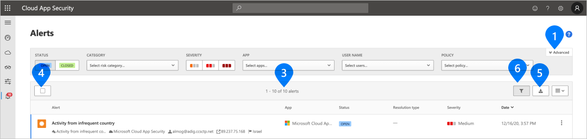
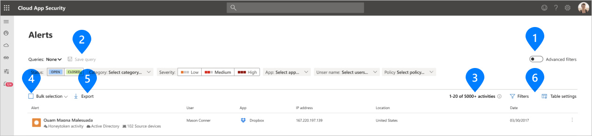

# Microsoft Cloud App Security user interface updates

[!INCLUDE [Banner for top of topics](includes/banner.md)]

In the coming months, Cloud App Security will be updating its UI to provide a more consistent experience across Microsoft 365 security portals.

Use this article to learn about the changes as they unfold.

## Week of January 10, 2021

### What's changed

We've updated the following filters and controls for tables and forms across all Cloud App Security portal pages.

- The design and positioning of Basic and Advanced filters toggle control
- The design of Advanced filters in forms such as policies
- The design and positioning of table controls

### Examples

:::row:::
   :::column span="":::
      1. **Basic/Advanced filters** toggle
   :::column-end:::
   :::column span="":::
      4. **Bulk selection** check box
   :::column-end:::
:::row-end:::
:::row:::
   :::column span="":::
      2. **Save query** button
   :::column-end:::
   :::column span="":::
      5. **Export** button
   :::column-end:::
:::row-end:::
:::row:::
   :::column span="":::
      3. Number of results (X of Y) indicator
   :::column-end:::
   :::column span="":::
      6. Table settings controls
   :::column-end:::
:::row-end:::

#### Current design

#### New design

