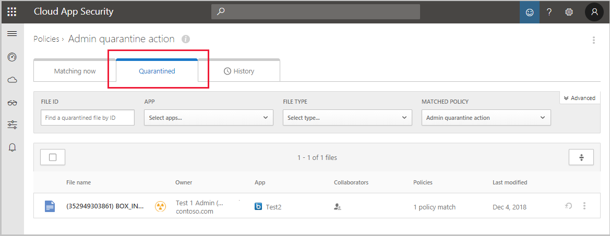

---
# required metadata

title: Protect files with Cloud App Security admin quarantine
description: This tutorial describes the scenario for using admin quarantine to control data breaches.
keywords:
author: ShlomoSagir-MS
ms.author: shsagir
manager: ShlomoSagir-MS
ms.date: 7/30/2019
ms.topic: tutorial
ms.collection: M365-security-compliance
ms.prod:
ms.service: cloud-app-security
ms.technology:
ms.assetid: 3fc04cfb-ad4c-4ac2-980a-ee9f4c740d88

# optional metadata

#ROBOTS:
#audience:
#ms.devlang:
ms.reviewer: reutam
ms.suite: ems
#ms.tgt_pltfrm:
ms.custom: seodec18
#Customer intent: As a sec operator, I want to quarantine my files so that I don't have information leaks.
---
# Tutorial: Protect files with admin quarantine

*Applies to: Microsoft Cloud App Security*

[File policies](data-protection-policies.md) are a great tool for finding threats to your information protection policies. For instance, create file policies that find places where users stored sensitive information, credit card numbers, and third-party ICAP files in your cloud.

This tutorial helps you use Microsoft Cloud App Security to detect unwanted files stored in your cloud that leave you vulnerable, and take immediate action to stop them in their tracks and lock down the files that pose a threat by using **Admin quarantine** to protect your files in the cloud, remediate problems, and prevent future leaks from occurring.

> [!div class="checklist"]
> * Understand how quarantine works 
> * Set up admin quarantine

## Understand how quarantine works

>[!NOTE]
> - For a list of apps that support admin quarantine, see the the list of [governance actions](governance-actions.md).
> - If a file in SharePoint or OneDrive is detected to be malware, it is not quarantined in the Cloud App Security portal.

1. When a file matches a policy, the **Admin quarantine** option will be available for the file.

2. Do one of the following actions to quarantine the file:

   - Manually apply the **Admin quarantine** action:

     

   - Set it as an automated quarantine action in the policy:

     

3. When **Admin quarantine** is applied, the following things occur behind the scenes:

   1. The original file is moved to the admin quarantine folder you set.
   2. The original file is deleted.
   3. A tombstone file is uploaded to the original file location.

      

   4. The user can only access the tombstone file. In the file, they can read the custom guidelines provided by IT and the correlation ID to give IT to release the file.

4. When you receive the alert that a file has been quarantined, investigate the file in the Cloud App Security **Alerts** page:

   

5. And also in the **Policy Report** on the **Quarantined** tab:

   

6. After a file is quarantined, use the following process to remediate the threat situation:

    1. Inspect the file in the quarantined folder on SharePoint online.
    2. You can also look at the audit logs to deep dive into the file properties.
    3. If you find the file is against corporate policy, run the organization’s Incident Response (IR) process.
    4. If you find that the file is harmless, you can restore the file from quarantine. At that point the original file is released, meaning it's copied back to the original location, the tombstone is deleted, and the user can access the file.

       

7. Validate that the policy runs smoothly. Then, you can use the automatic governance actions in the policy to prevent further leaks and automatically apply an Admin quarantine when the policy is matched.

> [!NOTE]
> When you restore a file:
> - Original shares are not restored, default folder inheritance applied.
> - The restored file contains only the most recent version.
> - The quarantine folder site access management is the customer’s responsibility.

## Set up admin quarantine

1. Set file policies that detect breaches. Examples of these types of policies include:

    - A metadata only policy such as a classification label in SharePoint Online
    - A native DLP policy such as a policy that searches for credit card numbers
    - An ICAP third-party policy such as a policy that looks for Vontu

2. Set a quarantine location:
   1. For Office 365 SharePoint or OneDrive for Business, you can't put files in admin quarantine as part of a policy until you set it up:
      

      To set admin quarantine settings, under the settings cog, go to **Settings**. Provide a location for the quarantined files and a user notification that your user will receive when their file is quarantined.
      

   2. For Box, the quarantine folder location and user message can't be customized. The folder location is the drive of the admin who connected Box to Cloud App Security and the user message is: This file was quarantined to your administrator's drive because it might violate your company's security and compliance policies. Contact your IT administrator for help.

## Next steps 
[Daily activities to protect your cloud environment](daily-activities-to-protect-your-cloud-environment.md)

[Premier customers can also create a new support request directly in the Premier Portal.](https://premier.microsoft.com/)  
