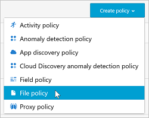
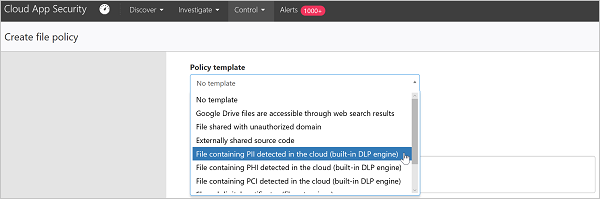
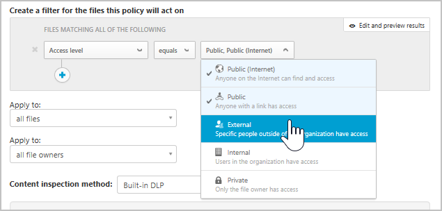
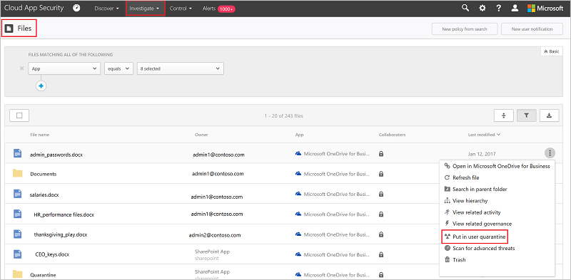
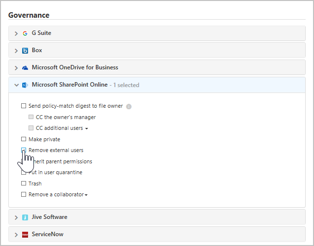
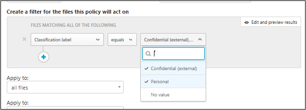
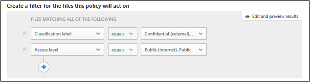
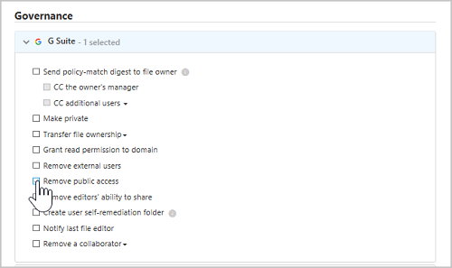

---
# required metadata

title: Overview of data control scenario | Microsoft Docs
description: This topic describes the scenario for controlling data in your cloud environment.
keywords:
author: rkarlin
ms.author: rkarlin
manager: mbaldwin
ms.date: 9/25/2017
ms.topic: article
ms.prod:
ms.service: cloud-app-security
ms.technology:
ms.assetid: 57927618-cb66-4c7f-afd7-c96926460816

# optional metadata

#ROBOTS:
#audience:
#ms.devlang:
ms.reviewer: reutam
ms.suite: ems
#ms.tgt_pltfrm:
#ms.custom:

---

# Protecting your data with Cloud App Security

In today's corporate world, where there is so much data and so many devices, it can be hard to keep track of where your data is and who has access to it. Cloud App Security enables you to take control over your data by enabling file protection across the cloud. Cloud App Security provides you with tools for creating policies for what you want to allow and not allow across your corporate cloud, and gives you a wide range of automated processes to provide continuous compliance scans, legal eDiscovery tasks, DLP for sensitive content stored in your cloud or shared externally or publicly and many more use cases.
Cloud App Security can monitor any file type based on more than 20 metadata filters (for example, access level, file type). For more information see [Files](files-filters.md). The following are two examples of data related threats that all organizations face, with procedures for how to protect your files in the cloud.

## Files that contain sensitive data are being shared externally 

This use case applies to Office 365, G Suite, Box, Dropbox, and Salesforce.

### THE THREAT
One of the greatest benefits cloud technology provides is the ability to share anything with anyone. But with great power comes great responsibility, and in order to make sure no sensitive data is being shared externally you need to know which files contain sensitive data and who are they shared with. Using the tools provided with your cloud apps you are not able to tell what is saved in the cloud app, or who has access - keeping you unaware of possible data leaks.

### THE SOLUTION
By finding these two parameters- sensitivity and sharing level, and crossing them together you can identify these possible breaches. Cloud App Security scans all of the files saved in your cloud apps and classifies them by their sharing level automatically. You can then configure a file policy in Cloud App Security to search for all the sensitive data saved in your cloud apps. Once you find a sensitive file shared externally you can either take manual remediation actions or you can set Cloud App Security to do it automatically for you. By doing this you can remove the data leak risk with a click.

#### Prerequisites

[Connect](enable-instant-visibility-protection-and-governance-actions-for-your-apps.md) at least one cloud app to Cloud App Security.

#### Setting up monitoring

1.	Start monitoring your app by setting up a policy that will scan all of the externally shared files for sensitive content:

    1. On the **Policies** page, click [**Create file policy**](data-protection-policies.md). 
    

    2. In the [**Policy template**](policy-template-reference.md) field, choose **File containing PII detected in the cloud (built-in DLP engine)** and click **Apply template**. 
    
    3. To monitor inappropriate sharing of these files containing private information, add a filter with the access level you are trying to prevent - for example,  **Access level equals External, Public, Public (Internet)**. 
     

2. Investigating your matches
    
    1. In the **Policies** page, click on the policy name to go to the **Policy report** and review the matches that were triggered for the policy.

    2. You can investigate the match by clicking on a specific match to open the file drawer. In the drawer, you can see the other policies that this file matched, the content scan status and if you click on that you can see the content matches, you can click on the **Collaborators** to see the list of collaborators and you can see if there are any classification labels on the file. You can also take a look at the **Path** to see where the file is saved to get more context about the file itself.
    
    3. If you find false positives, mark them with a checkmark to exclude them from the report and from live matches. You can use the feedback feature to let the Cloud App Security team of improvements you'd like to add. 

#### Validating your policy

1. Create a new Word document with the following text in it: 078-05-1120.
2. Then, save the file as *test file.docx* and share it with someone outside your domain or with a public URL. 
3. Go to the policy report. A file policy match should appear shortly. 
4. You can click on the match to see the context of the file. The match itself will be masked to protect the sensitive data. 

#### Removing the risk

After you've validated it and fine-tuned the policy, remove possible false positives that may have matched your policy. Then, do the following: 
  1. You can take immediate [governance actions](governance-actions.md) by clicking on the three dots at the end of the row and selecting the relevant governance action, for example, **Put user in quarantine**.

 

   2. After it's fully validated, you can set it to perform automatic governance actions. For example, in SharePoint and OneDrive you can **Remove external users** or **Put in user quarantine**, and for G Suite and Box you can **Remove external users** and **Remove public access**.

  

## Files shared publicly and labeled as confidential

This use case applies to Office 365, G Suite, Box, Dropbox, and Salesforce.

This use case takes advantage of the integration between Cloud App Security and Azure Information Protection. If you are running Azure Information Protection across your organization and have taken the time to label your files with Azure Information Protection labels, Cloud App Security enables you to monitor and control what happens to those files after they are labeled.

### THE THREAT

You know you need to protect your data, you've already gone to the trouble of classifying your files in Azure Information Protection. But once you classify them, how do you know where they are and who's looking at them? 

### THE SOLUTION
 You can monitor these classified files when they're in the cloud using Cloud App Security. This enables you to make sure that the data you classified as **confidential** (or some other sensitive classification) is not being inappropriately shared. Let Cloud App Security monitor and manage the files you classified in Azure Information Protection by rolling out the following policy and governance actions.

#### Prerequisites

- [Connect](enable-instant-visibility-protection-and-governance-actions-for-your-apps.md) at least one cloud app to Cloud App Security.
- Follow the [Azure Information Protection integration instructions](azip-integration.md) to enable the automatic scan.

#### Setting up monitoring

1. Monitor all of the files with the desired classification labels that are publicly shared:	
    
    1. On the **Policies** page, click [**Create file policy**](data-protection-policies.md). 

    2.	In the filter section, you can remove the filters for **Access level** and **Last modified** to run this policy on all the files in your cloud. These filters only apply to files modified from no on. Add the filter **Classification label** and then **equals** and select your organization's classification label. 
    
    

    3.	To monitor inappropriate sharing of these classified files, add a filter with the access level you are trying to prevent - for example,  **Access level equals Public, Public (Internet)**.  After you start the policy, it takes time for Cloud App Security to scan existing files and also any new files you add. Depending on the amount of data you have in your cloud, it may take some time to complete the scan.

    

2. Investigating your matches

    1. Click on the policy name to go to the **Policy report** and review the matches that were triggered for the policy.
    
    2. You can investigate the match by clicking on a specific match to open the file drawer. In the drawer, you can see the classification labels that were set on this file, other policies that this file matched, and you can click on the **Collaborators** to see the list of collaborators. You can also take a look at the **Path** to see where the file is saved to get more context about the file itself.
      
    3. If you find false positives, mark them with a check mark to exclude them from the report and from live matches. You can use the feedback feature to let the Cloud App Security team of improvements you'd like to add. 

#### Validating your policy

1. Create a new Word document and use the Azure Information Protection tool bar to set the any sensitivity label, such as **Confidential**. 

2. Upload the file to your cloud app and then share it with a public URL. 

3. Go to the **Policy report**. A file policy match should appear shortly. 

4. You can see the classification label by clicking on the file and opening the **File drawer**. 

#### Removing the risk

After you've validated it and fine-tuned the policy to remove possible false positives that may have matched your policy, do the following: 

1. You can take immediate [governance actions](governance-actions.md) by clicking on the three dots at the end of the row and selecting the relevant governance action, for example, **Put in user quarantine**.
    
2. After it's fully validated, you can set it to perform automatic governance actions. For example, in SharePoint and OneDrive you can **Put in user quarantine**, and for G Suite and Box you can **Remove public access**.
 
 

For more information about Cloud App Security working with Azure Information Protection, see [Protect against user mistakes](https://docs.microsoft.com/enterprise-mobility-security/solutions/protect-data-user-mistake).

## See Also  
[Daily activities to protect your cloud environment](daily-activities-to-protect-your-cloud-environment.md)   
[For technical support, please visit the Cloud App Security assisted support page.](http://support.microsoft.com/oas/default.aspx?prid=16031)   
[Premier customers can also choose Cloud App Security directly from the Premier Portal.](https://premier.microsoft.com/)  
  
  