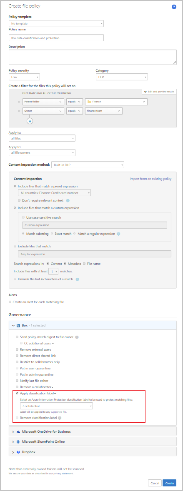

# Tutorial: Automatically apply sensitivity labels from Microsoft Purview Information Protection

[!INCLUDE [Banner for top of topics](includes/banner.md)]

In a perfect world, all your employees understand the importance of information protection and work within your policies. But in a real world, it's probable a partner who works with accounting uploads a document to your Box repository with the wrong permissions. A week later you realize your enterprise's confidential information was leaked to your competition. Microsoft Defender for Cloud Apps helps you prevent this kind of disaster before it happens. This feature is available for Box, SharePoint and OneDrive for Business. Applying a sensitivity label is one of a long list of available [governance actions](governance-actions.md).

In this tutorial, you'll learn how to identify which public permissions are set on a document that's saved in your cloud storage, so you're alerted when a breach occurs. In addition, you can automatically apply your Microsoft Purview Information Protection **Confidential** sensitivity label to provide added encryption to files.

> [!div class="checklist"]
>
> - [Set up data protection](#set-up-data-protection)
> - [Validate your policy](#validate-your-policy)

## Enhanced data-level encryption protection

Defender for Cloud Apps integration with Microsoft Purview Information Protection enables an added level of protection by automatically encrypting files. When Microsoft Purview Information Protection encrypts files, applications that support Microsoft Purview Information Protection like Microsoft 365, know how to open the files and honors permissions set in the sensitivity labels. Use labels to apply specific protection rules. For example, set a file that can be opened but not shared, printed, forwarded, or edited.

This strong level of protection travels with the file. The file is still protected if you send the file, copy it, or store it in your online storage app. If one of your employees loses a thumb drive with the file on it, the file will be locked. Should someone try to open the file, the file owner will receive an alert. With Defender for Cloud Apps, you can apply protection automatically. For example, set all files that have credit card numbers, or were uploaded by the finance department and are shared externally, to be automatically protected with a sensitivity label.

## The threat

A user in your organization saves confidential customer information files to Box and sets it to be shared with everyone in the organization. The user doesn't realize that not only their immediate team, but the entire support staff has access to that Box account. This access includes vendors, partners, and visitors who occasionally stop into the office. Any person with access to your organization's Box account now has access to that information. Not only can that access be dangerous for your organization, it can be against personal information regulations in many countries/regions, causing potential legal issues.

## The solution

Use Defender for Cloud Apps with Microsoft Purview Information Protection to embed classification and protection information for persistent protection that follows your data — so it stays protected no matter where it's stored or who it's shared with. This protection enables you to share data safely with coworkers, customers, and partners. Define who can access data and what they can do with it. For instance, allow users to view and edit files but not print or forward. You can also add other [governance actions](governance-actions.md) supported by Defender for Cloud Apps to the files such as remove collaborators and remove sharing abilities.

## Prerequisites

- [Enable Defender for Cloud Apps and Microsoft Purview Information Protection](azip-integration.md) for your tenant.
- [Connect Box](./connect-box.md) to Defender for Cloud Apps.

## Set up data protection

Let's set up a policy that looks for credit card numbers in files stored in your Box account. When files are found, automatically apply a sensitivity label and control what happens to all files with that label.

1. Start protecting the data you store in Box by setting up a policy that will encrypt any sensitive data stored in Box:

    1. In the Microsoft 365 Defender portal, under **Cloud Apps**, select [**Policies**](control-cloud-apps-with-policies.md) -> **Policy management**.

    1. Select **Create policy** and select **File policy**.

    1. Call the policy *Box data protection*.

    1. Under **Create a filter for the files this policy will act on**, target your proprietary and sensitive data.
        - For example, select **Parent folder** equals **Customer data** in Box and select **Collaborators** equals **Finance & Accounting**.

    1. Within that folder, look for files containing credit card information. Under **Content inspection method**, select **Built-in DLP**, select **Include files that match a preset expression**, and select **All countries:Finance:Credit card number**.

    1. Under **Governance**, open the **Box** section and select **Apply sensitivity label**. Select the label you want to apply.

    1. Because [Defender for Cloud Apps is integrated with Microsoft Purview Information Protection](azip-integration.md), you can select from your existing list of sensitivity labels to be used to protect the data.

    1. Select **Create**.

   
   

1. Investigating your matches

    1. In the **Policy management** page, select the policy name to go to **View policy matches**. Review the matches that were triggered for the policy.

    1. You can investigate the match by selecting a specific match to open the file drawer. In the drawer, you can see the other policies that this file matched.

## Validate your policy

1. To simulate an alert, go to your Box account and try to access a file in the folder **Customer data**.
1. Go to the policy report. A file policy match should appear shortly.
1. You can select the match to see which files were protected. The match itself will be masked to protect the sensitive data.

>[!NOTE]
>
> - Defender for Cloud Apps currently supports automatic application of sensitivity labels on Box, GSuite, SharePoint and OneDrive for business.
> - When a document is labeled by Defender for Cloud Apps, visual markings, such as headers, footers, or watermarks, are not applied. For more information, see [Learn about sensitivity labels](/microsoft-365/compliance/sensitivity-labels).
>

## Next steps

> [!div class="nextstepaction"]
> [Best practices for protecting your organization](best-practices.md)

[!INCLUDE [Open support ticket](includes/support.md)]
