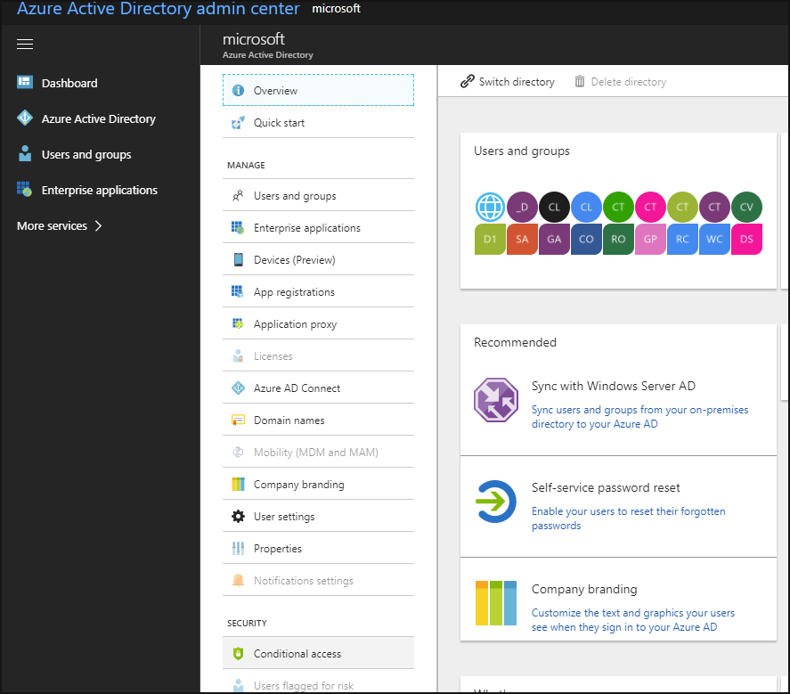
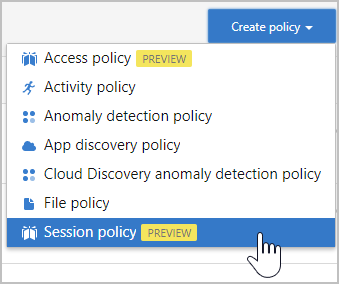
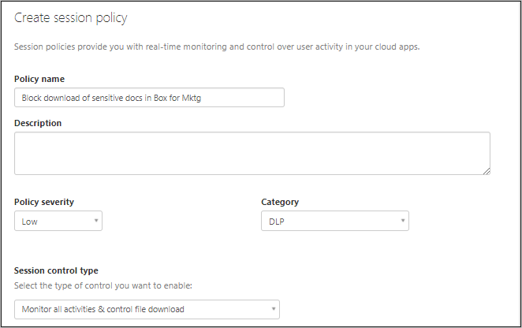
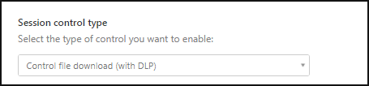
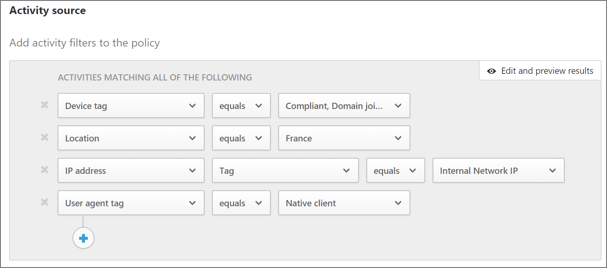
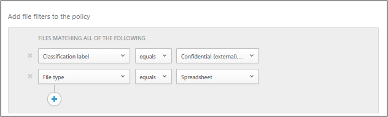
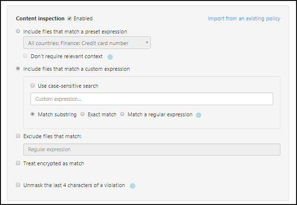
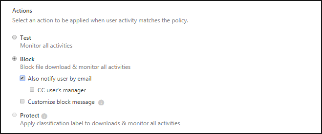
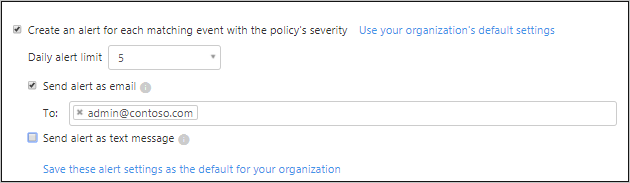

---
# required metadata

title: How to block downloads of sensitive data to unmanaged devices using Cloud App Security proxy| Microsoft Docs
description: This topic describes the scenario for protecting your organization against downloads of sensitive data by unmanaged devicesusing Azure AD proxy capabilities.
keywords:
author: rkarlin
ms.author: rkarlin
manager: mbaldwin
ms.date: 10/18/2017
ms.topic: article
ms.prod:
ms.service: cloud-app-security
ms.technology:
ms.assetid: 06238ebc-2088-4372-9412-96cceaf3b145

# optional metadata

#ROBOTS:
#audience:
#ms.devlang:
ms.reviewer: reutam
ms.suite: ems
#ms.tgt_pltfrm:
#ms.custom:

---

# Blocking downloads of sensitive information on unmanaged devices using the Cloud App Security proxy

Today's IT admin is stuck between a rock and hard place: You want to enable your employees to be productive. That means enabling employees to access apps so they can work at any time, from any device. On the other hand, you want to protect the company's assets, and that includes proprietary and privileged information. How can you enable your employees to access your cloud apps, while protecting your data? **This use case allows you to block downloads by users who have access to your sensitive data in enterprise cloud apps from either unmanaged devices or off-corporate network locations.**

## THE THREAT
An account manager in your organization wants to check something in Salesforce from home over the weekend, on their personal laptop. The Salesforce data may include client credit card information or personal information. The home PC is unmanaged, meaning that if they download documents from Salesforce onto it, it may be infected with malware or if it is lost or stolen, it may not be password protected and anyone who finds it has access to sensitive information. 

## THE SOLUTION
Protect your organization by monitoring and controlling cloud app use using Azure AD conditional access and the Cloud App Security proxy.  

## Prerequisites

- A valid license for Azure AD Premium P2
- Configure a cloud app for SSO in Azure AD  
- Make sure the [app is deployed to Cloud App Security](proxy-deployment-aad.md)

## Create a block download policy for unmanaged devices  

Cloud App Security session policies allow you to further restrict a session based on device state. When you want to control a session using its device as a condition, you must create both a conditional access policy AND as session policy to accomplish this.  

### Step 1: Create an Azure AD conditional access policy

1. Create an Azure AD conditional access policy with assigned users and app.
2. Select **Use proxy enforced restrictions** under session controls within the conditional access policy. After completing this task, proceed to the Cloud App Security portal and create a session policy to monitor and control file downloads in the session.  

 

### Step 2: Create a session policy

1. In the Cloud App Security portal, select **Control** followed by **Policies**. 

2. In the **Policies** page, click **Create policy** followed by **Session policy**.
 
 

2. In the **Create session policy** page, give your policy a name and description for example, **Block downloads from Salesforce for unmanaged devices**.

3. Assign a **Policy severity** and **Category**.

 

4. Under **Session control type**, select **Monitor all activities and control file download**. This gives you the ability to monitor everything your users do within a Salesforce session, and gives you control to block and protect downloads in real time.

 

5. Under **Activity source,** and **Activity filters** select the  settings: 
    - **Device tag**: Select **Does not equal** and then select **Compliant**,  **Domain joined**, or **Valid client certificate**, depending on the method used in your organization for identifying managed devices. 
    - **App**: Select the app you want to control. 

 7. Alternatively, if you want to block the downloads for locations that are not part of your corporate network, under **Activity source,** and **Activity filters** select the following options: 

  - **IP address** or **Location**: You can use either of these two parameters to identify non-corporate, or unknown locations, from which a user might be trying to access sensitive data.

  If you want to block downloads from BOTH unmanaged devices and non-corporate locations, you have to create two session policies, one that sets the **Activity source** using the location and one that sets the **Activity source** to unmanaged devices.
 
 

6. Under **Activity source,** and **File filters** set the  filters: 
    - **Classification labels**: If you use Azure Information Protection classification labels and want to filter the files based on a specific Azure Information Protection Classification label.
    - Select **File name** or **File type** to apply restrictions based on these.
 
 

7. Enable **Content inspection** to enable the internal DLP to scan your files for sensitive content. 

 

8. Under **Actions**, select **block**. Customize the blocking message that your users get when they are unable to download files.  

 

9. Set the alerts you want to receive when the policy is matched. You can set a limit so that you don't receive too many alerts, and you can select whether to get the alerts as an email message, text message, or both.

 

10. Click **Create**  
 

## Validate your policy 

1. To simulate the blocked file download, from an unmanaged device or a non-corporate network location, log in to app and attempt to download a file. 
2. The file should be blocked and you should receive the message you set under **Customize block messages**. 
3. In the Cloud App Security portal, click on **Control** followed by **Policies**, and then click on the policy you’ve created to view the policy report. A session policy match should appear shortly. 
4. In the policy report, you can see which logins where redirected to the proxy for session control, and which files were downloaded or blocked from the monitored sessions.

  
## See Also  
[Create a session policy](session-policy-aad.md)   
[For technical support, please visit the Cloud App Security assisted support page.](http://support.microsoft.com/oas/default.aspx?prid=16031)   
[Premier customers can also choose Cloud App Security directly from the Premier Portal.](https://premier.microsoft.com/)  
  
  