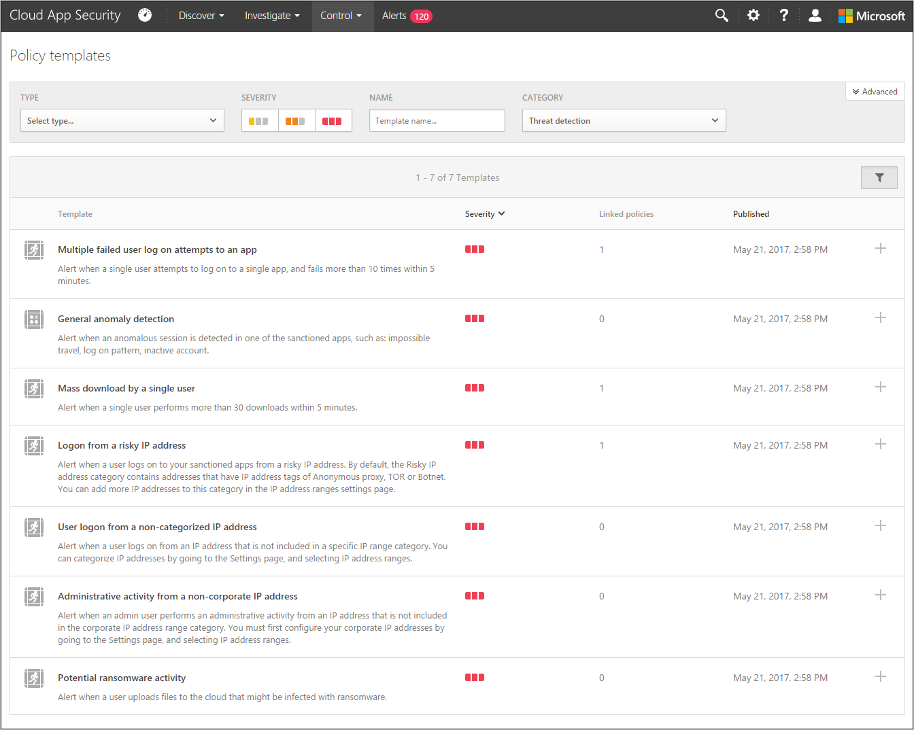
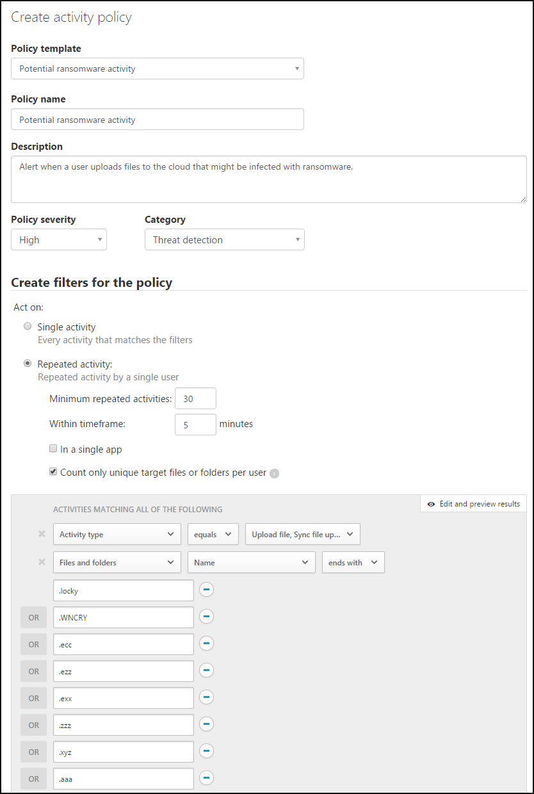

---
# required metadata

title: Overview of threat protection scenario | Microsoft Docs
description: This topic describes the scenario for protecting your organization against threats in your cloud environment.
keywords:
author: rkarlin
ms.author: rkarlin
manager: mbaldwin
ms.date: 4/22/2018
ms.topic: article
ms.prod:
ms.service: cloud-app-security
ms.technology:
ms.assetid: 7a06a243-9ec2-4a11-8db2-bc065cdfef64

# optional metadata

#ROBOTS:
#audience:
#ms.devlang:
ms.reviewer: reutam
ms.suite: ems
#ms.tgt_pltfrm:
#ms.custom:

---
*Applies to: Microsoft Cloud App Security*

# Protecting your organization from ransomware

In latest massive ransomware attack, WannaCry hit the cyber world hard, infecting an estimated 200,000 computers across 150 countries. With the increase of ransomware attacks over the last few years, an average of 25,000 attacks per month in 2015 and 56,000 in 2016, it's becoming a cybersecurity necessity to be proactive about making sure your network and your cloud aren't at risk. This article explains how you can use Cloud App Security to monitor your cloud, detect and mitigate threats and apply best practices for protecting your environment against ransomware.

## What is ransomware?
Ransomware is a cyber attack in which the attacker sends you a file that can block you from accessing your computer and encrypt your own files. The files are sometimes held for ransom and aren't decrypted until you pay the attacker to restore access to your computer, files or critical LOB apps. Ransomware attacks can affect any computer, home, office, network or server. In fact, because large organizations are made up of many users who may inadvertently open a file that unleashes ransomware across your network, organizations are at even greater risk of being forced to pay the attacker to stop the ransomware and restore access to computers or files.

>[!NOTE]
> This use case applies to Office 365, G Suite, Box and Dropbox.

## THE THREAT
A user in your organization is the target of a ransomware attack. The user might unknowingly open an email infected and run ransomware which infects the all of his files, including the files synced to the cloud.

## THE SOLUTION
Detect potential ransomware on your cloud environment by creating a policy to update you when suspicious activity is detected, and set up automated actions to prevent ransomware files from being saved to your cloud.

## Out-of-the-box protection

[Connect](enable-instant-visibility-protection-and-governance-actions-for-your-apps.md) at least one cloud app (Office 365, G Suite, Box and Dropbox) to Cloud App Security.

1.	By default, Cloud App Security scans your network to establish a baseline, wherein it learns patterns of what your users ordinarily do in your cloud, when they do it and what they commonly do. 

2. Cloud App Security's automated [threat detection policies](anomaly-detection-policy.md) start running in the background from the time you connect. One of these policies searches for ransomware activity to ensure comprehensive coverage against sophisticated ransomware attacks. Using our security research expertise to identify behavioral patterns that reflect ransomware activity, Cloud App Security ensures holistic and robust protection. If Cloud App Security identifies, for example, a high rate of file uploads or file deletion activities it may represent an adverse encryption process. This data is collected in the logs received from connected APIs and is then combined with learned behavioral patterns and threat intelligence, for example, known ransomware extensions. 

## Legacy policy creation

2. In addition, it is important to start monitoring your cloud apps by setting up a policy that will watch your cloud apps for massive downloads and alert you if something out of the ordinary happens:

    1. On the **Control** tab, click [**Templates**](policy-template-reference.md). 
   
    2. From the [**Policy template**](policy-template-reference.md) list, choose **Potential ransomware activity**. 
       
    3. This template is designed out-of-the-box to search for activity typical of ransomware attacks, and files and folders associated with known ransomware. Optionally, you can set the type of alert you receive (email and text message) when the policy is matched.
        
    4. Click **Create**. 
   
     
2. Investigating your matches
    
    1. In the **Policies** page, click on the policy name to go to the **Policy report** and review the matches that were triggered for the policy.

    2. You can investigate the match by clicking on a specific match to open the activity drawer. In the drawer, you can see the other policies that this activity matched. 
     
## Remediating attacks and preventing risk

After you've validated it and fine-tuned the policy, remove possible false positives that may have matched your policy. Then, do the following: 
1. When a ransomware policy is matched, you can remediate it by setting automated [governance actions](governance-actions.md).

2. To prevent future attacks, setting the policy to perform automatic governance actions. For example, in SharePoint and OneDrive you can set the policy to automatically **Suspend user**.
 
 
## Validating ransomeware protection

1. To simulate an alert, change the extension of 30 files to .wncry and upload them to your SharePoint site.
3. Go to the policy report. An activity policy match should appear shortly. 
4. You can click on the match to see which files were downloaded. The match itself will be masked to protect the sensitive data. 

   ## See Also  
   [Daily activities to protect your cloud environment](daily-activities-to-protect-your-cloud-environment.md)   

[Premier customers can also choose Cloud App Security directly from the Premier Portal.](https://premier.microsoft.com/)  
  
  