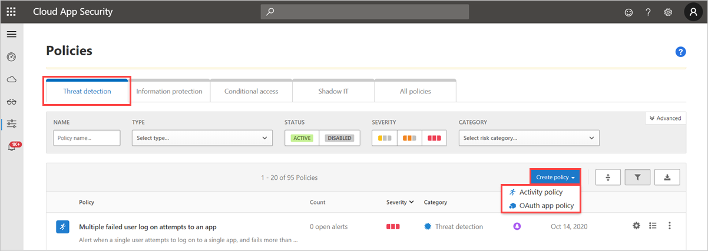
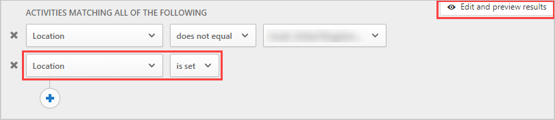
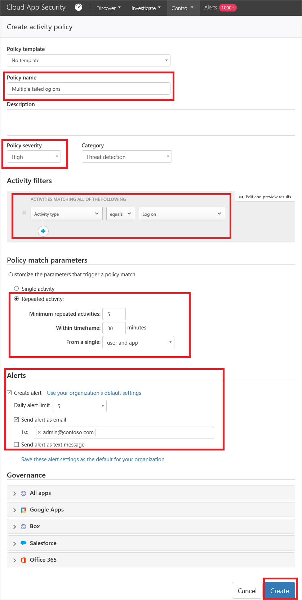
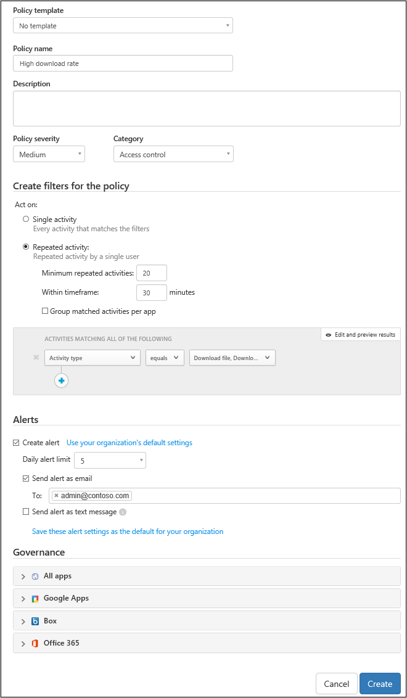

# Create Microsoft Defender for Cloud Apps activity policies

Activity policies allow you to enforce a wide range of automated processes using the app provider's APIs. These policies enable you to monitor specific activities carried out by various users, or follow unexpectedly high rates of one certain type of activity.

After you set an activity detection policy, it starts to generate alerts - alerts are only generated on activities that occur after you create the policy.

> [!NOTE]
>  - Policies that trigger more than 200,000 matches per day, or 100,000 matches per 3 hours, may be disabled automatically. You can try refining policies by adding additional filters or, if you are using policies for reporting purposes, consider [saving them as queries](activity-filters-queries.md#activity-queries) instead.
>   - It may take up to 15 minutes from setting up a new policy to deployment.

## Custom alerts

Activity policies allow custom alerts to be sent or actions taken when user activity is detected. For example, you want to know every time:

- A user tries to sign in and fails 70 times in one minute
- A user downloads 7,000 files
- A user is logged in from an unfamiliar country/region

You can set activity alerts to be sent to yourself or to the user when these events occur. You can even suspend the user until you have finished investigating what happened.

To create a new activity policy, follow this procedure:

1. In the Microsoft Defender Portal, under **Cloud Apps**, go to **Policies** -> **Policy management**. Then select the **Threat detections** tab.

1. Click **Create policy** and select **Activity policy**.

    

1. Give your policy a name and description, if you want you can base it on a template, for more information on policy templates, see [Control cloud apps with policies](control-cloud-apps-with-policies.md).

1. To set which actions or other metrics will trigger this policy, work with the **Activity filters**.

   To ensure that you only include results where the specified filter field has a value, we recommend adding the same field again using the **is set** test. For example, when filtering by **Location** *does not equal* a specified list of countries/regions, also add a filter for **Location** *is set*. You can also preview the filter results by selecting **Edit and preview results**. For example:

   

   When a filter is set to *does not equal* and the attribute does not exist on the event, the event will not be filtered out. For example, filtering on **Device Tag does not equal Microsoft Entra hybrid joined** doesn't filter out events that do not contain **Device tag**, even if the device is Microsoft Entra joined.

   In case of a guest user, there may be cases where the **User From Group** filter doesn't recognize the account by its domain. To make sure all guest users are included, use the **External users** as the group, if it meets your needs for the policy.
                 
1. Under **Create filters for the policy**, select when a policy violation will be triggered. Choose to trigger when a **Single activity** matches the filters or only when a specified number of **Repeated activities** are detected.
    - If you choose **Repeated activity**, you can set **In a single app**. This setting will trigger a policy match only when the repeated activities occur in the same app. For example, five downloads in 30 minutes from Box trigger a policy match.

1. Configure the **Actions** that should be taken when a match is found.

Take a look at these examples:

- Multiple failed logins

    You can set policy so that you receive an alert when a large number of failed logins within a short time period occurs. To configure this sort of policy, choose the appropriate activity filter in the **New Activity Policy** page.

    Beneath the **Activity filters** field, configure the parameters for which the alert will be triggered.

    

- High download rate

    You can set your policy so that you receive an alert when there has been an unexpected or uncharacteristic level of downloading activity. To configure this sort of policy, under **Rate** parameters, choose the parameters to trigger the alert.

    

## Activity policy reference

This section has reference details about policies, explanations for each policy type, and the fields that can be configured for each policy.

An **Activity policy** is an API-based policy that enables you to monitor your organization's activities in the cloud. The policy takes into account over 20 file metadata filters including device type and location. Based on the policy results, notifications can be generated and users can be suspended from the cloud app.
Each policy is composed of the following parts:

- Activity filters – Enable you to create granular conditions based on metadata.

- Activity match parameters – Enable you to set a threshold for the number of times an activity repeats to be considered to match the policy.  Specify the number of repeated activities required to match the policy. For example, set a policy to alert when a user has 10 unsuccessful login attempts in a 2-minute time frame. By default, **Activity match parameters** raise a match for every single activity that meets all of the activity filters.

  - Using **Repeated activity** you can set the number of repeated activities, the duration of the time frame in which the activities are counted. You can also specify that all activities should be performed by the same user and in the same cloud app.

- Actions – The policy provides a set of governance actions that can be automatically applied when violations are detected.

## Next steps

> [!div class="nextstepaction"]
> [Data protection policies](data-protection-policies.md)

[!INCLUDE [Open support ticket](includes/support.md)]
