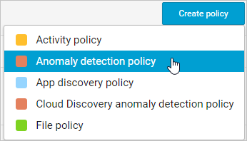
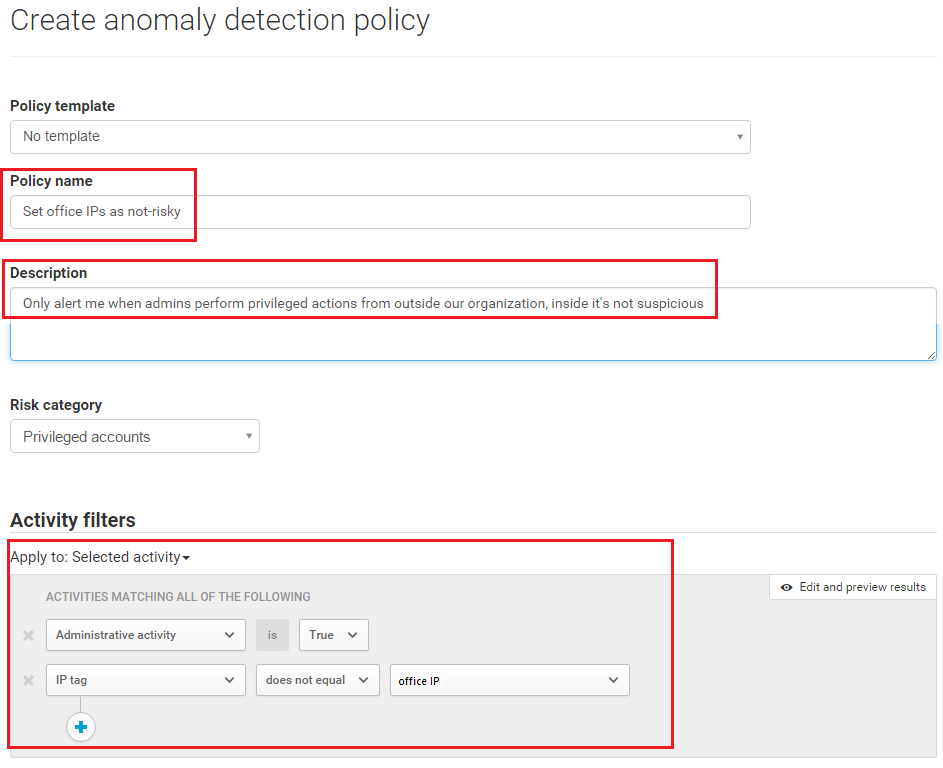

---
# required metadata

title: User activity policies | Microsoft Docs
description:
keywords:
author: rkarlin
manager: mbaldwin
ms.date: 10/15/2016
ms.topic: article
ms.prod:
ms.service: cloud-app-security
ms.technology:
ms.assetid: 99d5fd37-d922-4269-b557-86d7f84180eb

# optional metadata

#ROBOTS:
#audience:
#ms.devlang:
ms.reviewer: reutam
ms.suite: ems
#ms.tgt_pltfrm:
#ms.custom:

---

# User activity policies
  Activity policies allow you to enforce a wide range of automated processes leveraging the app provider’s APIs. These policies enable you to monitor specific activities carried out by various users, or follow unexpectedly high rates of one certain type of activity.  
  
  After you set an activity detection policy, it starts to generate alerts - alerts are only generated on activities that occur after you create the policy.
  
  
## Custom alerts  
 Activity policies enable you to set custom alerts to be sent or actions to be taken when user activity is detected. For example, if you want to know every time a user tries to log on and fails 70 times in one minute, or if a user downloads 7,000 files or is logged in from Afghanistan, you can set activity alerts to be sent to yourself or to the user when these events occur. You can even suspend the user until you have time to investigate what happened.  
  
 To create a new activity policy, follow this procedure:  
  
1.  In the console, click on **Control** followed by **Policies**.  
  
2.  Click **Create policy** and select **Activity policy**.  
  
       
  
3.  Give your policy a name and description, if you want you can base it on a template, for more information on policy templates, see [Control cloud apps with policies](control-cloud-apps-with-policies.md).  
  
4.  To set which actions or other metrics will trigger this policy, work with the **Activity filters**.  
  
5.  Under **Activity match parameters**, select whether a policy violation will be triggered when a single activity matches the filters or if a violation is only detected when a specified number of **Repeated activities** are detected.  
    If you choose **Repeated activity**, set the activities that will trigger the alert: The number of activities, time frame and whether a violation will count for a user within a specific app or for the same user with any app.  
  
6.  Configure the **Actions** that should be taken when a match is found.  
  
 Take a look at these examples:  
  
-   Multiple failed logins  
  
     You can set your policy so that you receive an alert when there have been a large number of failed login attempts within a certain, relatively short, time period. To configure a policy like this, choose the appropriate activity filter in the **New Activity Policy** page.  
  
     Beneath the **Activity filters** field, configure the parameters for which the alert will be triggered.  
  
       
  
-   High download rate  
  
     You can set your policy so that you receive an alert when there has been an unexpected or uncharacteristic level of downloading activity. To configure a policy like this, under **Rate** parameters, choose the parameters to trigger the alert.  
  
       
  
## Anomaly detection  
 After your organization is protected by Cloud App Security, all cloud activity is scored according to various pre-defined risk factors. Cloud App Security looks at every user session on your cloud and then takes into consideration the risk factors you set here to alert you when something happens that is different from either the baseline of your organization or from the user's regular activity. The anomaly detection policy page allows you to configure and customize which risk factor families will be considered in the risk scoring process. The policies can be enforced differently for different users, locations, and organizational sectors. For example, you can create a policy that alerts you when members of your IT team are active from outside your offices.  
  
 To configure an anomaly detection policy:  
  
1.  In the console, click on **Control** followed by **Policies**.  
  
2.  Click **Create policy** and select **Anomaly detection** policy.  
  
       
  
3.  Fill in the policy's name and description, and continue to the **Activity filters** field where you can choose the activity for which you wish to apply the policy.  
  
4.  Give your policy a name and description, if you want you can base it on a template, for more information on policy templates, see [Control cloud apps with policies](control-cloud-apps-with-policies.md).  
  
5.  To apply the policy to all activities in your cloud environment, select **All monitored activity**. To limit the policy to specific types of activities, choose **Selected activity**. Click on **Add filters** and set the appropriate parameters by which to filter the activity. For example, to enforce the policy only on activity performed by Salesforce admins, choose this user tag.  
  
6.  Underneath this field set the **Risk factors**. You can choose which risk families you want to consider while calculating the risk score. On the right of the row you can use the On/Off button to enable and disable the various risks. Additionally, for greater granularity, you can choose the activity on which to enable each particular risk family.  
  
     Risk factors are as follows:  
  
    -   **Login failures**: Are users attempting to log in and failing multiple times over a short period?  
  
    -   **Admin activity**: Are admins using their privileged accounts to log in from unusual locations or at strange hours?  
  
    -   **Inactive accounts**: Is there suddenly activity on an account that hasn't been in use for some time?  
  
    -   **Location**: Is there activity in an unusual, suspicious or new location?  
  
    -   **Impossible travel**: Is a user logging in from Denver and ten minutes later logging in from Paris?  
  
    -   **Device and user agent**: Is there activity from an unrecognized or unmanaged device?  
  
     You can use these parameters to define complex scenarios, for example, to exclude your office's IP range from the considered risk factors for anomaly detection, create a specific "office IP" tag and filter the range out of the considered parameters. To then exclude the range you created from the admin activity anomaly detection:  
  
    -   Within **Risk type**, find **Admin activity**.  
  
    -   Change **Apply to** to **Selected Activity**.  
  
    -   Under **Activity filters**, set **Apply to** to **Selected activity** and under **Activities matching all of the following**, choose **Administrative activity** is **True**.  
  
    -   Click on the **+** icon and select  **IP tag does not equal** and select the Office IP tag.  
  
7.  Under **Sensitivity**, select how often you want to receive alerts.  
  
     The sensitivity value will determine how many weekly alerts will trigger on average for every 1,000 users.  
  
       
  
8.  Click **Create**.  
 
  
## Activity policy reference  
  This section provides reference details about policies, providing explanations for each policy type and the fields that can be configured for each policy.  
  
   An **Activity policy** is an API-based policy that enables you to monitor your organization's activities in the cloud, taking into account over 20 file metadata filters (including device type and location). Based on the policy results, notifications can be generated and users can be suspended from the cloud app.   
Each policy is composed of the following parts:  
  
-   Activity filters – Enable you to create very granular conditions based on metadata.  
  
-   Activity match parameters – Enable you to set a threshold for the number of times an activity repeats to be considered to match the policy.  
  
-   Actions – The policy provides a set of governance actions that can be automatically applied when violations are detected.  
## See Also  
 [Data protection policies](data-protection-policies.md)   
 [For technical support, please visit the Cloud App Security assisted support page.](http://support.microsoft.com/oas/default.aspx?prid=16031)   
 [Premier customers can also choose Cloud App Security directly from the Premier Portal.](https://premier.microsoft.com/)  
  
  