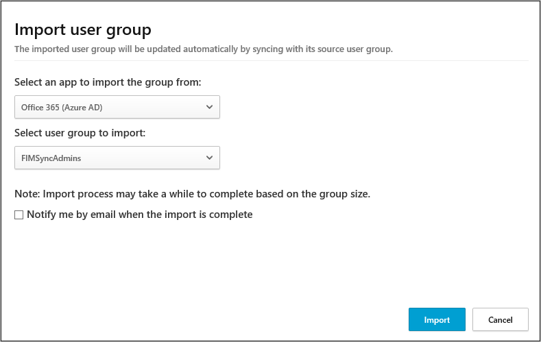

---
# required metadata

title: Import user groups from connected apps in Cloud App Security
description: This article provides instructions for importing your user groups from connected apps into Cloud App Security.
keywords:
author: shsagir
ms.author: shsagir
manager: shsagir
ms.date: 11/17/2019
ms.topic: conceptual
ms.collection: M365-security-compliance
ms.prod:
ms.service: cloud-app-security
ms.technology:

# optional metadata

#ROBOTS:
#audience:
#ms.devlang:
ms.reviewer: reutam
ms.suite: ems
#ms.tgt_pltfrm:
ms.custom: seodec18

---
# Importing user groups from connected apps

*Applies to: Microsoft Cloud App Security*

When you connect apps using API connectors, Microsoft Cloud App Security enables you to import user groups, for example from Office 365 and Azure Active Directory. There are two types of user groups:

- Automatic groups  
Automatic groups are created by default by Microsoft Cloud App Security. For example, there's an automatic user group called **External** that combines all users from all apps who are external to your organization and have access to files or were in user activities in your tenant. The following automatic groups exist in Cloud App Security:

  - External
  - Dropbox administrator
  - Office 365 administrator
  - G Suite administrator
  - Box administrator
  - All Salesforce standard and custom profiles, for example, Salesforce System Administrator. See the full list [here](https://help.salesforce.com/articleView?id=standard_profiles.htm&language=en&type=0).

- Imported groups  
You can import any group from your connected apps. For example, you can import user groups from Office 365 (Active Directory) and other connected apps. These groups enable you to look for threats in your org, not by looking at the whole org or at a specific user, but by looking at a specific group.

    > [!NOTE]
    > There may be a short delay until imported user groups are available in Cloud App Security. You may experience these delays in filters used in activity logs and policies.

Typical scenarios that use imported user groups include:

- Investigating which docs the HR people look at
- Check if there's something unusual happening in the executive group
- Find if someone from the admin group performed an activity outside the US.

## How to import user groups

1. In the menu bar, click the settings icon  and select **User groups**.
1. Click **Import user group**.

    

1. Select the app from which to import the user group. The list of apps will depend on which App Connectors you deployed.
1. Select the group to import. The list of available groups will be a list of all the existing user groups in the app itself. If you want to add a new group, you have to do it directly in the app itself. Then, when the group appears in the list here, select it.
1. Depending on the size of the group, import can take up to an hour. You can select the option to be notified by email when the import process is complete.
1. Click **Import**. After you import a group, Cloud App Security automatically syncs the group members, just like Active Directory Connect.
1. After the import is complete, from the **User groups** page you can click on a specific group to view a list of all the members of the group. Click on any member of the group to further drill down into the details of a specific account. You can view which apps they use and a summary of the account including graphs of the user and their activity.

Importing groups enables you to select those groups as filters when investigating in the **Activity log** and when creating policies.

> [!NOTE]
>
> - Only activities performed after importing a user group will be tagged as having been performed by a member of the user group.
> - After the initial sync, groups are updated every hour.

For more information on using the User group filters, see [Activities](activity-filters.md).

## Next steps

> [!div class="nextstepaction"]
> [Set up Cloud Discovery](set-up-cloud-discovery.md)

[Premier customers can also create a new support request directly in the Premier Portal.](https://premier.microsoft.com/)
