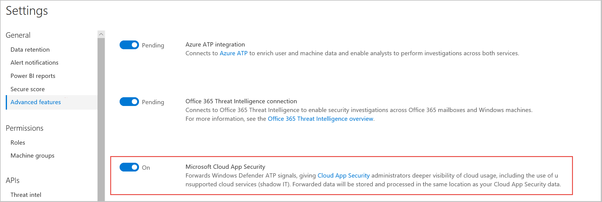
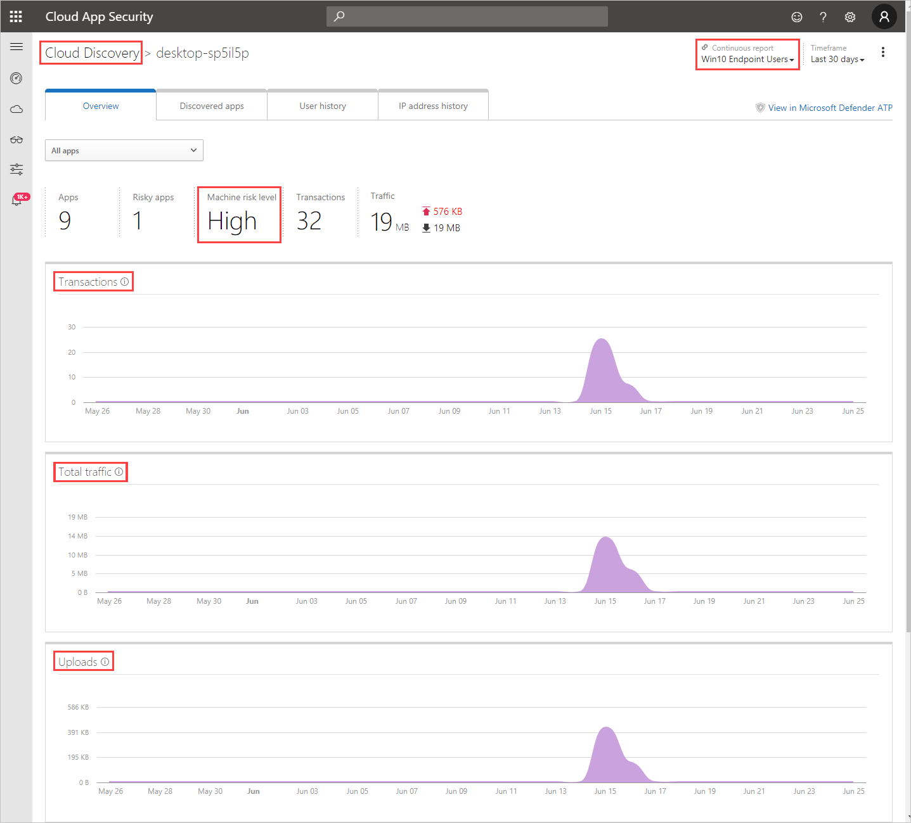

---
# required metadata

title: Integrate Microsoft Defender ATP with Cloud App Security
description: This article describes how to integrate Microsoft Defender Advanced Threat Protection with Cloud App Security for enhanced visibility into Shadow IT and risk management.
keywords:
author: shsagir
ms.author: shsagir
manager: shsagir
ms.date: 7/11/2019
ms.topic: conceptual
ms.collection: M365-security-compliance
ms.prod:
ms.service: cloud-app-security
ms.technology:

# optional metadata

#ROBOTS:
#audience:
#ms.devlang:
ms.reviewer: reutam
ms.suite: ems
#ms.tgt_pltfrm:
ms.custom: seodec18

---
# Microsoft Defender Advanced Threat Protection integration with Microsoft Cloud App Security

*Applies to: Microsoft Cloud App Security*

Microsoft Cloud App Security integrates with Microsoft Defender Advanced Threat Protection (ATP) natively. The integration simplifies roll out of Cloud Discovery, extends Cloud Discovery capabilities beyond your corporate network, and enables machine-based investigation. [Microsoft Defender ATP](https://docs.microsoft.com/windows/security/threat-protection/windows-defender-atp/windows-defender-advanced-threat-protection) is a security platform for intelligent protection, detection, investigation, and response. Microsoft Defender ATP protects endpoints from cyber threats, detects advanced attacks and data breaches, automates security incidents, and improves security posture.

Cloud App Security uses the traffic information collected by Microsoft Defender ATP about the cloud apps and services being accessed from IT-managed Windows 10 machines. The native integration enables you to run Cloud Discovery on any machine in the corporate network, using public Wi-Fi, while roaming, and over remote access. It also enables machine-based investigation.

The integration doesn't require any additional deployment and works out of the box. You don't need to route or mirror traffic from your endpoints or do complex integration steps. Logs from your endpoints sent to Cloud App Security provide user information for traffic activities. Microsoft Defender ATP network activity provides device context. Pairing device context with the username provides a full picture across your network enabling you to determine which user did which activity from which machine.

Once activity information is collected, you are ready to [deep dive into cloud app use](discovered-apps.md#deep-dive-into-discovered-apps) in your organization. Cloud App Security takes advantage of Microsoft Defender ATP Network Protection capabilities to block endpoint device access to cloud apps. You can block apps by [tagging them as **Unsanctioned**](governance-discovery.md#BKMK_SanctionApp) in the portal. Based on the comprehensive usage and risk assessment of each unsanctioned app, the app's domains are used to create [domain indicators](https://docs.microsoft.com/windows/security/threat-protection/microsoft-defender-atp/manage-indicators#create-indicators-for-ips-and-urlsdomains-preview) in the Microsoft Defender ATP portal. Windows Defender Antivirus, running on endpoint devices, uses the domain indicators block access to these apps.

Additionally, when you identify a risky user, you can check all the machines the user accessed to detect potential risks. If you identify a risky machine, check all the users who used it to detect further potential risks.

> [!NOTE]
> Want to experience Microsoft Defender ATP? [Sign up for a free trial](https://www.microsoft.com/WindowsForBusiness/windows-atp?ocid=docs-wdatp-assignaccess-abovefoldlink).

## Prerequisites

- Microsoft Cloud App Security license
- Microsoft Defender ATP license
- Windows 10 version 1709 (OS Build 16299.1085 with KB4493441), Windows 10 version 1803 (OS Build 17134.704 with KB4493464), Windows 10 version 1809 (OS Build 17763.379 with KB4489899) or later Windows 10 versions
- Windows Defender Antivirus
  - [real-time protection enabled](https://docs.microsoft.com/windows/security/threat-protection/windows-defender-antivirus/configure-real-time-protection-windows-defender-antivirus)
  - [cloud-delivered protection enabled](https://docs.microsoft.com/windows/security/threat-protection/windows-defender-antivirus/enable-cloud-protection-windows-defender-antivirus)
  - [Network protection enabled and configured to block mode](https://docs.microsoft.com/windows/security/threat-protection/microsoft-defender-atp/enable-network-protection)

## How it works

On its own, Cloud App Security collects logs from your endpoints using either [logs you upload](create-snapshot-cloud-discovery-reports.md) or by [configuring automatic log upload](discovery-docker.md). Native integration enables you to take advantage of the logs Microsoft Defender ATP's agent creates when it runs on Windows and monitors network transactions. Use this information for Shadow IT discovery across the Windows machines on your network.

To enable you to perform Cloud Discovery across other platforms, it's best to use both the Cloud App Security [log collector](discovery-docker.md), along with Microsoft Defender ATP integration to monitor your Windows 10 machines.

## How to integrate Microsoft Defender ATP with Cloud App Security

To enable Microsoft Defender ATP integration with Cloud App Security:

1. In the Microsoft Defender ATP portal, from the navigation pane, select **Preferences setup**.
2. In the **Settings** menu, under **General**, select **Advanced features**.
3. Toggle the **Microsoft Cloud App Security** to **On**.
4. Click **Save preferences**.

>[!NOTE]
> It takes up to two hours after you enable the integration for the data to show up in Cloud App Security.
>

## Investigate machines in Cloud App Security

After you integrate Microsoft Defender ATP with Cloud App Security, you can investigate discovered machine data in the Cloud Discovery dashboard.

1. In the Cloud App Security portal, click **Cloud Discovery** and then **Cloud Discovery dashboard**.
2. In the top navigation bar, under **Continuous reports**, select **Win10 endpoint users**.
  
3. Across the top, you'll see the number of discovered machines added after the integration.
4. Click the **Machines** tab.
5. You can drill down into each machine that's listed, and use the tabs to view the investigation data. Find correlations between the machines, the users, IP addresses, and apps that were involved in incidents:

    - **Overview**
        - Transactions: Information about the number of transactions that took place on the machine over the selected period of time.
        - Total traffic: Information about the total amount of traffic (in MB) over the selected period of time.
        - Uploads: Information about the total amount of traffic (in MB) uploaded by the machine over the selected period of time.
        - Downloads: Information about the total amount of traffic (in MB) downloaded by the machine over the selected period of time.
    - **Discovered apps**  
  Lists all the discovered apps that were accessed by the machine.
    - **User history**  
    Lists all the users who signed in to the machine.
    - **IP address history**  
    Lists all the IP addresses that were assigned to the machine.
 

As with any other Cloud Discovery source, you can export the data from the Win10 endpoint users report for further investigation.

> [!NOTE]
>
> - Microsoft Defender ATP forwards data to Cloud App Security in chunks of ~4 MB (~4000 endpoint transactions)
> - If the 4 MB limit isn't reached within 1 hour, Microsoft Defender ATP reports all the transactions performed over the last hour.
> - If the endpoint device is behind a forward proxy, the volume of traffic won't be visible to Microsoft Defender ATP and hence will not be included in Cloud Discovery reports. For more information, see [Monitoring network connection behind forward proxy](https://techcommunity.microsoft.com/t5/Microsoft-Defender-ATP/MDATP-Monitoring-network-connection-behind-forward-proxy-Public/ba-p/758274).

## Block access to unsanctioned cloud apps

Cloud App Security uses the built-in [**Unsanctioned**](governance-discovery.md#BKMK_SanctionApp) app tag to mark cloud apps as prohibited for use, available in both the Cloud Discovery and Cloud app catalog pages. By enabling the integration with Microsoft Defender ATP, you can seamlessly block access to unsanctioned apps with a single click in the Cloud App Security portal.

### How it works

Apps marked as **Unsanctioned** in the Cloud App Security portal are automatically synced to Microsoft Defender ATP within a few minutes. More specifically, the domains used by these unsanctioned apps are propagated to the endpoint devices to be blocked by Windows Defender Antivirus within the Network Protection SLA (see notes for more details).

### How to enable app blocking with Microsoft Defender ATP

Use the following steps to enable access control for cloud apps:

1. In Cloud App Security, go to **Settings** > **Cloud app control**, and then select **Block unsanctioned apps**.

    // IMAGE PLACEHOLDER

1. In Microsoft Defender Security Center, go to **Settings** > **Advanced features**, and then select **Custom network indicators**. For information about network indicators, see [Create indicators for IPs and URLs/domains](https://docs.microsoft.com/windows/security/threat-protection/microsoft-defender-atp/manage-indicators#create-indicators-for-ips-and-urlsdomains-preview).

    This will allow you to leverage Windows Defender Antivirus network protection capabilities to block access to a predefined set of URL using Cloud App Security [app tags](governance-discovery.md#BKMK_SanctionApp) or an [app discovery policy](cloud-discovery-policies.md#creating-an-app-discovery-policy).

    // IMAGE PLACEHOLDER

## Investigate unsanctioned apps in Microsoft Defender Security Center

Every attempt to access an unsanctioned app triggers an alert in Microsoft Defender Security Center with in-depth details about the entire session. This enables you to perform a deeper investigation into attempts to access unsanctioned apps, as well as providing additional relevant information for use in endpoint device investigation.

Sometimes, access to an unsanctioned app is not blocked, either because the endpoint device is not configured correctly or if the enforcement policy has not yet propagated to the endpoint. In this instance, Microsoft Defender ATP admins will receive an alert in Microsoft Defender Security Center that the unsanctioned app was not blocked.

// IMAGE PLACEHOLDER

> [!NOTE]
> Notes:
>
> - It takes up to two hours after you tag an app as **Unsanctioned** for app domains to propagate to endpoint devices.
> - By default, apps and domains marked as **Unsanctioned** in Cloud App Security, will be blocked for all endpoint devices in the organization.
> - Currently, full URLs are not supported for unsanctioned apps. Therefore, when unsanctioning apps configured with full URLs, they are not propagated to Microsoft Defender ATP and will not be blocked. For example, `google.com/drive` is not supported, while `drive.google.com` is supported.
> - In-browser notifications may vary between different browsers.

## Next steps

> [!div class="nextstepaction"]
> [Control cloud apps with policies](control-cloud-apps-with-policies.md)

## Related videos

> [!div class="nextstepaction"]
> [Shadow IT discovery beyond the corporate network](https://www.youtube.com/watch?v=f8hbvbY1Hnc)

[!INCLUDE [Open support ticket](includes/support.md)]
