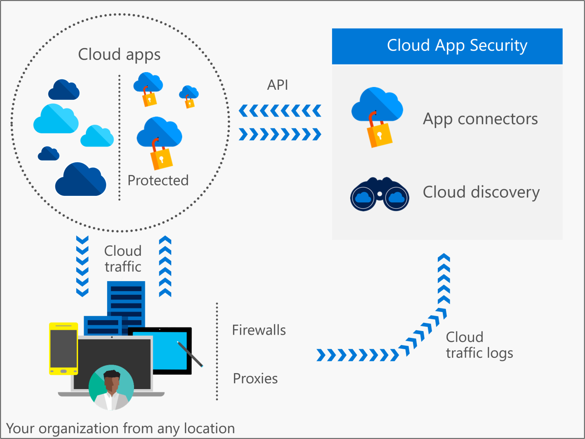

---
# required metadata

title: What is Cloud App Security | Microsoft Docs
description: This topic provides information about what Cloud App Security is and how it works.
keywords:
author: rkarlin
manager: mbaldwin
ms.date: 10/15/2016
ms.topic: article
ms.prod:
ms.service: cloud-app-security
ms.technology:
ms.assetid: f6f7ac64-6306-46fa-86ed-13b3b9600fd3

# optional metadata

#ROBOTS:
#audience:
#ms.devlang:
ms.reviewer: reutam
ms.suite: ems
#ms.tgt_pltfrm:
#ms.custom:

---
# What is Cloud App Security
 
> [!NOTE] 
> For information about Advanced Security Management - Cloud App Security capabilities in Office 365, see Get started with [Advanced Security Management](https://support.office.com/article/Get-started-with-Advanced-Management-Security-d9ee4d67-f2b3-42b4-9c9e-c4529904990a). 
 
While moving to the cloud has increased flexibility for employees and reduced IT cost, it has also introduced new complexity and challenges for keeping your organization secure. To realize the full benefit of cloud applications, IT teams must find the right balance of enabling access while maintaining control to protect critical data.  
  
Cloud App Security is a critical component of the Microsoft Cloud Security stack. It is a comprehensive solution that helps organizations take full advantage of the promise of cloud applications while maintaining control with improved visibility into activity. It also increases protection of critical data across cloud applications. With tools to help uncover Shadow IT, assess risk, enforce policies, investigate activities and stop threats, organizations can safely move to the cloud while maintaining control of critical data.  
  
## The Cloud App Security framework  
  
|----|----|----|  
||Discover|Uncover Shadow IT with Cloud App Security. Gain visibility by discovering apps, activities, users, data and files in your cloud environment as well as third-party apps that are connected to your cloud.|  
||Investigate|Investigate your cloud apps using cloud forensics tools to deep-dive into risky apps, specific users and files in your network as well as finding patterns in the data collected from your cloud and generating reports to monitor your cloud.|  
||Control|Mitigate risk by setting policies and alerts in order to achieve maximum control over network cloud traffic. Use Cloud App Security to migrate your users to safe, sanctioned cloud app alternatives.|  
||Protect|Use Cloud App Security to sanction/unsanction applications, enforce data loss prevention (DLP), control permissions and sharing, and generate custom reports and alerts.|  
  
## Architecture  

Cloud App Security enables visibility integration with your cloud in the following ways:  
  
-   Visibility using Cloud Discovery to map and identify your cloud environment, and the cloud apps you have in use.  
-   Ability to sanction and unsanction apps in your cloud.  
-   Visibility and governance of apps you connect to using our easy-to-deploy app connectors that leverage provider APIs.  
-   Continuous control by enabling you to set and then continually fine-tune policies.  
  
   
  
> [!NOTE]  
>  When Cloud App Security performs content inspection, data privacy is enforced. Your data is not stored in the Cloud App Security data base, only the metadata of the file records and the violations that were identified. See our [privacy policy](http://go.microsoft.com/fwlink/?LinkId=512132)  and the [Microsoft Trust Center](https://www.microsoft.com/TrustCenter/Privacy/You-are-in-control-of-your-data) for more information about data retention.
Cloud App Security retains data as follows:
>- Activity log: 180 days
>- Discovery data: 90 days
>- Alerts: unlimited 

After data is collected from these sources, Cloud App Security runs sophisticated analysis on it, alerting you right away to anomalous activities, and providing you with deep visibility. You can then configure a policy in Cloud App Security and then use it to protect everything in your cloud environment.  
  
###  How Cloud Discovery works  

Cloud Discovery uses your traffic logs to dynamically discover and analyze which cloud apps are in use in your organization.  
  
You can either create a snapshot report of your organization's cloud use, by manually uploading log files from your firewalls or proxies for analysis, or you can set up continuous reports by using Cloud App Security's log collectors to forward your logs periodically.  

For more information about Cloud Discovery, see [Set up Cloud Discovery](set-up-cloud-discovery.md).
  
### How sanctioning and unsanctioning an app works  

Cloud App Security enables you to sanction/unsanction apps in your organization, using our **Cloud app catalog**.  
  
The Microsoft team of analysts has an extensive, and continuously growing, catalog of over 13,000 cloud apps that are ranked and scored based on industry standards. The **Cloud app catalog** rates risk for your cloud apps based on regulatory certifications, industry standards, and best practices. You can then customize the scores and the weights of various parameters to your organization's needs. Based on these scores, Cloud App Security lets you know how risky the app is according to over 50 risk factors that might affect your environment.  
  
### How App Connectors work  
App connectors leverage APIs provided by various cloud apps providers to enable the Cloud App Security cloud to integrate with other clouds apps and extend control and protection. This enables Cloud App Security to pull information directly out of cloud apps for analysis.  
In order to connect an app and extend protection, the app administrator authorizes Cloud App Security to access the app, and then Cloud App Security queries the app for activity logs, scans data and accounts and cloud content. Cloud App Security can then enforce policies, detect threats and provide governance actions for resolving issues.  
  
Cloud App Security leverages the APIs provided by the cloud provider, each app has its own framework and API limitations. Cloud App Security works with the app providers to optimize the use of the APIs and to ensure the best performance. Taking into account the different limitations the apps impose on the APIs (such as throttling, API limits, dynamic time-shifting API windows, etc.), the Cloud App Security engines leverage the allowed capacity. Some operations, such as scanning of all files in the tenant, require a large amount of APIs and therefore are spread over a longer period. Expect some policies to run for several hours or several days.  
  
### How policy control works  

Policies allow you to define the way you want your users to behave in the cloud. They enable you to detect risky behavior, violations or suspicious data points and activities in your cloud environment, and if required, to integrate remediation processes to achieve complete risk mitigation. There are multiple types of policies that correlate to the different types of information you want to gather about your cloud environment and the types of remediation actions you may want to take.  
  
## See Also  

[Getting started with Cloud App Security](getting-started-with-cloud-app-security.md)   
[For technical support, please visit the Cloud App Security assisted support page.](http://support.microsoft.com/oas/default.aspx?prid=16031)   
[Premier customers can also choose Cloud App Security directly from the Premier Portal.](https://premier.microsoft.com/)  
  
  