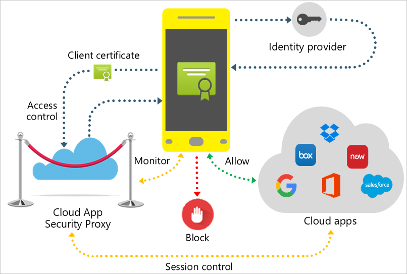

---
# required metadata

title: What is Cloud App Security?
description: This article describes Microsoft Cloud App Security and how it works.
keywords:
author: shsagir
ms.author: shsagir
manager: shsagir
ms.date: 8/15/2019
ms.topic: overview
ms.collection: M365-security-compliance
ms.prod:
ms.service: cloud-app-security
ms.technology:
ms.assetid: d46756b1-7dd8-4190-9799-3a97688f1266

# optional metadata

#ROBOTS:
#audience:
#ms.devlang:
ms.reviewer: reutam
ms.suite: ems
#ms.tgt_pltfrm:
ms.custom: seodec18
---

# Microsoft Cloud App Security overview

*Applies to: Microsoft Cloud App Security*

> [!NOTE]
> For information about Office 365 Cloud App Security, see [Get started with Office 365 Cloud App Security](https://support.office.com/article/Get-started-with-Advanced-Management-Security-d9ee4d67-f2b3-42b4-9c9e-c4529904990a).

Moving to the cloud increases flexibility for employees and IT alike. However, it also introduces new challenges and complexities for keeping your organization secure. To get the full benefit of cloud apps and services, an IT team must find the right balance of supporting access while maintaining control to protect critical data.

Microsoft Cloud App Security is a Cloud Access Security Broker that supports various deployment modes including log collection, API connectors, and reverse proxy. It provides rich visibility, control over data travel, and sophisticated analytics to identify and combat cyberthreats across all your Microsoft and third-party cloud services.

Microsoft Cloud App Security natively integrates with leading Microsoft solutions and is designed with security professionals in mind. It provides simple deployment, centralized management, and innovative automation capabilities.

For information about licensing, see the [Microsoft Cloud App Security licensing datasheet](https://aka.ms/mcaslicensing).

## The Cloud App Security framework

- **Discover and control the use of Shadow IT**: Identify the cloud apps, IaaS, and PaaS services used by your organization. Investigate usage patterns, assess the risk levels and business readiness of more than 16,000 SaaS apps against more than 80 risks. Start managing them to ensure security and compliance.

- **Protect your sensitive information anywhere in the cloud**: Understand, classify, and protect the exposure of sensitive information at rest. Leverage out-of-the box policies and automated processes to apply controls in real-time across all your cloud apps.

- **Protect against cyberthreats and anomalies**: Detect unusual behavior across cloud apps to identify ransomware, compromised users or rogue applications, analyze high-risk usage and remediate automatically to limit the risk to your organization.

- **Assess the compliance of your cloud apps**: Assess if your cloud apps meet relevant compliance requirements including regulatory compliance and industry standards. Prevent data leaks to non-compliant apps, and limit access to regulated data.

## Architecture

Cloud App Security integrates visibility with your cloud by:

- Using Cloud Discovery to map and identify your cloud environment and the cloud apps your organization is using.
- Sanctioning and unsanctioning apps in your cloud.
- Using easy-to-deploy app connectors that take advantage of provider APIs, for visibility and governance of apps that you connect to.
- Using Conditional Access App Control protection to get real-time visibility and control over access and activities within your cloud apps.
- Helping you have continuous control by setting, and then continually fine-tuning, policies.

### Data retention & compliance

For more information about Microsoft Cloud App Security data retention and compliance, see [Microsoft Cloud App Security data security and privacy](cas-compliance-trust.md).

### Cloud Discovery

Cloud Discovery uses your traffic logs to dynamically discover and analyze the cloud apps that your organization is using. To create a snapshot report of your organization's cloud use, you can manually upload log files from your firewalls or proxies for analysis. To set up continuous reports, use Cloud App Security log collectors to periodically forward your logs.

For more information about Cloud Discovery, see [Set up Cloud Discovery](set-up-cloud-discovery.md).

### Sanctioning and unsanctioning an app

You can use Cloud App Security to sanction or unsanction apps in your organization by using the *Cloud app catalog*. The Microsoft team of analysts has an extensive and continuously growing catalog of over 16,000 cloud apps that are ranked and scored based on industry standards. You can use the Cloud app catalog to rate the risk for your cloud apps based on regulatory certifications, industry standards, and best practices. Then, customize the scores and weights of various parameters to your organization's needs. Based on these scores, Cloud App Security lets you know how risky an app is. Scoring is based on over 80 risk factors that might affect your environment.

### App connectors

App connectors use APIs from cloud app providers to integrate the Cloud App Security cloud with other cloud apps. App connectors extend control and protection. They also give you access to information directly from cloud apps, for Cloud App Security analysis.

To connect an app and extend protection, the app administrator authorizes Cloud App Security to access the app. Then, Cloud App Security queries the app for activity logs, and it scans data, accounts, and cloud content. Cloud App Security can enforce policies, detects threats, and provides governance actions for resolving issues.

Cloud App Security uses the APIs provided by the cloud provider. Each app has its own framework and API limitations. Cloud App Security works with app providers on optimizing the use of APIs to ensure the best performance. Considering the various limitations that apps impose on APIs (such as throttling, API limits, and dynamic time-shifting API windows), the Cloud App Security engines utilize the allowed capacity. Some operations, like scanning all files in the tenant, require a large number of APIs, so they're spread over a longer period. Expect some policies to run for several hours or several days.

### Conditional Access App Control protection

Microsoft Cloud App Security Conditional Access App Control uses reverse proxy architecture to give you the tools you need to have real-time visibility and control over access to and activities performed within your cloud environment. With Conditional Access App Control, you can protect your organization:

- Avoid data leaks by blocking downloads before they happen
- Set rules that force data stored in and downloaded from the cloud to be protected with encryption
- Gain visibility into unprotected endpoints so you can monitor what's being done on unmanaged devices
- Control access from non-corporate networks or risky IP addresses

### Policy control

You can use policies to define your users' behavior in the cloud. Use policies to detect risky behavior, violations, or suspicious data points and activities in your cloud environment. If needed, you can use policies to integrate remediation processes to achieve complete risk mitigation. Types of policies correlate to the different types of information you might want to gather about your cloud environment and the types of remediation actions you might take.

## Related Videos

- [Joining the security community](https://channel9.msdn.com/Shows/Microsoft-Security/Join-the-Security-Community)

## Next steps

Read about the basics in [Getting started with Cloud App Security](getting-started-with-cloud-app-security.md).

[!INCLUDE [Open support ticket](includes/support.md)].
