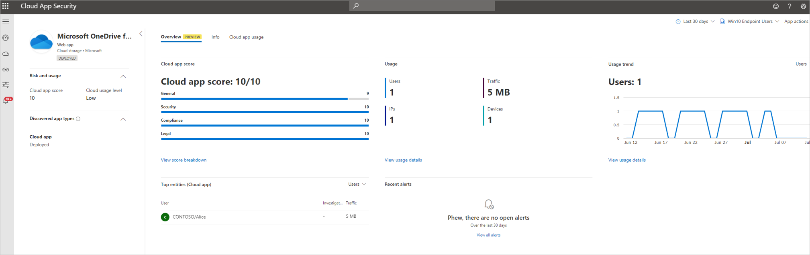
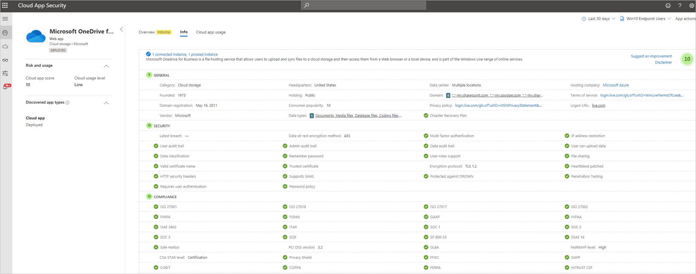
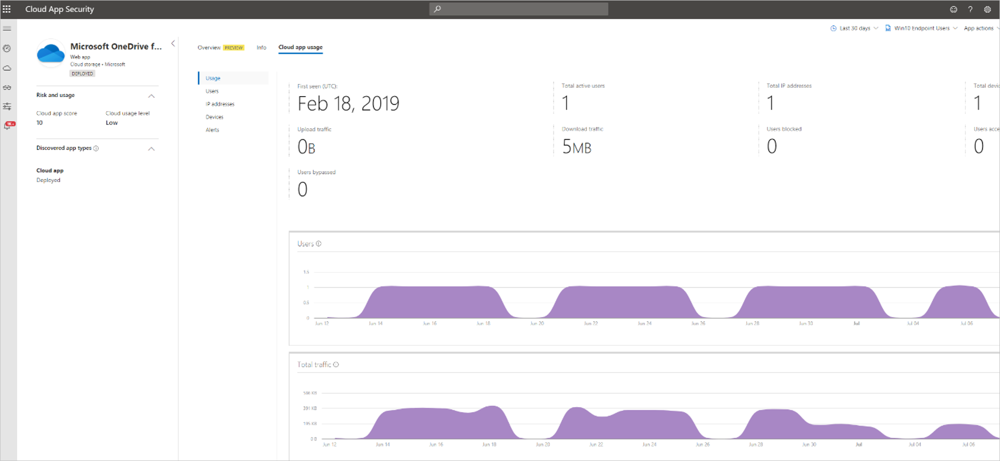
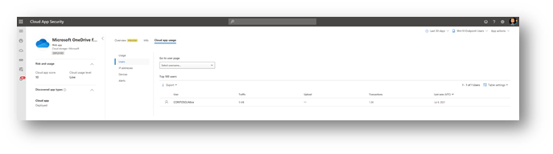
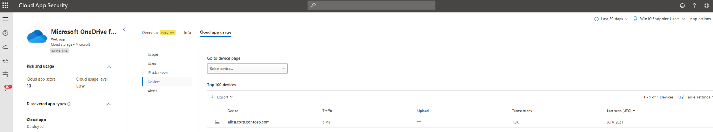
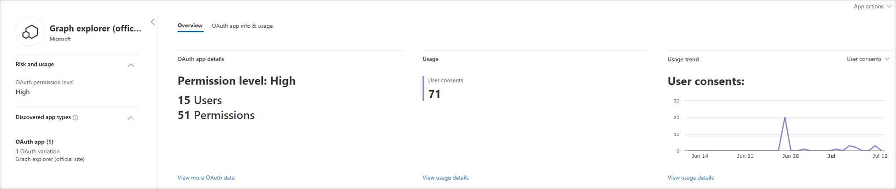
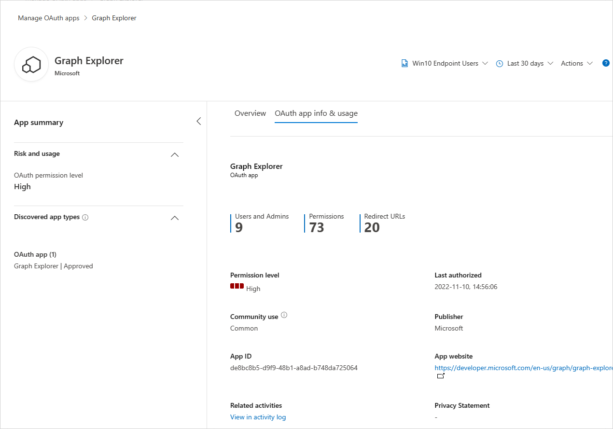

# Working with the app page

Cloud applications have become pivotal entities inside organizations, increasing productivity and enabling remote work. As adoption of these applications rises, Security and Compliance admins must deal with the risks that usage of cloud applications might expose the organization to.

Shadow IT, whether across pure web apps, or daily added OAuth apps, is a significant concern and requires a dedicated experience to handle such types of entities in the organization.

An admin should be able to get all risk and usage-related information about applications in use to make the best decision for the organization.

The app experience in Microsoft Defender for Cloud Apps  provides the necessary high-level overview of an app's usage in the organization, combined with the risk that the app potentially exposes the organization to. Allowing a single experience to review all apps' shadow usage and risk enable the admin to make rapid, in-context decisions about the app's usage in the organization.

The experience covers both Discovered apps as part of the pure Shadow IT discovery capabilities of Defender for Cloud Apps and any discovered OAuth apps as part of its OAuth app discovery for Microsoft 365 apps.

## Discovered cloud apps

Here you can review an app's high-level usage stats, understand top entities using the app in your organization, identify usage trends and review the potential risk the poses for your organization.

Continue investigating the app's risk by getting familiar with more than 90 risk indicators that affect the [app's risk](risk-score.md) in the **Info** tab.

Take a deep dive into the app's usage trends to identify usage spikes, top entities across various dimensions like data uploads, transactions, total traffic and so on.

Continue investigating by viewing the top 100 users, source IPs, and devices (when [Defender for Endpoint integration](mde-integration.md) is enabled) to be able to continue the investigation in an additional entity context.

After analyzing the risk versus the usage of the application, an admin can decide which app controls should be applied to this application using the app actions. Admins can control cloud applications by:

- Tagging the app with built-in tags to enforce further access control on the network layer (endpoints or integrated 3rd party network appliances). For more information, see [Govern discovered apps](governance-discovery.md).
- On-boarding the app to Microsoft Entra ID to manage logins and govern users when applicable. For more information, see [Add an application to your tenant](/azure/active-directory/manage-apps/add-application-portal).
- Using Conditional Access app controls to monitor and control user sessions, prevent risky actions, and avert potential data exfiltration. For more information, see [Protect apps with Microsoft Defender for Cloud Apps Conditional Access app control](proxy-intro-aad.md).
- Connecting the app via the app connectors in Defender for Cloud Apps when applicable. For more information, see [Connect apps](enable-instant-visibility-protection-and-governance-actions-for-your-apps.md).

## Discovered OAuth apps

Discover and review an OAuth app's privilege levels, amount and types of permissions granted, consented users across the organization, and trends of the app's consents and audited activities across organizational assets.

Drill down to get more metadata about the OAuth app, pivot to investigate app activities and app consents, and decide whether this app should continue to have access to organizational assets or should be banned by using the app actions.

## Client app context (preview)

>[!NOTE]
>This is a preview capability and does not guarantee full mapping across Cloud and Client apps. If a known client app was not mapped to discovered cloud apps, [contact support](support-and-ts.md).
>Client app context is available only for discovered cloud apps. To view the full list of discovered client apps in the organization, visit  [Threat vulnerability management in Microsoft Defender for Endpoint](/microsoft-365/security/defender-endpoint/next-gen-threat-and-vuln-mgt).

For customers using Microsoft Defender for Endpoint's Threat vulnerability management solution, a client app context will be available as part of the experience to better understand the full usage context of the app in the organization. For example, if the WhatsApp web app was discovered and WhatsApp clients are being installed across the organization, the information about the WhatsApp client installation and version weaknesses will appear in the cloud app's overview tab.

## Next steps

- [Working with discovered apps](discovered-apps.md)
- [Working with App risk scores](risk-score.md)
- [Govern discovered apps](governance-discovery.md)
- [Investigate risky OAuth apps](investigate-risky-oauth.md)
- [Manage OAuth apps](manage-app-permissions.md)
