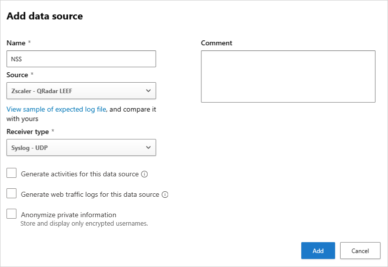

# Integrate Defender for Cloud Apps with Zscaler

[!INCLUDE [Banner for top of topics](includes/banner.md)]

If you work with both Microsoft Defender for Cloud Apps and [Zscaler](https://www.zscaler.com/), integrate the two to enhance your cloud discovery experience. Zscaler, as a standalone cloud proxy, monitors your organization's traffic and enables you set policies for blocking transactions. Together, Defender for Cloud Apps and Zscaler provide the following capabilities:

- **Seamless cloud discovery**: Uze Zscaler to proxy your traffic and send it to Defender for Cloud Apps. Integrating the two services means that you don't need to install log collectors on your network endpoints to enable cloud discovery.
- **Automatic blocking**: After configuring the integration, Zscaler's block capabilities are automatically applied on any apps you set as *unsanctioned* in Defender for Cloud Apps.
- **Enhanced Zscalar data**: Enhance your Zscaler portal with the Defender for Cloud Apps risk assessment for leading cloud apps, which can be viewed directly in the Zscaler portal.

## Prerequisites

- A valid license for Microsoft Defender for Cloud Apps, or a valid license for Azure Active Directory Premium P1
- A valid license for Zscaler Cloud 5.6
- An active Zscaler NSS subscription

## Deploy the Zscaler integration

1. In the Zscalar portal, complete the Zscaler integration for Defender for Cloud Apps. For more information, see the [Zscaler documentation](https://help.zscaler.com/zia/configuring-mcas-integration).
1. In [Microsoft 365 Defender](https://security.microsoft.com/), complete the integration with the following steps:

    1. Select **Settings** > **Cloud apps** > **Cloud discovery** > **Automatic log upload** > **+Add data source**.
    1. In the **Add data source** page, enter the following settings:

        - **Name** = NSS
        - **Source** = Zscaler QRadar LEEF
        - **Receiver type** = Syslog - UDP

        For example:

       

        > [!NOTE]
        > Make sure the name of the data source is **NSS.** For more information about setting up NSS feeds, see [Adding Defender for Cloud Apps NSS Feeds](https://help.zscaler.com/zia/adding-mcas-nss-feeds).

    1. To view a sample discovery log, select **View sample of expected log file** > **Download sample log**. Make sure that the downloaded sample log matches your log files.

After completing the integration steps, any app that you set as *unsanctioned* in Defender for Cloud Apps is pinged by Zscaler every two hours, and then blocked by Zscaler according to your Zscalar policies. For more information, see [Sanctioning/unsanctioning an app](governance-discovery.md#sanctioningunsanctioning-an-app).

Continue by investigating cloud apps discovered on your network. For more information and investigation steps, see [Working with Cloud Discovery](working-with-cloud-discovery-data.md).

## Next steps

> [!div class="nextstepaction"]
> [Control cloud apps with policies](control-cloud-apps-with-policies.md)

[!INCLUDE [Open support ticket](includes/support.md)]
